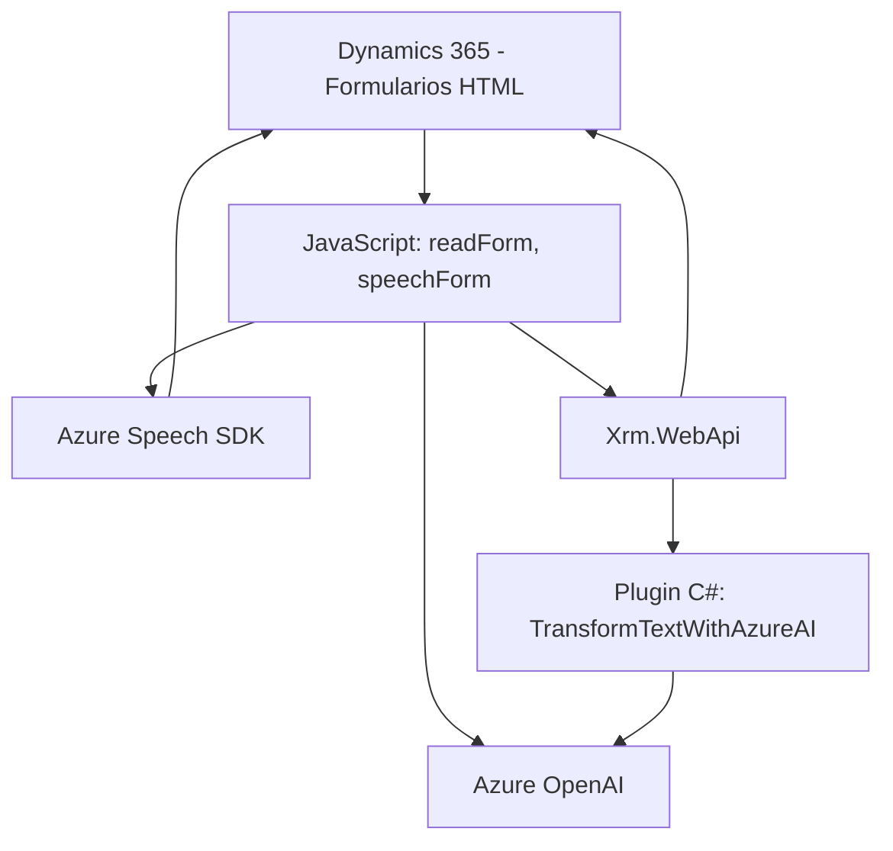

## Breve resumen técnico

El repositorio parece implementar una solución compleja que combina **tecnologías de Microsoft**, funcionalidad basada en **inteligencia artificial (IA)** de Azure, y una integración con **formularios dinámicos** dentro del ecosistema de **Dynamics 365**. Cuenta con módulos orientados a accesibilidad mediante entrada de voz y reconocimiento de comandos hablados, junto con procesamiento avanzado de texto mediante OpenAI para transformar datos en objetos estructurados. Es una solución híbrida, con capacidades frontend, backend y servicios externos.

## Descripción de arquitectura

La arquitectura sigue un diseño orientado a **n capas**:
1. **Capa de presentación**:
   - El frontend maneja interacción directa con los usuarios mediante formularios HTML en Dynamics 365.
   - Implementa módulos de entrada y salida de voz (Azure Speech SDK) para mejorar la experiencia usuario.
2. **Capa de lógica de negocio**:
   - Contiene scripts y funciones capaces de interpretar datos JSON dinámicos, actualizar formularios y procesar textos transcritos.
   - Implementación de plugins en Dynamics CRM para procesar texto y ejecutar transformación mediante servicios externos (Azure OpenAI).
3. **Capa de integración con servicios externos**:
   - Usa APIs (Speech SDK y Azure OpenAI), configuración dinámica, y flujo asincrónico para realizar operaciones en remoto.
   - Integración directa con otros servicios de Dynamics mediante **Xrm.WebApi**.

## Tecnologías usadas

1. **Frontend**:
   - JavaScript para lógica del cliente y adaptadores de datos.
   - SDK de Azure Speech para síntesis y reconocimiento de voz.
2. **Backend**:
   - C# con acceso a contextos de Dynamics CRM usando **Microsoft.Xrm.Sdk**.
   - Llamados al servicio Azure OpenAI para procesamiento de texto avanzado.
3. **Servicios de Microsoft**:
   - Dynamics 365 para gestión organizacional y de formularios.
   - Azure Speech SDK para conversión de texto a voz y reconocimiento de comandos hablados.
   - Azure OpenAI para procesamiento avanzado de IA.

## Diagrama Mermaid válido para GitHub

## Conclusión final

La solución implementa una arquitectura **n capas** con una fuerte orientación hacia **IA y servicios externos de Microsoft Azure**, diseñados para facilitar la accesibilidad y el procesamiento avanzado de datos. La implementación muestra modularización de funcionalidades, adaptabilidad mediante SDKs externos, y un diseño bien estructurado que aprovecha las tecnologías del ecosistema de Azure y Dynamics para extender capacidades de negocios.

### Fortalezas:
- **Accesibilidad**: Entrada y salida de voz.
- **Flexibilidad**: Procesamiento dinámico mediante APIs externas (Azure Speech y OpenAI).
- **Modularización**: Divisiones claras entre lógica de negocio, presentación, y servicios externos.

### Potenciales áreas de mejora:
- **Seguridad**: Manejo de claves y regiones de Azure podría beneficiarse de métodos más robustos (e.g., Key Vault).
- **Pruebas**: Es clave realizar testing a nivel de integración para garantizar compatibilidad entre servicios externos (OpenAI, Speech SDK) y Dynamics 365.