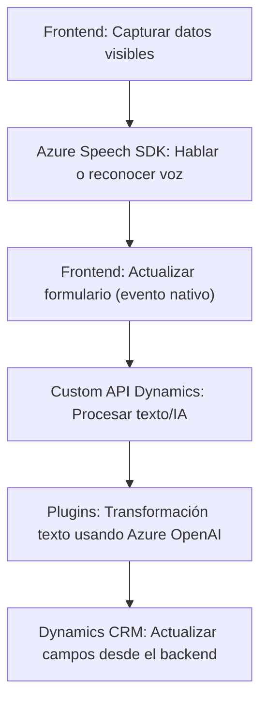

### Breve resumen técnico
Este repositorio pertenece a una solución tecnológica orientada a extender funcionalidades de un sistema CRM (probablemente **Microsoft Dynamics 365**) mediante la integración de servicios externos como **Azure Speech SDK** y **Azure OpenAI Service**. Está compuesto por archivos relacionados tanto con un módulo de **Frontend** para interacción con formularios como con **Plugins** en el backend para procesamiento avanzado utilizando servicios AI de Azure.

---

### Descripción de la arquitectura
La solución utiliza una arquitectura **híbrida** que combina:
1. **N capas**: Separación entre capa de presentación (frontend), capa lógica (Plugins), y servicios externos.
2. **Microservicios**: Realiza llamadas a APIs externas como Azure OpenAI y Azure Speech SDK.
3. **Event-driven**: En el frontend, las acciones están disparadas por eventos (interacción con formularios y acciones de voz).
4. **Modularidad**: Plugins backend y lógica frontend interactúan en flujo separado.

#### Flujo de datos principal:
1. **Frontend**:
   - Captura datos del formulario y los procesa con voz mediante el **Azure Speech SDK**.
   - Reconoce comandos de voz y actualiza dinámicamente formularios.
   - En algunos casos, delega procesamiento al backend mediante llamadas a **Custom APIs** de Dynamics.
2. **Backend**:
   - Consume texto (input de usuario o transcripción) enviado desde el frontend.
   - Procesa logicamente el texto usando **Azure OpenAI API** y retorna datos transformados (JSON).

---

### Tecnologías usadas
#### Frontend:
- **JS**:
  - Manejo del DOM y manipulación dinámica de formularios.
  - Trabajo con eventos y funciones asíncronas para integración con **Azure Speech SDK**.
  - Consumo de Microsoft Dynamics Custom APIs.

#### Backend:
- **Microsoft Dynamics Plugins**:
  - `.NET` con **C#**.
  - Uso de la interfaz `IPlugin` para personalizar lógica de negocio.
  - `HttpClient` para consumo de APIs externas, como **Azure OpenAI Service**.
  - JSON manejado por `Newtonsoft.Json.Linq`.

#### Servicios externos:
- **Azure Speech SDK**:
  - Sintetización texto-voz (text-to-speech).
  - Captura y comprensión de comandos de voz (speech-to-text).
- **Azure OpenAI**:
  - Modelo GPT para traducción de texto y reglas transformativas.

---

### Dependencias y componentes externos
1. **Azure Speech SDK**:
   - URL: `https://aka.ms/csspeech/jsbrowserpackageraw`.
   - Funciona con claves de suscripción y jurisdicción regional para la API.
2. **Azure OpenAI Service**:
   - Endpoint configurado para modelo GPT.
   - Requiere API Key y entorno seguro (Azure Portal).
3. **Microsoft Dynamics 365**:
   - APIs internas de Dynamics: `Xrm.WebApi` y contexto de plugins.
4. **Datos de usuario**:
   - Captura y procesamiento de datos visibles en el formulario.
   - Mapeo dinámico entre campos visibles y claves internas.

---

### Diagrama Mermaid válido para GitHub

---

### Conclusión final
La solución es técnicamente sofisticada, orientada al procesamiento de datos/formularios en un sistema CRM mediante funcionalidades de voz y transformación avanzada de texto. La arquitectura utiliza una mezcla de **n capas** en el procesamiento interno y delega tareas específicas a **microservicios** externos (Azure Speech SDK y OpenAI) para capacidades avanzadas. Está diseñada para ser extensible y modular, lo que facilita futuras adaptaciones o expansiones funcionales.