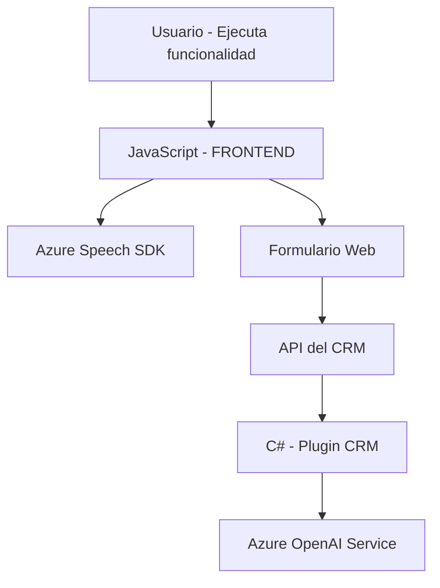

### Breve resumen técnico

Este repositorio implementa una solución orientada a la integración con servicios en la nube, concretamente con el **Azure Speech SDK** para funcionalidades de síntesis y reconocimiento de voz, y el servicio **Azure OpenAI** para transformación de texto en objetos estructurados. La arquitectura está distribuida en capas con módulos orientados al frontend, procesamiento de APIs, y extensiones específicas del CRM.

### Descripción de arquitectura

La solución tiene una arquitectura funcional con dos componentes principales:
1. **Frontend (JavaScript)**: Contiene scripts diseñados para manejar:
   - Entrada por voz (grabación, reconocimiento y procesamiento).
   - Síntesis de voz (lectura y audios en lenguaje natural).
2. **Backend (Plugin en Dynamics CRM)**:
   - Implementación de procesamiento avanzado de texto utilizando Azure OpenAI. 

La arquitectura es un híbrido de capas:
- **Frontend**: Modular con funciones específicas (no basado en frameworks).
- **Integraciones externas**: Comunicación con APIs como Dynamics CRM y Azure OpenAI, con patrones de servicios externos.
- **Backend del CRM**: Plugins que siguen el patrón de responsabilidad única y la estructura de eventos del CRM.
 
El diseño global se alinea con una arquitectura basada en **n capas**, en donde el frontend, servicios externos y plugins del backend interactúan mediante interfaces claramente definidas.

### Tecnologías usadas

1. **Frontend (JavaScript)**:
   - Lenguaje: JavaScript (ES5/ES6).
   - Framework/SDK: Azure Speech SDK.
   - Patrones de diseño: Delegación funcional y modularidad.

2. **Backend (Microsoft Dynamics CRM)**:
   - Lenguaje: C#.
   - Framework: Microsoft Dynamics SDK y .NET Framework.
   - Integración con **Azure OpenAI**.
   - Uso de bibliotecas: System.Net.Http, System.Text.Json, Newtonsoft.Json.Linq.

### Dependencias o componentes externos

1. **SDK externo**:
   - Azure Speech SDK: Se carga dinámicamente desde un CDN (`https://aka.ms/csspeech/jsbrowserpackageraw`) para trabajar con síntesis y reconocimiento de voz.

2. **APIs externas**:
   - Azure OpenAI Service: Utilizado en el plugin del CRM para transformar texto con inteligencia artificial.
   - Dynamics 365/CRM: Integración directa con workflows y manipulación de formularios mediante `Xrm.sdk`.

3. **Bibliotecas adicionales del backend**:
   - Compatibilidad con Microsoft Dynamics CRM: `Microsoft.Xrm.Sdk`, `Microsoft.Xrm.Sdk.Query`.
   - Serialización JSON: `System.Text.Json`, `Newtonsoft.Json.Linq`.

### Diagrama Mermaid válido para GitHub

### Conclusión final

El repositorio presenta una solución diseñada para integrar reconocimiento y síntesis de voz con formularios de un CRM, enriquecida mediante procesamiento avanzado de datos con inteligencia artificial. La arquitectura muestra un patrón de **n capas**, donde cada componente cumple una función claramente definida. Sin embargo, aspectos como la configuración de dependencias (claves API en código fuente) podrían optimizarse mediante principios de seguridad y buenas prácticas de configuración. La solución destaca por hacer uso extensivo de servicios en la nube para expandir las capacidades del CRM.