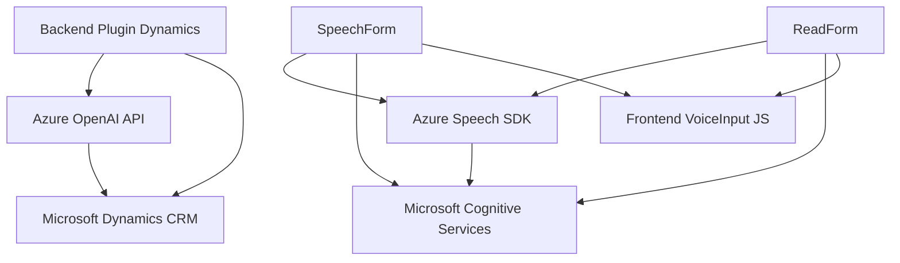

### Breve resumen técnico

Los archivos analizados en el repositorio forman parte de una solución que implementa una interfaz avanzada basada en voz y capacidades de inteligencia artificial para interactuar con formularios en Microsoft Dynamics CRM. Principalmente, se aprovechan servicios como Azure Speech SDK para la síntesis y el reconocimiento de voz, y Azure OpenAI API para la transformación inteligente de texto. La arquitectura está orientada a eventos con integración de servicios de terceros.

---

### Descripción de arquitectura

La arquitectura observada combina un **modelo de capas** con **interoperabilidad de servicios externos**. Cada capa se encarga de una funcionalidad específica:

1. **Frontend/JS**:
   - Archivos como `readForm.js` y `speechForm.js` manejan la interacción del cliente, traduciendo la entrada de voz en acciones sobre formularios.
   - Funciones de operación modular, como lectura de campos visibles, asignación dinámica y manipulación de datos.

2. **Backend Plugin**:
   - `TransformTextWithAzureAI.cs` actúa a nivel del backend de Dynamics CRM, entregando transformaciones textuales mediante Azure OpenAI API.
   - Este componente sigue el patrón de **Plugin de Dynamics CRM**, garantizando que la lógica se desencadene como parte de un evento del sistema.

3. **Servicios Externos**:
   - La solución depende de **Azure Speech Services** y **Azure OpenAI API** para sintetizar voz, reconocimiento y procesamiento avanzado de datos.

En términos generales, esta solución utiliza una **arquitectura híbrida de eventos y n-capas**, donde se encapsula toda lógica y dependencia externa (como servicios Azure) en unidades funcionales bien definidas.

---

### Tecnologías usadas

1. **Frontend (JavaScript)**:
   - **Azure Speech SDK**: Synthesis y reconocimiento de voz.
   - **Microsoft Dynamics JavaScript API (XRM)**: Interacciones con formularios y datos del contexto CRM.
   - API propias para manejar data relacionada con formularios (atributos y valores).
   - **Promises y estructuración modular** en funciones asíncronas.

2. **Backend Plugin (.NET)**:
   - **Microsoft Dynamics SDK (`IPlugin`)**: Arquitectura basada en eventos nativa de Dynamics CRM.
   - **Azure OpenAI API** (GPT-4): Procesamiento de texto avanzado.
   - **Newtonsoft.Json/ System.Text.Json**: Manejo de objetos JSON.
   - **System.Net.Http**: Para integración API.

3. **Servicios Externos**:
   - **Azure Speech SDK**: Sintetización y reconocimiento de voz.
   - **Azure OpenAI API**: Transformación de texto según reglas.

---

### Diagrama Mermaid

Este diagrama describe la relación entre las diferentes capas y componentes del sistema, incluyendo servicios internos y externos:

---

### Conclusión final

Este repositorio forma parte de una solución **híbrida n-capas** orientada a eventos que incrementa la funcionalidad de Microsoft Dynamics CRM mediante **interacción avanzada basada en voz** y **procesamiento inteligente de texto con IA**. Los servicios externos como Azure Speech SDK y OpenAI GPT-4 son esenciales para su funcionamiento. La arquitectura y modularidad observadas sugieren una solución escalable y altamente interactiva, adecuada para entornos empresariales que necesiten interfaces más accesibles y automatización basada en IA.