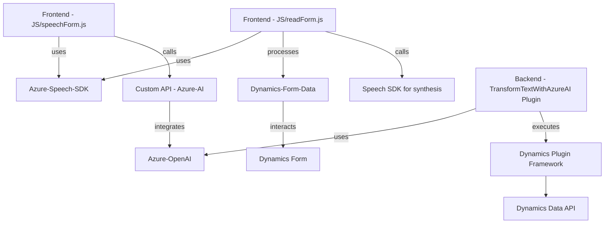

### Breve resumen técnico

Este repositorio contiene archivos que implementan una solución para integrar servicios de voz y texto mediante el uso de Azure Speech y Azure OpenAI. Los archivos están organizados en carpetas que sugieren una separación entre componentes de frontend (JavaScript) y backend (C# Dynamics plugins). Su propósito es mejorar la interacción de los usuarios con formularios de Dynamics 365 mediante comandos de voz y transcripción, y transformar texto a estructuras compatibles con el sistema.

---

### Descripción de arquitectura

La solución utiliza un **modelo de arquitectura multicapa**:
1. **Frontend:** Scripts en JavaScript enfocados en la interfaz del usuario, cuyo objetivo principal es la recolección y procesamiento de datos en formularios mediante entrada y reconocimiento de voz.
2. **Backend:** Implementado como plugins en Dynamics 365, se integra directamente en el motor del CRM para ofrecer capacidades ampliadas, como la transformación de texto usando Azure OpenAI.

### Tecnologías usadas

1. **Frontend:**
   - **JavaScript:** Para lógica de interacción entre el usuario y los formularios.
   - **Framework Dynamics 365:** Utilización del contexto de formularios mediante `executionContext`.
   - **Azure Speech SDK:** Reconocimiento y síntesis de voz, cargado dinámicamente desde Azure.
   
2. **Backend:**
   - **C#:** Para implementar plugins en Dynamics CRM.
   - **Microsoft Dynamics SDK:** Para integrar directamente en el sistema como plugin.
   - **Azure OpenAI Service:** Uso del servicio mediante llamadas HTTP con `HttpClient` para transformar texto.
   - **JSON Libraries (Newtonsoft.Json y System.Text.Json):** Manejo de transformaciones y estructuras JSON.

### Diagrama Mermaid válido para GitHub

---

### Conclusión final

Este repositorio parece definir una **solución de integración inteligente basada en servicios de Azure**, diseñada para mejorar la interacción del usuario con formularios en Dynamics 365 mediante entrada y salida de voz y texto estructurado. Usa una **arquitectura multicapa**, separando la lógica del frontend y las responsabilidades backend en términos de plugins para Dynamics CRM. Las dependencias incluyen servicios de SaaS (como Azure) y varios frameworks específicos de Dynamics. El sistema demuestra un fuerte enfoque modular con patrones como SOA y programación orientada a eventos, lo que asegura escalabilidad y mantenimiento del código.