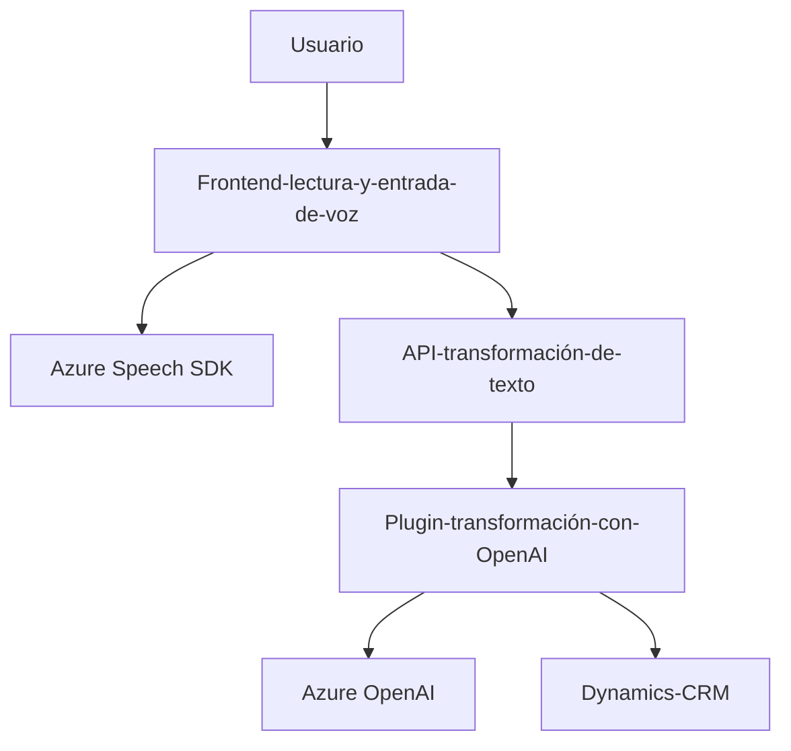

## Breve Resumen Técnico
El repositorio contiene una solución diseñada para interactuar con formularios en Dynamics CRM utilizando servicios de voz y texto integrados con **Azure Speech SDK** y **Azure OpenAI**. Las funcionalidades principales se centran en:
- Lectura en voz de los datos de un formulario (usando síntesis de voz).
- Procesamiento de entrada por voz para actualizar campos del formulario mediante transcripciones y transformación de texto con inteligencia artificial.
- Uso de plugins en Dynamics CRM para transformar texto dinámico basado en un flujo definido.

## Descripción de Arquitectura
La arquitectura sigue el modelo de **n capas** con separación entre frontend y backend:
1. **Capa frontend**: Implementada con JavaScript, interactúa con el navegador y Azure Speech SDK para administrar formularios dinámicos y entrada/salida de voz. También realiza llamadas hacia APIs externas.
2. **Capa backend**: Crea plugins en Dynamics CRM que usan la integración con Azure OpenAI para ejecutar transformaciones de texto.

## Tecnologías Usadas
- **Frontend**:
  - Lenguaje: JavaScript.
  - SDK: Azure Speech SDK.
  - APIs dinámicas: Integración HTTP para la interacción con servicios personalizados y OpenAI.
- **Backend**:
  - Lenguaje: C# (para plugins Dynamics CRM).
  - Framework: Dynamics CRM SDK.
  - Servicios: Azure OpenAI para transformaciones inteligentes de texto.
- **Dependencias externas**:
  - `System.Net.Http` y `Newtonsoft.Json` para la interacción con APIs.
  - Azure Speech SDK para reconocimiento y síntesis de voz.

## Dependencias o Componentes Externos
1. **Azure Speech SDK**: Usado para reconocimiento y síntesis de voz.
2. **Azure OpenAI API**: Proporciona transformación de texto con modelos de inteligencia artificial.
3. **Dynamics CRM SDK**: Para desarrollos plugin dentro de Dynamics CRM.
4. **Formulario dinámico/contexto**: Manejo de entidades y atributos en formularios CRM.

## Diagrama Mermaid (GitHub Compatible)

## Conclusión Final
La solución es un conjunto de herramientas integradas para gestionar dinámicas de formularios en CRM mediante tecnologías avanzadas en la nube. Se adoptan patrones como **modularidad** (funciones separadas por propósito), integración con **SDKs y APIs externas**, y plugins en **Dynamics CRM** para extender funcionalidades. La arquitectura es equivalente a un sistema de **n capas**, destaca por potenciar la experiencia interactiva con voz y la automatización mediante IA. Sin embargo, podrían optimizarse ciertos aspectos como el manejo seguro de configuraciones y claves API.