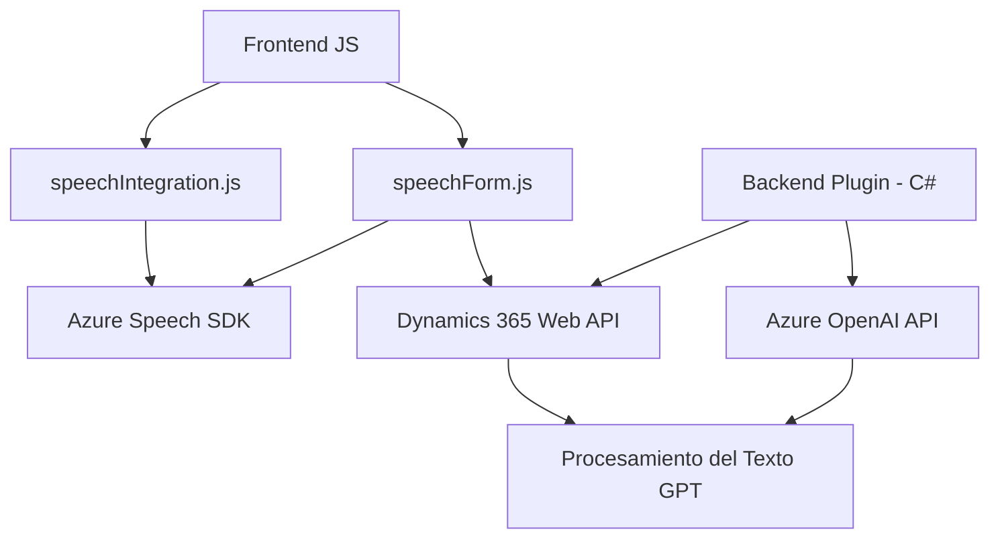

### **Breve resumen técnico**

El repositorio parece formar parte de un sistema más amplio que integra dos capas principales:
1. **Frontend**: Implementado en JavaScript, se enfoca en la interacción con un formulario de Dynamics 365 para recoger datos de los usuarios y recibe texto transcrito mediante reconocimiento de voz y procesamiento con Azure Speech SDK.
2. **Backend/Plugins**: Ejecución basada en un evento de Dynamics CRM que activa un plugin (`TransformTextWithAzureAI.cs`) para integrar capacidades de Azure OpenAI, procesar texto y devolver un JSON estructurado.

---

### **Descripción de arquitectura**

La solución es un **sistema CRM integrado con capacidades de IA y voz**, básicamente una unión entre un cliente (frontend web integrado en Dynamics 365, basado en reconocimiento/síntesis de voz) y lógica empresaria extendida (plugin CRM que actúa como backend) con Azure Cloud. Es una arquitectura de **n capas distribuidas**, donde el orden de capas es evidente:
- **Capa de Presentación**: Archivos como `speechIntegration.js` y `speechForm.js`, que despliegan la lógica en el navegador (interacción directa entre usuarios y Dynamics 365).
- **Capa de Aplicación**: El plugin `TransformTextWithAzureAI.cs`, que realiza la lógica avanzada de negocio y orquesta la comunicación con servicios de Azure para texto y voz.
- **Capa de Servicios Externos**: Integración con el Azure Speech SDK, Azure OpenAI API, así como la API web de Dynamics CRM (`Xrm.WebApi`).

Esta arquitectura orientada a servicios y basada en eventos permite un diseño escalable, con un enfoque en la **orquestación** de múltiples servicios en la nube.

---

### **Tecnologías usadas**

1. **Frontend**:
   - **JavaScript**: Desarrollo web para manipulación de formularios mediante Dynamics CRM Framework.
   - **Azure Speech SDK**: Reconocimiento y síntesis de voz soportadas por Microsoft Azure.
   - **Dynamics 365 Client API**: Para manipular datos, consultar formularios, y realizar operaciones CRUD.

2. **Backend**:
   - **C#** (.NET): Implementación del Plugin para Dynamics CRM.
   - **Microsoft Dynamics SDK**: Framework para extender funcionalidad mediante plugins.
   - **Azure OpenAI GPT-4 API**: Procesamiento inteligente y transformación de texto en JSON.
   - **HttpClient** y **Newtonsoft.Json**: Comunicación con servicios externos (OpenAI API) y manejo de estructuras JSON.

3. **Cloud Services**:
   - **Microsoft Azure Speech Services**: Reconocimiento y síntesis de voz.
   - **Azure OpenAI**: Inteligencia artificial y procesamiento avanzado de texto.

---

### **Diagrama Mermaid válido para GitHub**

---

### **Conclusión final**

Esta solución mezcla **frontend modular** escrito en JavaScript con funciones específicas para capturar y procesar datos en formularios integrados fácilmente en Dynamics 365, con un backend basado en eventos para **procesamiento avanzado de texto mediante IA** (Azure OpenAI). La arquitectura utiliza **n capas distribuidas**, siendo el núcleo de orquestación Dynamics CRM y múltiples servicios de Azure.

**Fortalezas**:
- Escalabilidad debido a su integración con dos servicios robustos de Azure.
- Modularidad y separación de responsabilidades en el código.

**Áreas de mejora**:
- La gestión de tokens y claves debe ser más segura (ejemplo: usar Azure KeyVault).
- Implementar pruebas unitarias para funciones críticas y evitar vulnerabilidades relacionadas con SDKs cargadas dinámicamente.