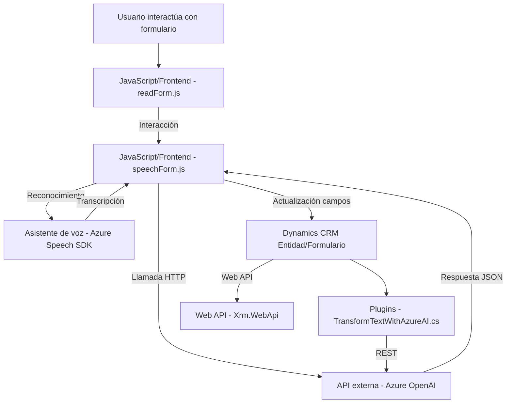

# Análisis Técnico

## 1. Tipo de solución
La solución corresponde a una integración entre múltiples componentes, que incluyen el frontend y backend, en el contexto de interacción con formularios en sistemas de CRM (Dynamics 365). Tiene funcionalidad centrada en:
- **Frontend**: Archivos `readForm.js` y `speechForm.js` gestionan la interacción del usuario dentro de formularios web, lectura, síntesis y reconocimiento de voz, y aplicación de datos.
- **Backend/Plugins**: Plugin `TransformTextWithAzureAI.cs` para procesar texto con Azure OpenAI.

En resumen, esta solución puede verse como una **integración entre frontend y microservicio**, donde ambos interactúan con servicios externos (Azure Speech SDK y Azure OpenAI).

---

## 2. Tecnologías, frameworks y patrones
### **Tecnologías y Frameworks**:
1. **Frontend**:
   - JavaScript con interacción DOM y módulos de código.
   - **Azure Speech SDK**: Para síntesis y reconocimiento de voz.
   - Dynamics 365 Web API: Interacción con el modelo de entidades CRM.
   
2. **Backend**:
   - **Microsoft.Xrm.Sdk**: Para desarrollo de extensiones en Dynamics CRM.
   - **Azure OpenAI API**: Uso de servicios GPT para transformación de texto.
   - `Newtonsoft.Json.Linq` y `System.Text.Json`: Para manipulación de datos JSON.
   - `System.Net.Http`: Para implementar solicitudes REST al servicio de OpenAI API.

### **Patrones aplicados**:
- **Modular design**: En la parte de frontend, cada función cumple un propósito específico.
- **Facade Pattern**: Las funciones principales en frontend (`startVoiceInput`, etc.) y backend (plugin) abstraen la complejidad y actúan como interfaces unificadas para los procesos principales.
- **Service Integration Pattern**: Dependencia directa de servicios externos (Azure Speech SDK y Azure OpenAI).
- **Event-driven design**: En el frontend, las transcripciones y grabaciones de voz se activan en respuesta a eventos.
- **Plug-in Architecture Pattern (Backend)**: Extensión de funcionalidades de Dynamics CRM a través de la interfaz de `IPlugin`.

---

## 3. Tipo de arquitectura
La solución es una combinación de:
- **Arquitectura de plugins para Dynamics CRM** en el backend (con `TransformTextWithAzureAI`) y el uso de servicios de Azure OpenAI.
- **N capas/Cliente-Servidor**: En el frontend, cuya responsabilidad descansa en la interacción usuario y el consumo de SDKs/APIs externas para permitir la interacción basada en voz.
- **Integración con servicios cloud (SaaS)**: Se observan patrones comunes de integración con servicios REST, como la OpenAI API, y la modularización para cargar y usar SDKs en tiempo de ejecución.

No se trata de un monolito ni de una arquitectura hexagonal explícita, debido a la separación clara del frontend como componente externo y el plugin como un microservicio extensible de Dynamics CRM.

---

## 4. Dependencias o componentes externos
1. **Azure Speech SDK**: Para la síntesis de voz (frontend) y reconocimiento de voz (frontend).
2. **Azure OpenAI API (GPT)**: Para procesamiento del texto (transformación a JSON).
3. **Dynamics CRM APIs**:
   - `Xrm.WebApi` para integración en formularios frontend.
   - `Microsoft.Xrm.Sdk` para la extensión en el lado del servidor.
4. **JSON API Integration**: Manipulación y procesamiento JSON con `System.Text.Json` y `Newtonsoft.Json.Linq` (backend).
5. **API requests (System.Net.Http)**: Realización de solicitudes HTTP para interactuar con Azure OpenAI desde el plugin.

---

## 5. Diagrama Mermaid para GitHub Markdown

---

## Conclusión Final
Este repositorio presenta una integración enfocada en soluciones tecnológicas modernas para la gestión de interacción por voz y procesamiento de texto en formularios de Dynamics 365. La combinación de frontend modular en JavaScript con integración SDK y API de Azure, junto con extensiones de Dynamics CRM basadas en la arquitectura de plugins, hace que esta solución sea híbrida (Frontend + Plugin). Su diseño modular y uso de patrones como el **Facade** y la integración con servicios externos la permite ser escalable en diferentes entornos.

Sin embargo, existen áreas de mejora:
- Exclusión de valores sensibles como claves API del código fuente, moviéndolos a configuraciones seguras.
- Optimización de operaciones asincrónicas en el plugin para evitar bloqueos.
- Mejoras en el diseño para permitir una personalización más flexible de la configuración regional.