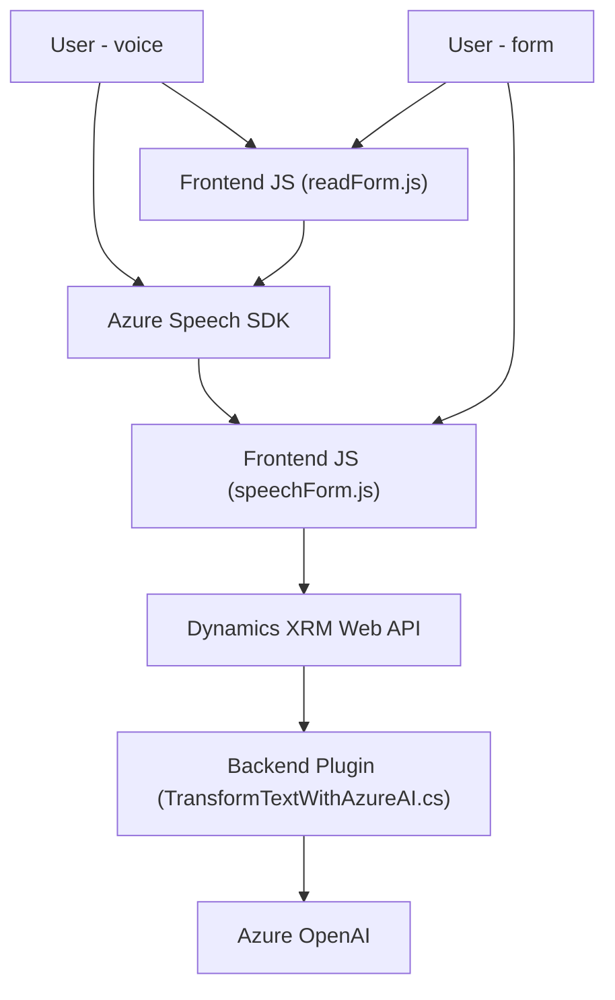

### Breve Resumen Técnico:
Este repositorio implementa un sistema de interacción mediante voz (entrada y salida) para formularios en una plataforma como Microsoft Dynamics. Utiliza servicios externos de Azure (Speech SDK y OpenAI) para reconocimiento y síntesis de voz junto con procesamiento avanzado de comandos. Desde el frontend obtiene datos del formulario y ejecuta operaciones basadas en la entrada por voz. En el backend, incluye un plugin para integrar lógica de transformación de texto en Dynamics CRM utilizando Azure OpenAI.

---

### Descripción de Arquitectura:
La arquitectura es una mezcla de **modularidad funcional** en el frontend y **plugin extensible** en el backend:
1. **Frontend**:
   - Modular, con funciones específicas para áreas como entrada/salida por voz, manipulación de formularios, y comunicación con APIs externas (Dynamics y OpenAI).
   - Uso de dependencias externas como **Azure Speech SDK** para reconocer y sintetizar voz.
   - Patrón **Event-driven integration**: La lógica se activa en respuesta a eventos como comandos de voz o interacción con SDK.

2. **Backend**:
   - Implementa un **plugin de Dynamics CRM** que extiende la funcionalidad del sistema mediante el patrón de arquitectura **SOA (Service-Oriented Architecture)**. 
   - Realiza integración directa con servicios de Azure para transformar texto en JSON estructurado mediante OpenAI.

La arquitectura general se adapta bien al **patrón de n capas** con frontend (UI + entrada/salida de voz) y backend (plugins y servicios) claramente definidos. También se observa un **Service-Oriented Architecture** para la interacción con servicios externos.

---

### Tecnologías Usadas:
1. **Frontend**:
   - Lenguaje: JavaScript.
   - Frameworks/Librerías: Azure Speech SDK.
   - APIs: Dynamics XRM Web API.

2. **Backend**:
   - Lenguaje: C#.
   - Frameworks/Librerías:
     - `Microsoft.Xrm.Sdk` para Dynamics CRM.
     - `Newtonsoft.Json` y `System.Text.Json` para manipulación de JSON.
     - `System.Net.Http` para interacciones HTTP con servicios de Azure OpenAI.

3. **Servicios Externos**:
   - Azure Speech SDK: Reconocimiento y síntesis de voz.
   - Azure OpenAI: Transformación avanzada de texto con IA.

---

### Dependencias o Componentes Externos:
1. **Azure Speech SDK** (URL: `https://aka.ms/csspeech/jsbrowserpackageraw`): Reconocimiento y síntesis de voz basada en IA.
2. **Azure OpenAI**: IA para procesamiento complejo de texto/formato JSON.
3. **Dynamics XRM Web API**: Utilizado para interactuar con la lógica de backend de CMS/CRM en la plataforma Dynamics.
4. **Browser Environment**: Integración con el DOM para manejar los formularios.

---

### Diagrama Mermaid:

---

### Conclusión Final:
El repositorio representa una **Voice Interaction System** construido sobre la plataforma **Microsoft Dynamics CRM** y potenciado por la integración con servicios de **Azure Speech SDK** y **OpenAI**. Orientado a un diseño **modular en el frontend** y una arquitectura **n capas** con interacción clara entre UI, API, y lógica empresarial basada en plugins. El uso de estándares como SDKs oficiales y APIs de Dynamics asegura compatibilidad, aunque se podrían considerar mejoras en el manejo de configuraciones críticas y excepciones para producción.