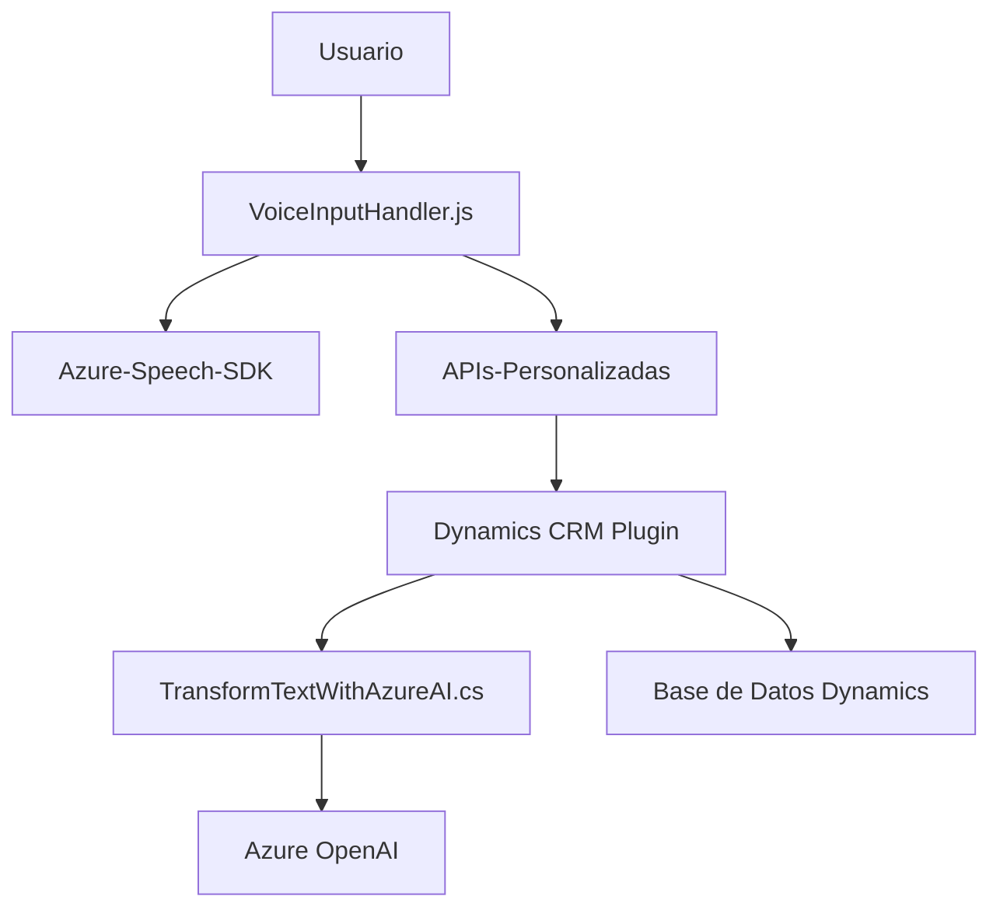

## Resumen técnico

Este repositorio presenta un conjunto de archivos orientados a la integración de inteligencia artificial y manejo de datos en formularios dinámicos. La solución está basada en el SDK de Azure Speech, plugins de Dynamics 365 y APIs personalizadas utilizando servicios de Azure OpenAI. Está diseñado para automatizar la interacción entre usuarios y formularios mediante reconocimiento de voz, generación de texto y normalización de datos.

---

## Descripción de arquitectura

La arquitectura es **modular** y **integrada**, usando componentes dispares que se comunican entre sí:
1. **Frontend**: Gestiona formularios, interacción con usuarios via reconocimiento de voz y llamada a APIs personalizadas.
2. **Plugin backend**: Procesa texto (normas predefinidas) y transforma el contenido gracias a Azure OpenAI. Este plugin sigue un enfoque orientado al procesamiento del contexto del usuario en Dynamics 365.

La solución maneja integraciones con:
- Servicios de inteligencia artificial (Azure Speech y Azure OpenAI).
- APIs locales/dinámicas en entornos CRM basados en Dynamics 365. 

Esta arquitectura se aproxima a un **modelo de microservicios**, especialmente en la relación entre los componentes (frontend, APIs personalizadas y plugins). Sin embargo, al depender del ecosistema CRM, ciertos aspectos combinan elementos de **n capas**.

---

## Tecnologías utilizadas

1. **Frontend**:
   - **SDK**: Azure Speech para interacción de voz.
   - **JavaScript**: Funciones dinámicas y modulares para procesamiento de datos en DOM/formularios.
   - **APIs personalizadas**: Para comunicar el frontend con servicios externos.

2. **Backend**:
   - **Microsoft Dynamics 365**:
     - Plugins desarrollados usando C# y la interfaz `IPlugin`.
     - Interacción con bases de datos dinámicas y campos de formularios.
   - **Azure OpenAI**:
     - Modelo **GPT** para procesamiento avanzado de texto y transformación de datos.
     - Consumo mediante `System.Net.Http`.

3. Dependencias externas:
   - SDK dinámico cargado desde Azure (via URL externa).
   - Libs de manipulación de JSON (e.g., Newtonsoft en C#).

---

## Diagrama **Mermaid**

---

## Conclusión final

### Ventajas:
Esta solución incorpora un diseño fácil de leer y escalable con capacidades avanzadas de IA que mejoran la interacción usuario-software. La elección de SDKs y la estructura modular permite una fácil conexión entre el frontend y los plugins backend.

### Recomendaciones:
- Mejorar la seguridad en manejo de claves API (Azure Speech/OpenAI).
- Optimizar el procesamiento de errores y logs para el plugin.
- Evaluar la posibilidad de desacoplar más servicios, hacia una arquitectura más independiente de Dynamics CRM.

La solución es funcional y refuerza una arquitectura híbrida entre **microservicios** y **n-capas**, permitiendo interacciones fluidas basadas en inteligencia artificial.