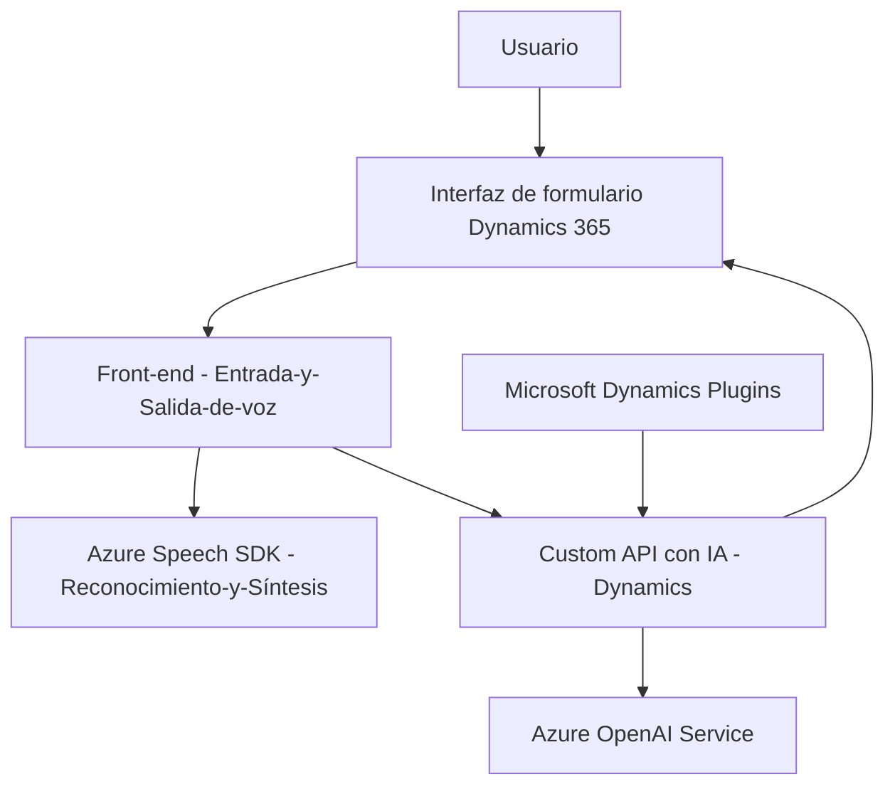

# Análisis técnico del repositorio

## Breve resumen técnico
El repositorio analizado parece implementar una solución tecnológica destinada para Microsoft Dynamics 365 con las siguientes características principales:

1. **Archivo `readForm.js`:** Implementa funcionalidades relacionadas con la síntesis de voz utilizando Azure Speech SDK para convertir los datos de formularios en audio.
2. **Archivo `speechForm.js`:** Facilita transcripción y entrada por voz en los formularios de Dynamics 365. Integración con Azure Speech SDK y un Custom API que transforma los datos mediante IA.
3. **Archivo `TransformTextWithAzureAI.cs`:** Define un plugin que interactúa directamente con Microsoft Dynamics CRM, transformando texto vía Azure OpenAI API en función de reglas customizadas, retornando datos en formato JSON.

## Descripción de la arquitectura
La arquitectura de todo el sistema se puede describir como híbrida y centrada en microservicios. Combina las siguientes capas:

1. **Back-end plugin para Dynamics CRM:** Encapsula la gestión de datos con plugins que procesan el texto recibido y lo envían al servicio Azure OpenAI para su transformación.
2. **Microservicio externo basado en IA (Custom API), integrado con Dynamics 365:** Maneja los datos transcritos, procesándolos con algoritmos basados en IA.
3. **Frontend basado en JavaScript:** Implementa dos módulos independientes:
   - `readForm.js`: para síntesis de voz.
   - `speechForm.js`: para entrada/transcripción de voz.

### Arquitectura
- **Microservicios:** La solución está orientada a microservicios, debido a su uso de plugins, servicios externos e integración modular con Azure API para síntesis e interpretación de texto basado en IA.
- **Patrones utilizados:**
  - **Callback pattern:** Utilizado para manejar carga dinámica de SDK mediante funciones como `ensureSpeechSDKLoaded`.
  - **Service Integration:** Integración con Azure APIs (Speech SDK y OpenAI).
  - **Encapsulación:** En cada archivo se observa segmentación por funcionalidades específicas (transcripción de texto, síntesis de voz y lógica de negocio de CRM).
  - **Event-driven pattern:** Dependencia de eventos en el `executionContext` para desencadenar acciones en los formularios.

---

## Tecnologías usadas
1. **Frontend:**
   - **JavaScript:** Para implementar la lógica de síntesis y transcripción de voz.
   - **Azure Speech SDK:** Utilizado para reconocimiento y síntesis de voz.
2. **Backend:**
   - **Microsoft Dynamics CRM SDK:** para integrarse y operar sobre datos de formularios.
   - **Azure OpenAI Service:** Para transformar texto con modelos de lenguaje como GPT.
   - **JSON libraries:**
     - `System.Text.Json`
     - `Newtonsoft.Json.Linq`
3. **Complementos:**
   - Custom API para procesar datos con IA.
   - Dinámica y gestión de formularios con Dynamics 365 Xrm.

---

## Diagrama **Mermaid** válido para GitHub

---

## Conclusión final
La solución del repositorio presenta un diseño robusto para expandir las capacidades de Microsoft Dynamics 365 con funcionalidades de síntesis y transcripción de voz. Incorpora una arquitectura híbrida basada en patrones como integración de servicios externos y manejo de eventos. Utiliza tecnologías avanzadas como Azure Speech SDK y Azure OpenAI Service para el procesamiento y transformación de datos mediante inteligencia artificial. Este enfoque modular y basado en microservicio le otorga escalabilidad y flexibilidad para adaptarse a diversos escenarios dentro del ecosistema de Dynamics 365.