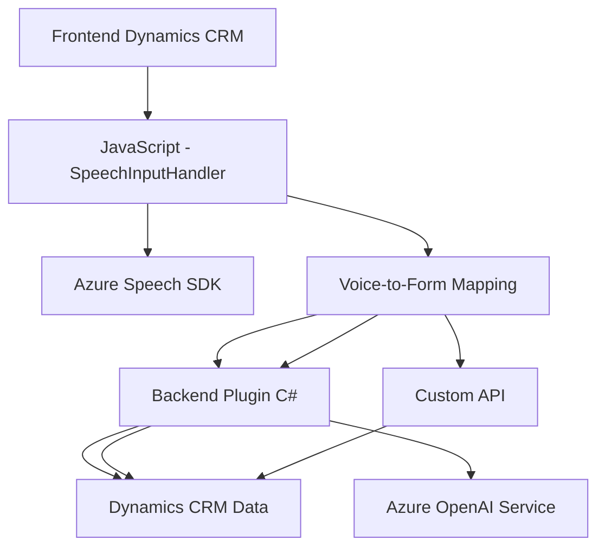

### Breve resumen técnico:
El repositorio define una solución que implementa integración avanzada entre un cliente, específicamente un frontend para Dynamics CRM, y servicios externos como **Azure Speech SDK** y **Azure OpenAI Service**. Está orientado a manipular formularios, procesar voz y texto dinámicamente, habilitando un flujo de interacción entre usuario, CRM y servicios basados en inteligencia artificial.

---

### Descripción de arquitectura:
1. **Patrones generales**
   - **Service-to-Service Integration**: La arquitectura describe una fuerte interconexión entre el frontend de Dynamics CRM, el plugin C#, y servicios adicionales como APIs y SDK de Microsoft Azure.
   - **Microservicios**: La solución utiliza microservicios en Azure, como **Azure Speech SDK** y **Azure OpenAI**, para realizar reconocimientos de voz, síntesis, y procesamiento de datos textuales.

2. **Detalle arquitectónico**
   - El frontend (en `JavaScript`) interactúa con el **Frontend Dynamics CRM** (client-side & APIs).
   - Los procesos de voz y AI tienen dos caminos principales:
     - La transcripción de voz utilizando el **Azure Speech SDK** (en tiempo real).
     - Transformaciones de texto mediante llamadas desde un plugin back-end (`IPlugin`) hacia **Azure OpenAI**, obteniendo respuestas estructuradas.
   - Arquitectura del lado del backend: `Plugins/TransformTextWithAzureAI.cs` describe un patrón **n-capas**, con la lógica del plugin actuando como capa intermedia entre Dynamics CRM y Azure.

---

### Tecnologías usadas:
1. **Frontend:**
   - JavaScript: Para funciones de procesamiento dinámico de formularios.
   - **Azure Speech SDK**: Para manejo de reconocimiento de voz y síntesis de texto a voz.
   - **Asincronía con Promesas**: Para manejar operaciones como la carga del SDK y las llamadas async al backend.

2. **Backend:**
   - **C# con .NET Framework**: Para la creación del plugin de Dynamics CRM.
   - **Microsoft.Xrm.Sdk**: Permite acceder y manipular los datos del sistema CRM.
   - **Azure OpenAI Service**: Servicio de inteligencia artificial para generación y transformación de texto.

3. **Patrones comunes:**
   - **Facade Pattern**: Simplificación del flujo a través de puntos de entrada (`startVoiceInput` y `Execute`).
   - **N-capas**: La arquitectura del backend implementa separación de presentación, lógica de negocio, y datos.
   - **Event-Driven Design**: Uso de eventos para manejar transcripción y síntesis en el frontend.

---

### Dependencias y componentes externos:
- **Externo:**
  - **Azure Speech SDK**: Procesamiento de reconocimiento de voz, síntesis de voz.
  - **Azure OpenAI Service**: Interacciones de texto basadas en inteligencia artificial.
  - **Xrm.WebApi.online**: API de Dynamics CRM para procesos web y custom APIs.
  - **Newtonsoft.Json** / `System.Text.Json`: Manejo estructurado de datos en formato JSON.
  - **Azure Key y Región**: Claves de acceso para los servicios en la nube de Microsoft.

- **Interno:**
  - Métodos y contextos del sistema Dynamics CRM en el frontend.
  - Plugins personalizados para lógica de negocio específica (TransformTextWithAzureAI).

---

### Diagrama Mermaid:

---

### Conclusión final:
La solución analizada proporciona una interacción avanzada entre un cliente CRM y los servicios inteligentes de Azure, utilizando funcionalidades modernas como reconocimiento de voz y transformación de texto. Opera con una integración de tipo **Service-to-Service** en el backend para conectar Dynamics CRM con Azure OpenAI.

Aunque el frontend sigue un estilo modular con separación de responsabilidades, el diseño no parece cumplir los principios de arquitectura escalable como la arquitectura hexagonal o DDD (diseño centrado en dominios). 

El **backend tipo plugin** en Dynamics CRM implementa una arquitectura de **n-capas**, siendo limpio pero muy dependiente de la lógica de negocio asociada al ecosistema Dynamics. A largo plazo, se recomienda evaluar cómo encapsular las dependencias externas (como los servicios en la nube) para evitar parejas rígidas entre los plugins y sistemas externos.