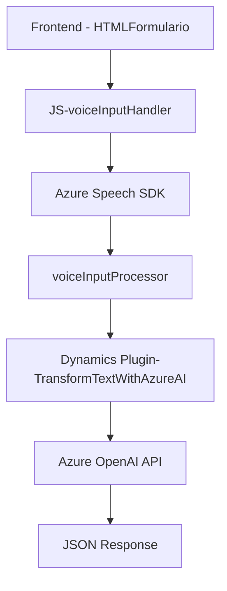

### Resumen técnico
El repositorio define una solución integrada con **Microsoft Dynamics 365**, enfocada en la gestión y procesamiento de formularios a través de entrada por voz, generación de texto, y transformación hacia JSON usando **Azure Speech SDK** y **Azure OpenAI API**. La solución consta de archivos para el frontend en JavaScript que interactúa con formularios y un plugin en .NET utilizado en Dynamics CRM.

### Descripción de la arquitectura
El sistema utiliza una **arquitectura de n capas** con elementos distribuidos entre el cliente (JavaScript), el servidor Dynamics CRM, y servicios externos como Azure Speech y OpenAI. Esto sugiere una arquitectura híbrida:
- **Frontend** (JavaScript) estructura la entrada de texto y voz.
- **Backend** (Plugin en C#) transforma y valida los datos.
- **Cloud Services** proporcionan las capacidades de procesamiento de voz y transformación de texto.

### Tecnologías usadas
1. **Lenguajes y frameworks:**
   - JavaScript tanto para front-end como para integración.
   - C# para creación de un plugin de Dynamics CRM.
2. **Servicios externos:**
   - **Azure Speech SDK**: Para síntesis y reconocimiento de voz.
   - **Azure OpenAI API**: Procesamiento y transformación avanzada de texto en JSON.
3. **Microsoft Dynamics API**: Para interactuar y registrar datos con formularios dinámicos.

4. **Patrones de diseño:**
   - **Delegación por callbacks**: Para cargar dinámicamente el Speech SDK en los scripts frontend.
   - **Integración de servicios externos**: Especialmente para conectar con APIs de Azure OpenAI.
   - **Single Responsibility Principle (SRP)** en métodos del plugin para tareas aisladas.

### Diagrama Mermaid
Aquí se describe la interacción general, desde la entrada de formularios hasta la generación del texto transformado.

### Conclusión final
El repositorio presenta un sistema robusto y escalable que aprovecha la **soft integration** entre módulos frontend, backend, y servicios en la nube. La arquitectura n capas permite dividir claramente cada responsabilidad y aprovechar tecnologías modernas como Azure Speech SDK y OpenAI para ofrecer funcionalidades avanzadas de reconocimiento y generación de texto/audio. La dependencia explícita de Dynamics API y servicios como Azure obliga a verificar cuidadosamente configuración, permisos y tiempo de respuesta para garantizar un sistema confiable y eficiente.