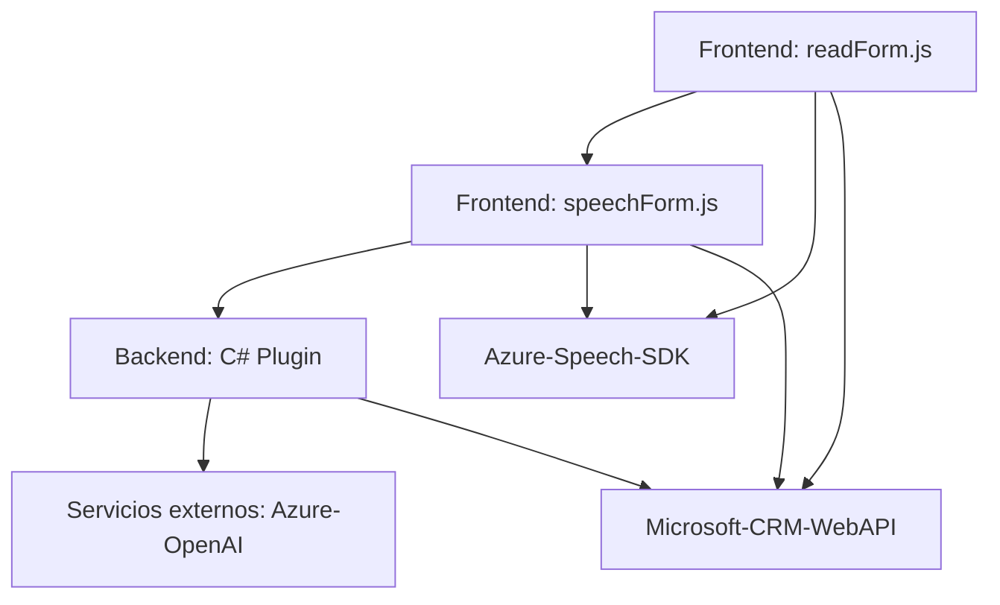

### Breve resumen técnico

El repositorio tiene tres componentes principales que, en conjunto, implementan una solución orientada a la automatización e integración con servicios de reconocimiento de voz, síntesis de texto y procesamiento avanzado mediante IA (Azure OpenAI). Las funcionalidades parecen enfocarse en mejorar la experiencia del usuario para interacción con formularios en entornos dinámicos como Microsoft Dynamics CRM.

---

### Descripción de arquitectura

La arquitectura general parece ser de tipo **n-capas**, dado que cuenta con una capa de presentación (Frontend), una capa lógica (que puede funcionar como middleware) y una capa de integración con Servicios Externos/Eventos personalizados para un sistema backend como Dynamics CRM. Sin embargo, dado el uso de múltiples APIs externas y plugins que ejecutan flujos específicos, la solución muestra elementos de arquitectura **orientada a servicios**.

Componentes principales:
1. **Frontend (JavaScript):** 
   - Encargado de la interfaz de usuario y la interacción directa con el formulario.
   - Consume Azure Speech SDK para reconocimiento y síntesis de voz.
   - Envía y recibe información procesada desde APIs externas.

2. **Middleware:**
   - En los archivos `JS/speechForm.js`, se encuentran componentes que gestionan la integración del reconocimiento de voz y las reglas para asignar valores a los formularios.
   - También invoca servicios externos personalizados y realiza procesamiento adicional cuando se activa la opción de inteligencia artificial.

3. **Plugin de backend (C#):**
   - Flujo especializado basado en la arquitectura Plugin de Dynamics CRM.
   - Consume el servicio Azure OpenAI para procesar texto de acuerdo con reglas.
   - Expone resultados en JSON estructurado mediante parámetros de salida en Dynamics CRM.

La naturaleza modular del código y la integración a APIs externas refuerza el concepto **Service-oriented architecture (SOA)**.

---

### Tecnologías y patrones usados

1. **Frontend:**
   - **JavaScript:** Para integración y lógica del cliente, dividido en módulos funcionales (`readForm.js`, `speechForm.js`).
   - **Azure Speech SDK:** Para el procesamiento de texto a voz y reconocimiento de voz.
   - **Microsoft CRM APIs (`Xrm.WebApi`):** Para comunicación con la base de datos del sistema CRM.

2. **Backend:**
   - **C#:** Para implementar plugins de Dynamics CRM, usando la interfaz `IPlugin`.
   - **Azure OpenAI:** Llamadas a servicios de OpenAI (GPT) para transformar texto basado en reglas específicas.
   - **HttpClient:** Manejo de solicitudes HTTP REST al consumir servicios externos.
   - **JSON Libraries:** Para manejar datos en formato JSON (`System.Text.Json`, `Newtonsoft.Json`).

3. **Patrones:**
   - **Modularidad:** Los archivos y funciones tienen responsabilidades independientes y específicas, lo que permite fácil mantenimiento.
   - **Event-driven:** Acciones como la carga del SDK de Speech se desencadenan mediante eventos y callbacks.
   - **Integración de Servicios:** Uso extensivo de SDKs y APIs externas para la síntesis, reconocimiento de voz y procesamiento de datos.
   - **Plugin Architecture:** Implementación de la interfaz `IPlugin` para personalización de eventos CRM.
   - **Pipeline Processing:** Organización de flujo modular para la extracción, procesamiento y aplicación de datos desde el frontend hacia el backend.

---

### Dependencias o componentes externos presentes
1. **Azure Speech SDK:**
   - Reconocimiento de voz y síntesis de texto a voz.
   - Claves y regiones de Azure para autenticación y configuración.

2. **Microsoft CRM APIs (`Xrm.WebApi`):**
   - Para interacción con los datos del formulario y entidades del CRM.

3. **Azure OpenAI API:**
   - Servicio de GPT-4, configurado mediante HTTP para transformar texto.

4. **JSON libraries:** 
   - Serialización/deserialización de datos JSON en plugins.

---

### Diagrama **Mermaid** válido para GitHub Markdown

---

### Conclusión final

La solución analizada es una integración avanzada para sistemas de CRM que combina el procesamiento de formularios, la síntesis de voz y el reconocimiento de voz, utilizando tecnologías modernas como Azure Speech SDK y Azure OpenAI. Utiliza una arquitectura n-capas con elementos de orientación a servicios (SOA) que permite la comunicación entre componentes frontend, servicios externos y plugins para Dynamics CRM. La modularidad del código facilita la ampliación y mantenimiento del sistema, haciendo que sea una implementación adaptable para entornos empresariales.

