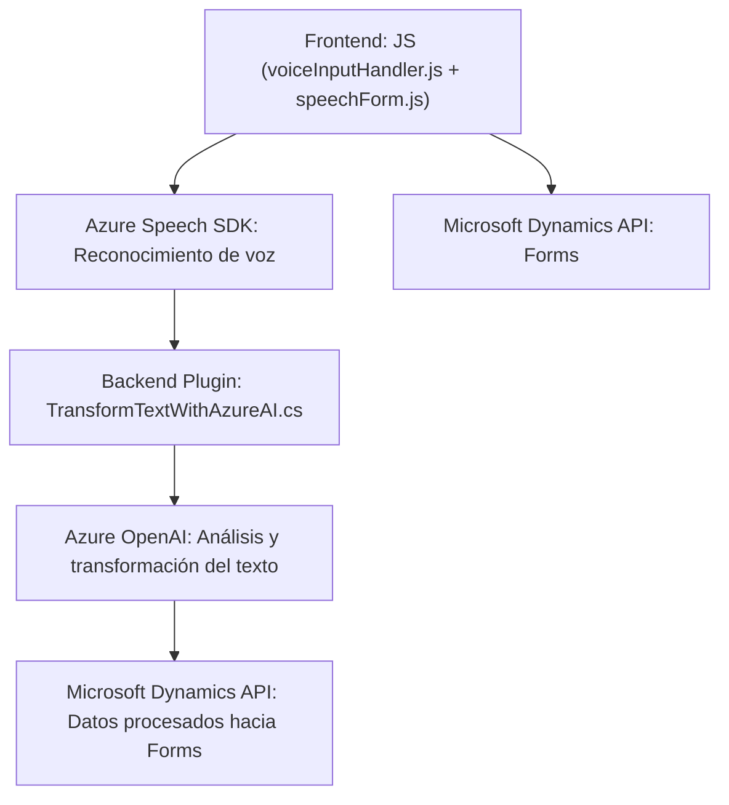

### Breve Resumen Técnico:
El repositorio contiene tres componentes principales: dos relacionadas con la interacción basada en voz y gestión de formularios en un entorno CRM (Microsoft Dynamics 365) implementadas en **JavaScript** y **Plugins** de C# para procesar formularios usando inteligencia artificial a través de **Azure Speech SDK** y **Azure OpenAI**. La solución parece ser una integración en un entorno empresarial para automatizar el procesamiento mediante voz e IA.

---

### Descripción de Arquitectura:
La arquitectura de este proyecto está orientada a un **modelo de capas**. Incluye interacción entre:
1. **Frontend (JavaScript)**: Implementa la lógica de interacción con formularios y sintetización de voz mediante **Azure Speech SDK**.
2. **Backend (Plugins en C#)**: Procesa texto de manera más compleja con reglas usando **Azure OpenAI** y expone APIs personalizadas para interactuar con el CRM.
3. **Integración dinámica**: Servicios externos como Azure Speech SDK y Azure OpenAI son integrados como dependencias, siguiendo los principios de desacoplamiento y modularidad.

Patrones utilizados:
- **Capas**: Distinción clara entre lógica de presentación (frontend) y lógica empresarial (plugin en C#).
- **Integración con servicios externos**: Uso de APIs en Azure para procesamiento de voz e inteligencia artificial.
- **Comprobación dinámica de dependencias**: Verificación y carga de recursos como SDKs antes de su uso.
- **Encapsulación**: Separación lógica en funciones bien definidas y clases en cada componente.

---

### Tecnologías Usadas:
1. **Frontend**:
   - **JavaScript** como lenguaje principal.
   - Azure Speech SDK para síntesis de voz y reconocimiento.
   - Asincronía con `Promise` y `async/await`.

2. **Backend**:
   - C# como lenguaje principal para desarrollo de plugins en Dynamics 365.
   - Azure OpenAI para generación y procesamiento de texto estructurado.
   - Microsoft Dynamics CRM SDK para interacción con formularios y entidades del CRM.

3. **Dependencias externas**:
   - Azure Speech SDK (obtenido dinámicamente desde un CDN).
   - APIs personalizadas en Microsoft Dynamics CRM.
   - JSON parsing con `Newtonsoft.Json` para transformación avanzada.

---

### Diagrama Mermaid:
Este diagrama explica visualmente las interacciones dentro del proyecto.

---

### Conclusión Final:
La solución presentada es una combinación de **Frontend y Plugin Backend**, diseñada para integrarse completamente con Microsoft Dynamics CRM y con **Azure AI Services** (Speech y OpenAI). La arquitectura combina las interacciones basadas en voz, procesamiento de texto y automatización de formularios en una solución robusta con principios de modularidad.

Puntos destacados:
- El uso de tecnologías cloud como Azure asegura escalabilidad y rendimiento, ideal para entornos empresariales.
- La arquitectura en capas y la segregación de responsabilidades facilitan la mantenibilidad del proyecto.
- Aunque los componentes están bien diseñados, asegurar pruebas unitarias y de integración para todas las dependencias externas será clave para producción.