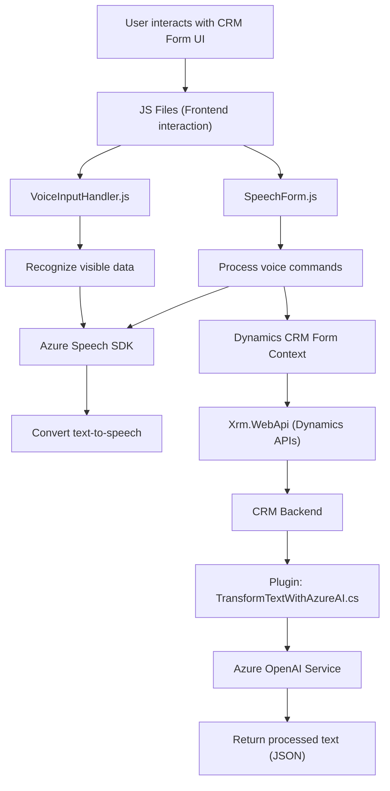

### **Resumen técnico**
El repositorio contiene diferentes archivos organizados por funcionalidades que sugieren una aplicación centrada en las siguientes características:
1. **Frontend (JavaScript):** Interacción con formularios a través de reconocimiento de voz y síntesis de audio por un servicio externo (Azure Speech SDK).
2. **Backend Plugin (C#):** Integración con Dynamics CRM y Azure OpenAI para procesamiento de texto utilizando modelos avanzados de IA.

La solución parece ser **una aplicación empresarial para interactuar con formularios en tiempo real** usando reconocimiento de voz y síntesis de texto a voz, además de procesamiento de datos con IA (Azure OpenAI).

---

### **Descripción de arquitectura**
La solución utiliza un enfoque **modular** y se organiza como una **arquitectura de microservicios aplicada a Dynamics CRM**. 

#### **Frontend**
El código en los archivos de JavaScript muestra un enfoque modular y reutilizable, orientado a la integración con servicios externos (Azure Speech SDK) y vinculación directa con formularios de CRM Dynamics. Sobresale el patrón **Service-Oriented Architecture** basado en APIs externas y la división funcional, cumpliendo con principios de separación de responsabilidades.

#### **Backend**
El código en `TransformTextWithAzureAI.cs` corresponde a un plugin de **Microsoft Dynamics CRM** que comunica con Azure OpenAI, delegando procesamiento avanzado de información a un servicio externo. Este plugin sigue el patrón típico de extensibilidad en Dynamics CRM, con lógica encapsulada y acceso a los servicios internos de CRM.

### **Tecnologías y frameworks usados**
1. **Frontend:**
   - **JavaScript:** Lenguaje base de interacción en la capa del navegador.
   - **Azure Speech SDK:** Comunicación con la API para reconocimiento y síntesis de voz.
   - **Dynamics CRM Context API:** Referencias al contexto de formularios (API del sistema interno de Dynamics CRM).

2. **Backend:**
   - **C# y .NET Framework:** Arquitectura de plugins en Dynamics CRM.
   - **Azure OpenAI Service:** Uso de modelos GPT vía API externa para procesar texto.
   - **Newtonsoft.Json:** Manipulación y serialización de datos JSON.

---

### **Dependencias externas o componentes presentes**
1. **Azure Speech SDK:** Para reconocimiento de voz y síntesis de texto.
2. **Azure OpenAI Service (GPT-4):** Para procesamiento de texto avanzado y transformación estructurada.
3. **Dynamics CRM APIs:** Interacción con formularios y datos propios del sistema.
4. Librerías adicionales:
   - `Newtonsoft.Json` (para manejo JSON en C#).
   - Clientes HTTP (`System.Net.Http`) para comunicación con servicios externos.

---

### **Diagrama Mermaid**
A continuación, se describe el flujo de interacción entre los diferentes componentes del sistema utilizando un diagrama Mermaid.

---

### **Conclusión final**
Este repositorio presenta una solución destinada a la **automatización y accesibilidad de formularios empresariales usando reconocimiento de voz**, generación de audio, y procesamiento inteligente de datos mediante IA. La arquitectura está diseñada con principios modernos como **Service-Oriented Architecture**, separación de responsabilidades, y extensibilidad en Microsoft Dynamics CRM usando plugins.

La implementación logra un alto grado de modularidad y escalabilidad gracias al uso de servicios de Azure (Speech SDK y OpenAI) y la lógica bien estructurada tanto para frontend como para backend.