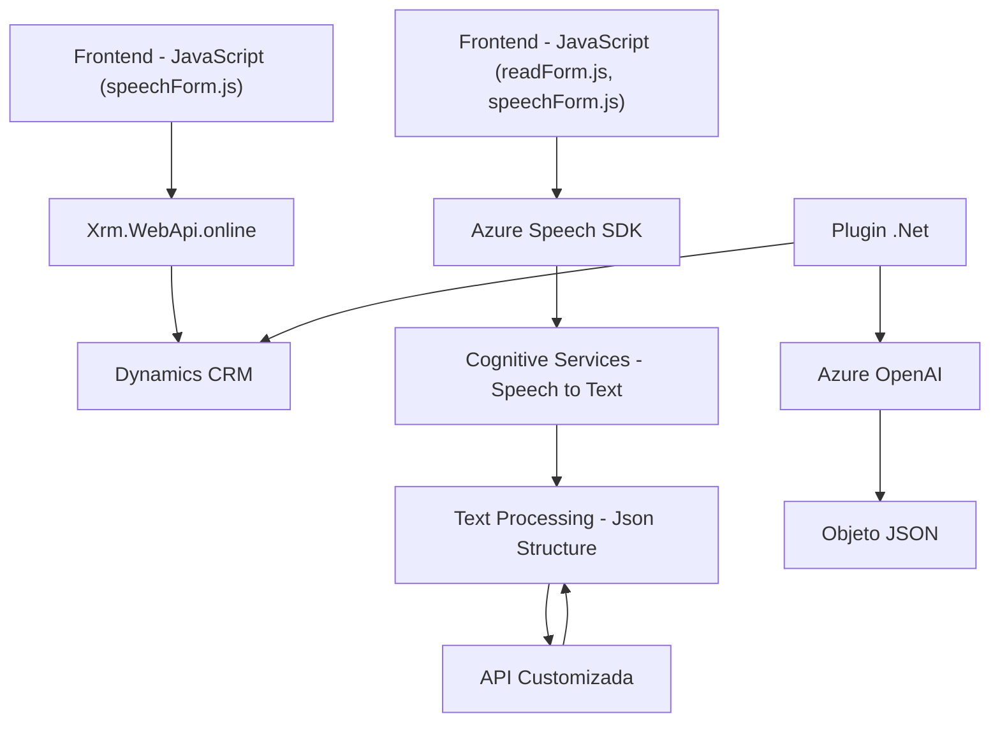

# Análisis del repositorio

## Breve resumen técnico
El repositorio presenta módulos en JavaScript y C# para implementar una solución con interacción dinámica entre los formularios de un sistema CRM (Microsoft Dynamics CRM), análisis/transcripción de voz mediante el servicio **Azure Speech SDK** y el procesamiento de texto a través de inteligencia artificial utilizando **Azure OpenAI**. Los archivos están organizados con una clara división de responsabilidades, integrando tanto servicios locales como externos.

---

## Descripción de arquitectura
La arquitectura general sigue el modelo de **arquitectura n-capas**, con una separación entre las capas de presentación (frontend), lógica de negocio (plugins), y servicios externos de integración (Azure Speech SDK y Azure OpenAI). Esto permite una implementación modular y escalable que delega funcionalidades específicas a servicios especializados.

### Principales características:
1. **Frontend**:
   - Scripts basados en JavaScript para manejar datos del cliente.
   - Integración directa con el Azure Speech SDK para grabación, transcripción y síntesis de datos de audio.
   - Modularización del código con funciones específicas y reutilizables.

2. **Backend/Plugins**:
   - Plugins en **C#** para Dynamics CRM (usando el framework `Microsoft.Xrm.Sdk`).
   - Enlace directo al servicio Azure OpenAI para el procesamiento de texto y generación de datos JSON estructurados.
   - Operación durante eventos específicos en el ciclo del CRM (como creación/actualización de datos).

3. **Servicios externos**:
   - Uso intensivo de la nube Azure con servicios Cognitive Services (Azure Speech SDK) y Azure OpenAI para funcionalidades de voz e inteligencia artificial.
   - Extensión de arquitectura mediante manejo de APIs y procesamiento de datos en formato JSON.

---

## Tecnologías, frameworks y patrones usados
1. **Tecnologías principales**:
   - **Frontend JS**:
     - Azure Speech SDK.
     - Herramientas específicas de Dynamics CRM (como `Xrm.WebApi.online`).
     - Post procesamiento manual de texto y JSON mediante funciones utilitarias.

   - **Backend C#**:
     - Dynamics CRM Plugin Framework.
     - Integración con Azure OpenAI mediante solicitudes HTTP.
     - Manejo de JSON con `Newtonsoft.Json` y `System.Text.Json`.

2. **Frameworks**:
   - Dynamics CRM SDK (Microsoft.Xrm.Sdk).
   - Azure Cognitive Services APIs (Speech SDK).
   - Azure OpenAI APIs.

3. **Patrones de diseño**:
   - **Modularización**: Funciones específicas dedicadas a tareas individuales, facilitando pruebas y mantenimiento.
   - **Callback/Event-Driven Architecture**: El frontend gestiona operaciones asincrónicas y condiciones previas como la carga del SDK.
   - **Integración de APIs externas**: Interacciones directas con Azure SDK y OpenAI mediante patrones REST/HTTP.
   - **Plug-in Oriented Architecture**: Extensibilidad en sistemas CRM mediante la implementación de la interfaz `IPlugin`.

---

## Dependencias o componentes externos
1. **Azure Speech SDK**:
   - URL de SDK: `https://aka.ms/csspeech/jsbrowserpackageraw`.
   - Funciones principales: grabación/transcripción de voz y síntesis de texto en audio.
   - Dependencia crítica para las funcionalidades de voz en los módulos de JavaScript.

2. **Azure OpenAI**:
   - Usado en el backend para procesar datos de texto y convertirlos a JSON estructurado.
   - Dependencia basada en solicitudes HTTP POST.

3. **Dynamics CRM SDK** (`Microsoft.Xrm.Sdk`):
   - Framework nativo para plugins y extensiones en la plataforma Dynamics CRM.

4. **Librerías adicionales**:
   - **System.Net.Http**: Para manejo de solicitudes web (HTTP Request).
   - **Newtonsoft.Json** y **System.Text.Json**: Para parseo y manejo de estructura JSON.

---

## Diagrama Mermaid

---

## Conclusión final
El repositorio implementa una solución integrada para un sistema CRM, donde las funcionalidades de voz e inteligencia artificial complementan la experiencia del usuario al trabajar con formularios. Usa una arquitectura **n-capas**, maximizando la separación de responsabilidades para mantener escalabilidad y flexibilidad en el desarrollo. El uso de las tecnologías modernas (Azure Speech SDK y Azure OpenAI) permite un flujo avanzado entre el análisis de voz, procesamiento de datos y visualización en formularios dinámicos. Sin embargo, la solución depende en gran medida de servicios externos (Azure), lo cual puede ser considerado una limitación en entornos que buscan minimizar este tipo de dependencia.