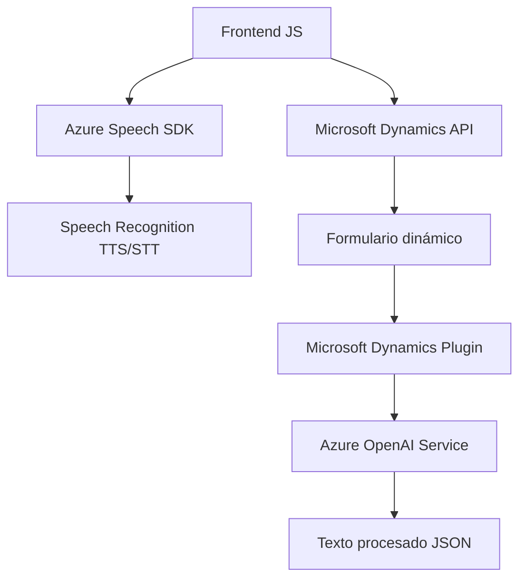

### Breve resumen técnico:
El repositorio parece contener una solución que integra inteligencia artificial y síntesis/reconocimiento de voz para Microsoft Dynamics 365. Implementa funcionalidades tanto de frontend en JavaScript como plugins en C# para procesar datos en formularios con servicios en la nube como Azure Speech SDK y Azure OpenAI.

---

### Descripción de arquitectura:
1. **Tipo de solución:**  
   La solución es una **aplicación híbrida** que combina un frontend interactivo basado en JavaScript y un plugin backend en C#. Está diseñada para ampliar las capacidades de Microsoft Dynamics 365 con procesamiento avanzado de datos.

2. **Arquitectura:**  
   - **Capas principales:**  
     - **Frontend:** Invoca funciones relacionadas con síntesis y reconocimiento de voz desde el navegador, conectando servicios externos como Azure Speech SDK y manipulando formularios visualmente dinámicos.  
     - **Backend Plugin:** Procesa texto avanzado en Dynamics 365 usando Azure OpenAI y maneja lógica empresarial asociada a los datos.
   - **Tipo de arquitectura:**  
     - Predominan los principios de **arquitectura en capas**, con separación de frontend, lógica de aplicación y servicios externos como API.  
     - Uso de plugins sugiere **microservicios acoplados a Dynamics 365**, que extienden funcionalidades sin alterar la plataforma base.

3. **Patrones encontrados:**  
   - **Event-driven architecture:** Callbacks y eventos disparan la carga de SDK dinámicos y el flujo de reconocimiento de voz.  
   - **Modular design:** Las funciones son desacopladas para facilitar su reutilización y pruebas unitarias.  
   - **Plugin architecture:** Los plugins C# ejecutan transformaciones específicas sobre texto según las reglas definidas.  
   - **Service integration pattern:** Forte interacción con APIs externas como Azure Speech y Azure AI.

---

### Tecnologías usadas:
1. **JavaScript (Frontend):**
   - Integración con **Azure Speech SDK** para síntesis TTS y reconocimiento STT.
   - Uso de APIs de **Microsoft Dynamics 365** para interactuar con formularios y datos.
   - Manipulación dinámica del DOM para carga de SDK externos.

2. **C# (Backend Plugin):**
   - Desarrollo sobre **Microsoft Dynamics CRM SDK**.
   - Uso extensivo de **Azure OpenAI Service** mediante llamadas HTTP con modelos como GPT-4.
   - Transformaciones de texto estructurado con patrones personalizados.

3. **Servicios Cloud:**  
   - **Azure Speech SDK:** Suministra capacidades de síntesis y reconocimiento de voz.  
   - **Azure OpenAI:** Apoya las transformaciones avanzadas de texto mediante modelos GPT.

---

### Dependencias o componentes externos:
1. **Externos:**  
   - SDK de Azure Speech integrado dinámicamente desde un CDN externo.  
   - Azure OpenAI Service consumido mediante solicitudes HTTP.  
   - Plataforma Dynamics 365 para manipulación de campos y triggers.

2. **Internos:**  
   - Manejo de datos de formulario y atributos mediante APIs de Dynamics 365 (`formContext`, `entity.attributes`).
   - Métodos personalizados con lógica aplicada a transformación de valores, emparejamiento de campos, mapeos, entre otros.

---

### Diagrama Mermaid:
El siguiente diagrama resume los módulos principales con sus interacciones:

---

### Conclusión final:
La solución ejemplifica una integración avanzada de servicios en la nube con una plataforma empresarial como Microsoft Dynamics 365. Utiliza tecnologías modernas y patrones como event-driven y service integration para lograr funcionalidades extendidas como entrada de voz procesada y transformaciones inteligentes de texto. Este diseño modular soporta una escalabilidad sólida y es adecuada para escenarios donde hay interacción constante entre usuarios y datos sensibles empresariales.