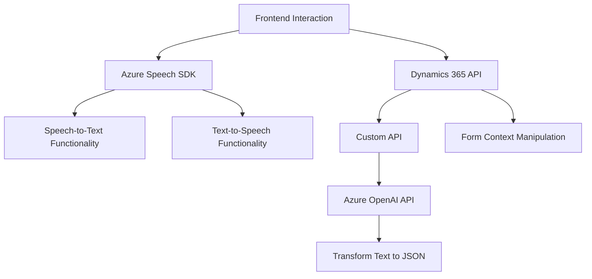

### Breve Resumen Técnico

El repositorio analiza múltiples integraciones enfocadas en la interacción entre formularios dinámicos (Dynamics 365), reconocimiento de voz (Azure Speech SDK), y procesamiento avanzado de texto con inteligencia artificial (Azure OpenAI). Todos los archivos están orientados al manejo de datos en formularios y su accesibilidad mediante voz, mientras posibilitan integraciones con servicios externos para reconocimiento y transformación.

---

### Descripción de Arquitectura

La solución combina elementos de arquitectura modular, patrones basados en SDK y microservicios. De forma específica:
1. **Front-End**: Los archivos `readForm.js` y `speechForm.js` implementan lógica basada en la interfaz del usuario, utilizando un enfoque procedural organizado en funciones.
2. **Plugin**: `TransformTextWithAzureAI.cs` forma parte de la segmentación de microservicios basada en plugins para Dynamics CRM, con encapsulación de lógica de negocio enfocada en la integración con Azure OpenAI.
3. **Integración**: Se observa un patrón de arquitectura orientada a microservicios, donde cada componente interactúa con servicios externos como Azure Speech SDK y Azure AI sin causar acoplamientos excesivos.

---

### Tecnologías Usadas
1. **Framework y SDK principal**:
   - Microsoft Dynamics 365 - Model-Driven Apps (integración de formularios dinámicos interactivos).
   - Azure Speech SDK - Reconocimiento de voz y síntesis de texto a voz.
   - Azure OpenAI API - Transformación avanzada de texto estructurado.

2. **Lenguajes**:
   - **JavaScript**: Archivos del front-end manejan sintaxis limpia y cargan dinámicamente SDK de Azure.
   - **C# (.NET Framework)**: Archivo implementa un plugin altamente acoplado al framework Dynamics CRM.

3. **Otras herramientas/librerías**:
   - JSON Parsing (`System.Text.Json`, probablemente `Newtonsoft.Json`).
   - HttpClient para comunicación de APIs.
   - Promesas y programación asíncrona para carga dinámica de dependencias en JS y llamadas HTTP en C#.

---

### Diagrama Mermaid

---

### Conclusión Final

La solución analizada es un proyecto integrado con elementos de Inteligencia Artificial, reconocimiento de voz y manipulación de formularios dinámicos, destacando por las siguientes características:
1. **Escalabilidad**: Usa servicios externos como Azure Speech y OpenAI, permitiendo procesamiento avanzado de datos sin depender excesivamente de la infraestructura interna.
2. **Modularidad**: El diseño segmenta claramente las responsabilidades (voz, texto, y manipulación dinámica de formularios).
3. **Interoperabilidad**: La integración con Dynamics CRM junto con APIs externas como Custom API es eficiente y adaptable a casos de negocio variados.

Sin embargo, el diseño puede mejorar con un enfoque más robusto al manejo de excepciones, configuración de dependencias, y validaciones de entrada para entornos críticos.