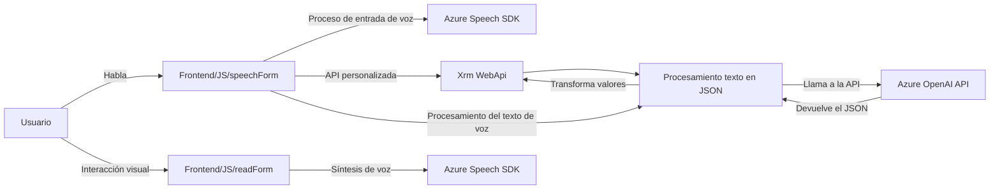

### Breve Resumen Técnico

El repositorio contiene archivos que están diseñados principalmente para la integración entre formularios interactivos relacionados con Microsoft Dynamics CRM y servicios de voz e inteligencia artificial ofrecidos por Azure. Los tres archivos presentan funcionalidades de síntesis de voz, entrada por voz y procesamiento de texto mediante Azure AI, destacando el uso de SDKs y APIs externas para maximizar la comunicación intuitiva y la automatización.

---

### Descripción de Arquitectura

La solución sigue una **arquitectura de n-capas**, con componentes bien diferenciados y el uso de distintas tecnologías según el propósito:
1. **Capa de presentación (Frontend):** Contiene una implementación en JavaScript que se compone de módulos responsables de realizar la entrada y salida de voz en formularios interactivos.
2. **Capa de lógica de negocio:** La capa de plugins para Dynamics, escrita en C#, encapsula la integración con Azure OpenAI para manipular datos provenientes del usuario o frontend, procesarlos y devolver resultados.
3. **Capa de servicios externos:** Se utiliza Azure Speech SDK para síntesis y reconocimiento de voz, junto con el servicio Azure OpenAI para procesamiento de texto avanzado.

---

### Tecnologías Usadas

1. **Frontend:** 
   - Lenguaje: JavaScript.
   - SDK principal: Azure Speech SDK (utilizando reconocimiento y síntesis de voz).
   - Otros: APIs específicas de Microsoft Dynamics para la interacción con formularios.

2. **Backend/Plugins:** 
   - Lenguaje: C# (.NET Framework).
   - Microsoft Dynamics CRM SDK.
   - Azure OpenAI API (procesamiento de texto).
   - JSON parsing: Newtonsoft.Json.Linq y System.Text.Json.
   - HTTP requests: System.Net.Http.

---

### Dependencias o Componentes Externos Presentes

1. **Azure Speech SDK:** Para la síntesis y reconocimiento de voz.
2. **Azure OpenAI API:** Para procesamiento avanzado de texto en JSON mediante inteligencia artificial.
3. **Microsoft Dynamics SDK:** Para trabajar con datos del CRM (formContext y WebApi).
4. **HTTP client libraries:** Para realizar llamadas API al servicio de Azure OpenAI y otras integraciones.

---

### Diagrama Mermaid válido para GitHub

---

### Conclusión Final

Este repositorio representa una solución orientada a la interacción del usuario con formularios en Dynamics CRM, utilizando tecnologías de inteligencia artificial y voz para mejorar la experiencia. Su arquitectura de **n-capas** permite una clara separación de responsabilidades entre el frontend, la lógica del negocio y la integración con servicios externos como el Azure Speech SDK y OpenAI API. Además, los archivos están diseñados de manera modular, lo que facilita el mantenimiento y extensibilidad del código. Sin embargo, el manejo de credenciales estático en el plugin plantea posibles preocupaciones de seguridad que tendrían que gestionarse de forma más robusta.