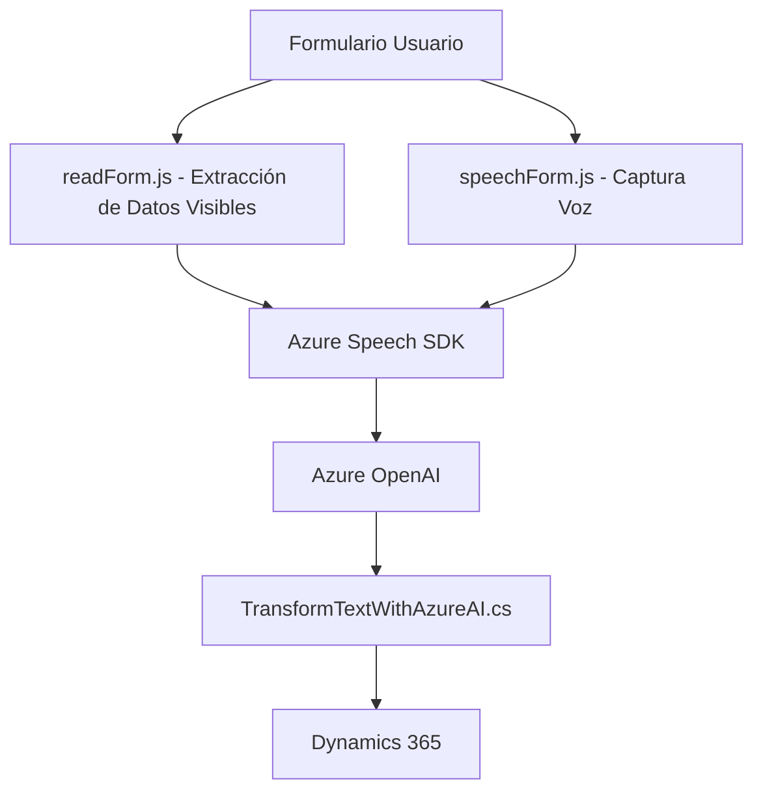

### Breve Resumen Técnico:
La solución presentada consiste en una arquitectura con componentes para el procesamiento de datos textuales y de voz utilizando servicios externos (Azure Speech y Azure OpenAI), integrados a un entorno empresarial como Dynamics 365. Los archivos están destinados a resolver problemas específicos relacionados con la accesibilidad, interacción basada en voz, y transformación de texto.

### Descripción de Arquitectura:
1. **Tipo de Solución:**  
   - **Híbrida:** Incluye componentes frontend (`readForm.js`, `speechForm.js`), y backend (`TransformTextWithAzureAI.cs`), junto a integraciones con APIs externas como Azure AI.
  
2. **Arquitectura General:**  
   - **N Capas:** El frontend extrae datos de formularios y realiza operaciones de síntesis mientras el backend actúa como una capa de integración para APIs externas y procesamiento interno. Dynamics 365 guía la integración y orquestación.
   - **Event-Driven Architecture:** Basada en eventos disparados por interacciones del usuario que alimentan los flujos (e.g., inicio de captura de voz, procesamiento, asignación de datos).

### Tecnologías Usadas:
1. **Frontend:**
   - **JavaScript:** Para manipulación de DOM y lógica de negocio.
   - **Azure Speech SDK:** Integración con el servicio de síntesis y reconocimiento de habla.
  
2. **Backend:**
   - **C# y Microsoft.Xrm.Sdk:** Para el plugin de Dynamics 365 que interactúa con Azure OpenAI API.
   - **System.Net.Http y Json Libraries:** Para realizar llamadas HTTP y manejar datos en formato JSON.
  
3. **Servicios Externos:**
   - **Azure Speech SDK:** Generación y análisis de voz.
   - **Azure OpenAI:** Transformación avanzada de texto basado en IA.

### Diagrama Mermaid:

### Conclusión Final:
El repositorio implementa una solución empresarial basada en una arquitectura de N capas que abarca componentes frontend, backend, y servicios externos. La carga dinámica del SDK de Azure Speech y la integración con Azure AI para procesamiento de texto son características clave. Este diseño optimiza la accesibilidad y potencia la orquestación de datos en un contexto empresarial como Dynamics 365, escalando funcionalidades mediante servicios de IA avanzados.