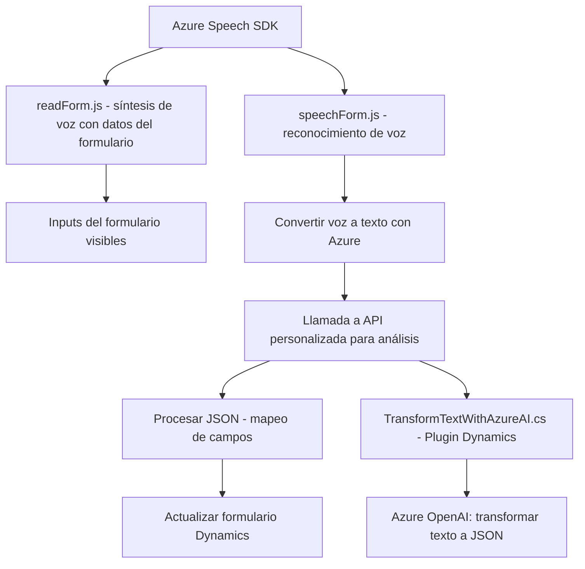

### Breve resumen técnico

El repositorio muestra una solución centrada en la integración funcional entre Microsoft Dynamics 365, Azure Speech SDK y Azure OpenAI para optimizar la interacción mediante voz y automatizar la transformación de texto. Incluye tres componentes principales:
1. **Frontend/JS/readForm.js**: Gestiona la extracción de datos visibles de formularios y permite su síntesis en voz usando Azure Speech SDK.
2. **Frontend/JS/speechForm.js**: Implementa reconocimiento de voz desde el usuario hacia el formulario, con opciones de procesamiento manual o ampliación mediante servicios de análisis personalizados.
3. **Plugins/TransformTextWithAzureAI.cs**: Define un plugin dinámico que transforma texto usando Azure OpenAI, con reglas estrictas de generación de estructuras JSON.

---

### Descripción de arquitectura

La solución utiliza una arquitectura modular basada en **servicios** y **SDK externos** para:
1. Proveer funcionalidades específicas de reconocimiento de voz y síntesis mediante el **Azure Speech SDK**.
2. Realizar transformaciones avanzadas de texto usando **Azure OpenAI**.
3. Establecer un flujo de comunicación entre interfaces frontend y el backend de Dynamics CRM mediante **plugins y APIs**.

La arquitectura predominante es **n-capas** debido a la separación clara entre:
- **Frontend**: Manejo de la interfaz interactiva y entrada/salida de datos (voz).
- **Backend**: Extensiones CRM con procesamiento de datos mediante plugins.
- **APIs externas**: Servicios de Azure/OpenAI integrados en ambas capas.

---

### Tecnologías usadas
1. **Microsoft Dynamics CRM & SDK**:
   - Framework para gestión e integración como plugins.
2. **Azure Speech SDK**:
   - Reconocimiento de voz.
   - Síntesis de voz.
3. **Azure OpenAI**:
   - Procesamiento de texto hacia estructuras JSON.
4. **JavaScript en frontend**:
   - Modularidad en frontend (formularios Dynamics CRM).
   - Uso de promesas y callbacks dinámicos.
5. **C# en backend**:
   - Implementación de plugins en Dynamics CRM.
   - Realización de solicitudes HTTP para APIs externas.
6. **Servicios externos integrados**:
   - `trial_TransformTextWithAzureAI` como servicio personalizado utilizando Dynamics API para procesamiento avanzado.

---

### Diagrama Mermaid válido para GitHub

---

### Conclusión final

La solución representa una integración avanzada para automatizar la interacción entre formularios Dynamics 365 y los servicios inteligentes de Azure (Speech y OpenAI). Sigue los principios de separación de responsabilidades con patrones de SDK, modularización funcional y uso de APIs externas.

#### Fortalezas:
- **Integración fluida:** Uso de Azure SDK y Dynamics API para conectar frontend y backend.
- **Adaptabilidad:** Posibilidad de extender con servicios personalizados como el análisis de texto avanzado.
- **Modularidad:** Las funciones y métodos están bien segmentados, facilitando el mantenimiento y escalabilidad.

#### Posibles mejoras:
1. Agregar pruebas unitarias tanto en backend (C# plugin) como para el frontend (JavaScript).
2. Optimizar el manejo de SDK externos mediante patrones asincrónicos más avanzados (e.g., Promises combinados con async/await).
3. Considerar el uso de herramientas de autenticación avanzada para proteger la comunicación con servicios externos como Azure.

En resumen, se trata de una arquitectura funcional que impulsa la eficiencia en el procesamiento de datos mediante interacción híbrida (voz-texto) adecuada para escenarios corporativos intensivos.