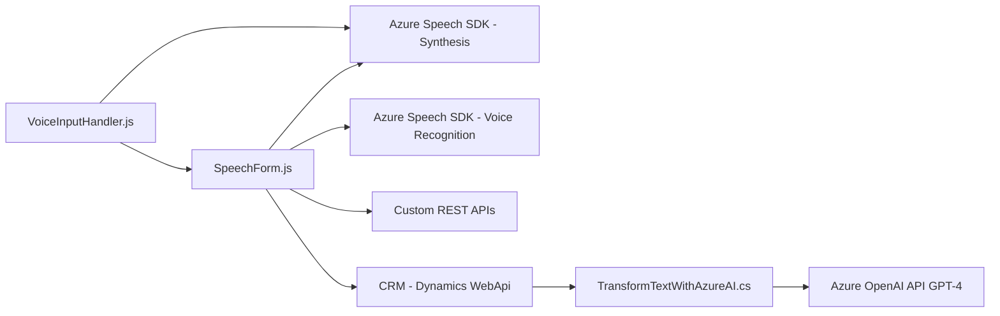

### Breve resumen técnico
El repositorio incluye tres módulos (arquivos) que implementan funcionalidades de entrada de voz, interacción con formularios CRM y procesamiento de texto utilizando Azure OpenAI y Azure Speech SDK. La solución parece destinada a una plataforma que combina entrada y salida por voz con el procesamiento de datos y text-to-speech para formularios empresariales, probablemente en un entorno CRM.

---

### Descripción de la arquitectura
La solución combina características de arquitectura basada en eventos y modularidad. Cada archivo se centra en una pieza específica dentro de una arquitectura orientada a componentes:
1. **Frontend:** Gestiona entrada de datos por voz y salida en text-to-speech usando funciones modulares.
2. **Integración con APIs:** Llama a APIs externas (Azure Speech y OpenAI) para síntesis de voz, reconocimiento y transformación de texto.
3. **Plugin layer en CRM:** Utiliza plugins para actualizar o transformar datos directo desde el sistema.

La solución parece estar diseñada bajo una arquitectura orientada a microservicios, donde diferentes servicios (por ejemplo, synthesizing voice, voice recognition, and AI text transformation) son integrados externamente pero interactúan como un ecosistema funcional.

Usa **patrones como modularidad, lazy loading, event-driven architecture, data mapping y plugin pattern**, con integración RESTful para comunicarse con servicios externos como Azure y APIs CRM personalizadas.

---

### Tecnologías usadas
1. **Frontend web:**
   - **JavaScript:** Lenguaje de programación utilizado en los módulos del frontend.
   - **Azure Speech SDK:** Gestión de reconocimiento de voz y síntesis.
2. **CRMs y Plugins:**
   - **Microsoft Dynamics CRM SDK:** Utilizado en el backend y plugins.
3. **Servicios API externos:**
   - **Azure OpenAI GPT:** Procesamiento avanzado y transformación de texto.
   - **REST API:** Para interactuar con servicios externos.

---

### Diagrama Mermaid válido para GitHub

---

### Conclusión final
La solución muestra un diseño moderno que integra el reconocimiento y la síntesis de voz con un sistema CRM (Microsoft Dynamics) mediante un enfoque event-driven y modular. La arquitectura microservicios permite incorporar servicios externos como Azure Speech SDK y Azure OpenAI API, ampliando las capacidades de interacción y procesamiento con comandos de voz y transformaciones AI para datos textuales. Esta estructura es adecuada para aplicaciones empresariales que requieren interacción basada en voz y automatización de información mediante servicios de inteligencia artificial y API. 

Para mejorar, sería clave:
- Verificar el almacenamiento seguro de claves (como las de Azure).
- Incluir pruebas unitarias de cada módulo.