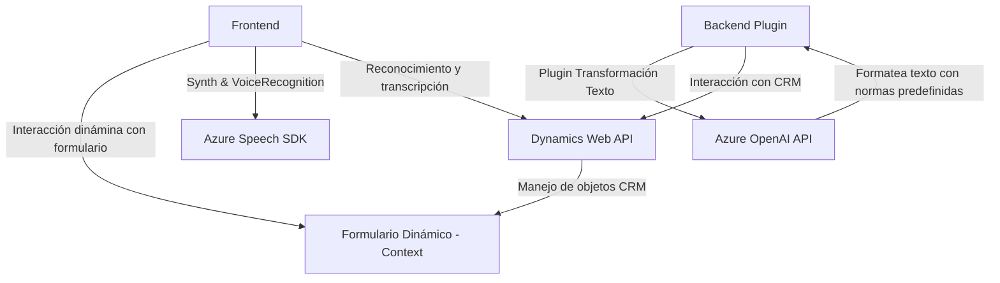

### Breve resumen técnico:
El repositorio contiene tres archivos diseñados para integrar inteligencia artificial y reconocimiento de voz en una solución que parece estar basada en Dynamics 365 (CRM), con soporte del Azure Speech SDK para funciones de síntesis y reconocimiento de voz, y Azure OpenAI para procesamiento avanzado de texto. 

---

### Descripción de la arquitectura:
La solución combina elementos de frontend y backend, en donde el frontend interactúa con formularios dinámicos y emplea SDK para síntesis y reconocimiento de voz. Por otro lado, el backend está basado en un plugin para Dynamics CRM que utiliza la API de Azure OpenAI para realizar transformaciones de texto. La arquitectura general está orientada hacia **n capas**, con separación clara entre la capa de presentación, lógica de negocio y acceso a servicios externos vía APIs.

---

### Tecnologías usadas:
1. **Frontend**:
   - Lenguaje: JavaScript.
   - SDK externo: Azure Speech SDK (para síntesis y reconocimiento de voz).
   - Dependencia de ejecución: Dynamics 365 `executionContext`.

2. **Backend**:
   - Lenguaje: C# (.NET Framework).
   - Dependencias:
     - `System.Net.Http` y `HttpClient` para peticiones REST.
     - `Newtonsoft.Json` y `System.Text.Json` para operaciones JSON.
     - Dynamics 365 SDK: `Microsoft.Xrm.Sdk`.
   - Servicio externo: Azure OpenAI API para procesamiento de texto mediante modelos de lenguaje.

3. **Patrones de diseño**:
   - Modularización: Las funciones del frontend y los métodos en el backend están claramente separados y cumplen roles específicos.
   - Carga dinámica de recursos: El SDK de Azure Speech se carga en el navegador solo bajo demanda.
   - Integración de API: Uso de dependencias externas para realizar procesos que no se implementan directamente en el sistema.

---

### Diagrama **Mermaid** válido para GitHub:

---

### Conclusión final:
La solución está diseñada para aprovechar servicios cloud avanzados como **Azure Speech SDK** y **Azure OpenAI API**, lo que permite integrar capacidades de síntesis y reconocimiento de voz. La arquitectura de **n capas**, con una separación explícita entre frontend y backend, permite escalabilidad y un diseño modular, mientras que el uso de servicios externos reduce la necesidad de desarrollar nuevas soluciones desde cero. Esto es ideal para sistemas basados en Dynamics 365 que requieren características avanzadas y flexibles para manejar operaciones en formularios dinámicos mediante interacción de inteligencia artificial y voz.