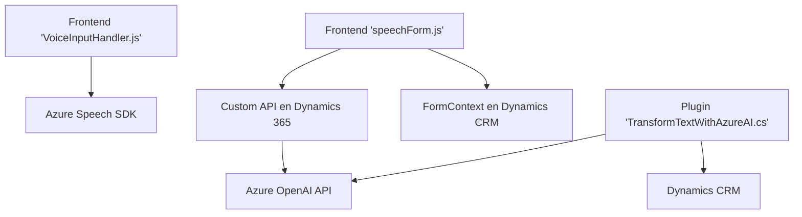

### Resumen técnico

El repositorio contiene múltiples archivos con lógica orientada a la integración de servicios externos. Estos archivos están relacionados con la interacción entre formularios, reconocimiento y síntesis de voz, transformación de texto mediante IA, y conexión con APIs externas como Azure Speech SDK y Azure OpenAI. Los archivos sugieren una solución orientada a mejorar la experiencia del usuario en escenarios de entrada y salida de datos mediante tecnologías avanzadas de voz y AI.

---

### Descripción de arquitectura

La arquitectura del sistema parece estar orientada a una **n-capas**, con capas bien divididas: 
1. **Capa de presentación**: Los archivos de frontend (JavaScript) encargados del manejo de la experiencia del usuario, procesamiento de voz, entrada y salida en formularios.
2. **Capa de lógica de negocio**: Representada por el plugin `TransformTextWithAzureAI.cs`, integrándose como un componente en Dynamics CRM para procesamiento backend.
3. **Capa de servicios externos**: Comunicación con APIs de Azure (Azure Speech SDK y Azure OpenAI API) como plataformas externas para reconocimiento de voz, síntesis de audio y transformación de texto.

El sistema utiliza integración con la API de Dynamics CRM para interactuar con datos. También hace uso de servicios en la nube, por lo que hay una aproximación hacia un enfoque **SOA** (arquitectura orientada a servicios).

---

### Tecnologías usadas

1. **Frontend**:
   - **JavaScript**: Lógica de interacción del cliente y conexión con servicios externos.
   - **Azure Speech SDK**: Para reconocimiento y síntesis de voz.

2. **Backend**:
   - **C#/.NET** para la implementación del plugin en Dynamics CRM (evento basado en `IPlugin`).
   - **Dynamics CRM SDK (Microsoft.Xrm.Sdk)**: Para interacción en el entorno CRM.
   - **Azure OpenAI API**: Para transformación de texto mediante IA.

3. **Dependencias externas**:
   - **Newtonsoft.Json** y `System.Text.Json`: Manipulación JSON.
   - **System.Net.Http**: Manejo de peticiones a APIs.

4. **Patrones**:
   - Modularidad: Funcionalidades encapsuladas dentro de funciones y métodos con propósito único.
   - SOA: Uso de APIs externas para extensibilidad del sistema.
   - Plugin pattern: Integración basada en `IPlugin` en CRM.

---

### Diagrama Mermaid válido para GitHub

---

### Conclusión final

La solución representa una integración moderna entre tecnologías de frontend, backend y servicios cloud para mejorar la interacción con formularios dinámicos en Microsoft Dynamics CRM. La arquitectura es mayormente basada en un estilo n-capas y tiene una fuerte dependencia en servicios externos de Azure, especialmente para el reconocimiento, síntesis de voz y transformación de texto con IA. Esto demuestra un uso avanzado de capacidades de Microsoft Azure y buenas prácticas de modularidad en el diseño de software.