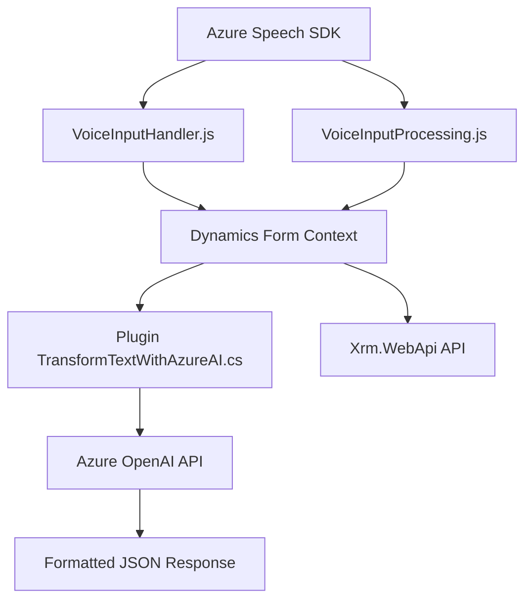

### Breve resumen técnico
Este repositorio contiene una solución que mezcla funcionalidades de frontend, integración con SDK de voz, y un plugin para transformación avanzada de texto mediante Azure AI. Los componentes principales se distribuyen entre el frontend (Javascript para interacción con formularios y voz) y backend C# (plugin para integrar OpenAI con Dynamics CRM). El sistema ofrece capacidades de entrada de voz, síntesis de texto y procesamiento basado en IA, lo que sugiere un enfoque API y event-driven.

---

### Descripción de arquitectura
1. **Tipo de solución:** La solución es una combinación de **frontend avanzado** con capacidades de interacción de voz y un plugin backend que extiende las funcionalidades de Dynamics CRM.
   
2. **Arquitectura:** La arquitectura combina elementos de:
   - **N-capas**: Con una separación clara entre presentación (frontend en JavaScript) y lógica empresarial (en el plugin C#).
   - **Hexagonal o Puertos y Adaptadores**: Especialmente el plugin, que actúa como puerto hacia Azure AI/OpenAI para servicios de transformación de texto.
   - **Microservicios ligados al cliente**: La lógica de voz en el frontend funciona como una especie de micro-servicio especializado para la interfaz del usuario.

---

### Tecnologías usadas
- **Frontend (JavaScript)**:
  - Azure Speech SDK: Para funcionalidades de síntesis y reconocimiento de voz.
  - Dynamics CRM APIs (integración directa con atributos de formularios).
- **Backend (C#)**:
  - SDK de Dynamics CRM: Para ejecutar lógica empresarial mediante plugins.
  - Azure OpenAI (GPT-4): Procesamiento inteligente de texto.
  - `System.Net.Http` para llamadas HTTP.
  - JSON para comunicación de datos estructurados.
- **Patrones utilizados**:
  - Modularización funcional: Separación de responsabilidades en funciones específicas.
  - Event-driven: Activación de funcionalidades por eventos (grabación de voz, ejecución de plugins).
  - Adaptadores: Interfaces hacia SDKs y APIs externas.

---

### Dependencias o componentes externos
**Dependencias clave:**
- **Azure Speech SDK**: Para manejo de síntesis y reconocimiento de voz en el frontend.
- **Azure OpenAI/GPT-4**: Para procesamiento avanzado de texto.
- **Dynamics CRM SDK**: Relacionado con la ejecución de plugins.
- **Xrm.WebApi**: Referenciado desde los archivos de frontend para conectar con APIs personalizadas del entorno CRM.

**Otros posibles servicios externos:**
- Entidades lookup utilizados en Dynamics CRM.
- API personalizada referenciada en `callCustomApi` para manejar lógica de IA.

---

### Diagrama **Mermaid**

---

### Conclusión final
Este repositorio implementa una solución híbrida orientada al frontend con integración directa a sistemas empresariales (Dynamics CRM). Su funcionalidad de voz y síntesis está bien encapsulada en módulos independientes en JavaScript y complementada por un plugin backend que usa Azure OpenAI para tareas de procesamiento de texto. La arquitectura es moderna, basada en interacciones con SDKs y APIs externas, y combina varios patrones como event-driven, adaptadores, y arquitectura n-capas.