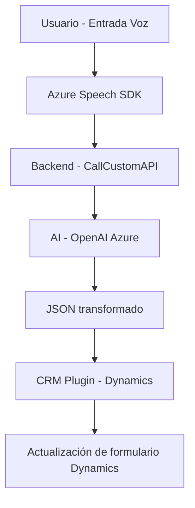

### Breve Resumen Técnico

El análisis de los tres archivos del repositorio muestra que se trata de una solución que implementa una integración entre un sistema CRM, servicios externos (Azure), y una solución personalizada de procesamiento y manejo de datos. Es evidente que el sistema está orientado a optimizar la interacción entre usuarios y formularios del CRM mediante reconocimiento de voz y transformación de datos con inteligencia artificial.

---

### Descripción de arquitectura

La arquitectura de la solución combina **componentes modulares y externalizados**, diseñados para mejorar la interacción y procesamiento de datos en un sistema CRM (probablemente Dynamics 365). Los elementos clave incluyen:

1. **Frontend JavaScript (Client-side)**: La carpeta `FRONTEND` contiene archivos que implementan la lógica de interacción del cliente, principalmente para reconocimiento de voz, extraer datos visibles de formularios, y comunicarse con APIs externas.
2. **Backend integrations with CRM Plugins**: El archivo `.cs` en el repositorio muestra que hay elementos que se ejecutan como **plugins** en el lado del servidor bajo Dynamics CRM para realizar transformaciones avanzadas de datos (Azure OpenAI).
3. **External Service Dependencies**:
   - **Azure Speech SDK** para el manejo de entrada y salida de voz en el frontend.
   - **Azure OpenAI API** (en el plugin de Dynamics CRM) para generar un JSON estructurado a partir de los textos ingresados.
4. **API-based integration**: Uso del `Xrm.WebAPI` de Dynamics 365 para la gestión de formularios y la ejecución de solicitudes desde el frontend con la lógica de la API personalizada `callCustomApi`.

### Tecnologías Usadas

1. **Frontend**:
   - JavaScript como lenguaje principal.
   - Azure Speech SDK para reconocimiento y síntesis de voz.
   - Dynamics 365 WebAPI para gestión del contexto de formularios.
   - Modularización de código para encapsular funcionalidades específicas.

2. **Backend**:
   - C# (Microsoft .NET Framework) para desarrollo de plugins de Dynamics CRM.
   - Azure OpenAI API para procesar texto avanzado.
   - HTTP Client (`System.Net.Http`) para realizar integraciones externas.
   - JSON Libraries (`System.Text.Json`, `Newtonsoft.Json.Linq`) para manejo estructurado de datos.

### Arquitectura

La solución implementa una **arquitectura de N-Capas** (o Layers), pero con integración de servicios externos, incluyendo:
- **Presentación:** Código JavaScript en el frontend que permite la interacción directa con el usuario mediante reconocimiento de voz y síntesis.
- **Lógica de Negocio:** Localizada en un plugin escrito en .NET para Dynamics CRM, encargado de ejecutar transformaciones utilizando la API de OpenAI.
- **Capas externas:** Servicios externos como Azure Speech SDK y OpenAI muestran una integración basada en **microservicios API externos**.

Se perciben patrones de arquitectura en área específica:
- **API Wrapper Pattern:** Para gestionar SDKs (Azure Speech SDK) y la comunicación con servicios externos, como el acceso a OpenAI API.
- **Dynamic Resource Loading Pattern:** Dinámico para la integración de SDKs como Azure Speech.
- **Data Transformation:** La lógica de transformación de datos mediante técnicas de inteligencia artificial y normalización sigue un enfoque pipeline, procesando paso a paso los datos con validaciones y adecuaciones técnicas.

---

### Diagrama **Mermaid** válido para GitHub

---

### Conclusión Final

La solución está diseñada como una integración modular con un sistema CRM que utiliza diferentes capas de tecnología para ofrecer procesamiento avanzado basado en la entrada de voz y transformación de datos con inteligencia artificial. La arquitectura implementa patrones de carga dinámica, modularidad funcional y orquestación de servicios externos, lo que es adecuado para aplicaciones empresariales en dinámicas focalizadas en CRM.

El diseño y las dependencias de esta solución deberían ser evaluadas con pruebas en un contexto robusto, dado el uso de SDKs y APIs externas como Azure Speech y OpenAI. A pesar de su dependencia de servicios computacionales externos, esta arquitectura presenta flexibilidad y escalabilidad, pero requiere una gestión adecuada de credenciales y tarifas de las APIs utilizadas.