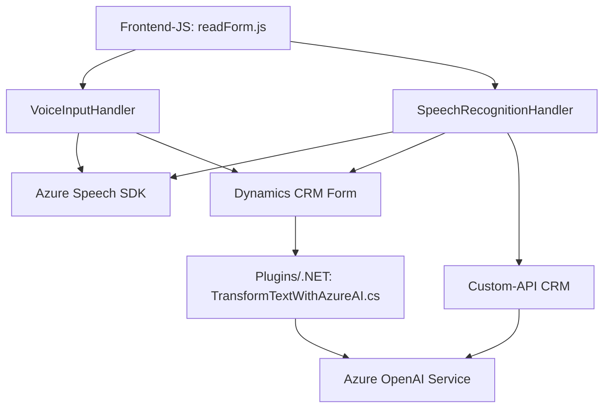

### Breve resumen técnico

Este repositorio contiene componentes para la integración de un sistema CRM con capacidades avanzadas de procesar comandos de voz, síntesis vocal, reconocimiento de voz, y transformación de texto a través de servicios de **Azure Speech SDK** y **Azure OpenAI**. Los archivos están organizados en tres capas principales: frontend interactivo (JavaScript), funcionalidad de reconocimiento y síntesis conectada al CRM, y un plugin en .NET para el procesamiento avanzado mediante IA.

---

### Descripción de arquitectura

La solución tiene una **arquitectura modular y orientada a servicios** que integra:
1. Un **frontend** (en JavaScript), encargado de capturar, procesar y sintetizar texto.
2. Un conjunto de **handlers y lógica de negocio en servidor** en el entorno de Dynamics CRM.
3. Plugins desarrollados en .NET que combinan servicios externos (Azure OpenAI y Speech SDK).

El repositorio muestra elementos de una **arquitectura de n capas**, que separa claramente:
- **Capa de presentación**: Implementada con JavaScript en el frontend, interactúa directamente con usuarios para entrada y salida de voz y texto.
- **Capa de lógica de negocio**: Manejo de datos en plugins y servicios que están integrados con Dynamics CRM a través de eventos y APIs.
- **Capa de acceso a datos**: Utiliza APIs del CRM y servicios externos (Speech SDK, OpenAI) para extraer, transformar y almacenar información.

---

### Tecnologías usadas

- **Frontend**:
  - `JavaScript`: Para el manejo de voz y visualización en formularios.
  - **Azure Speech SDK**: Para reconocimiento de voz y generación de texto a voz.
  - **Event-driven programming**: Estructura basada en eventos para inicializar procesos de voz.

- **Backend/Plugins**:
  - `.NET Framework` (Plugins con C#): Para procesos dinámicos dentro de Dynamics CRM.
  - `System.Net.Http` & `Json`: Comunicaciones con APIs externas (Azure OpenAI y Speech SDK).
  - **Azure OpenAI Service**: Utilizado en el plugin para procesamiento avanzado de texto mediante IA.

- **Patrones**:
  - **Modularidad**: Separación lógica de funciones y servicios.
  - **Event-driven**: Activación de funciones en respuesta a eventos del sistema CRM.
  - **Plugin-based Architecture**: Uso de Dynamics CRM para ejecutar lógica personalizada.
  - **Capa de servicio**: Comunicación interna y externa con componentes externos como Speech SDK y OpenAI.

---

### Diagrama Mermaid válido para GitHub

---

### Conclusión final

Esta solución representa una integración avanzada entre un sistema CRM y servicios en la nube, diseñada para mejorar la accesibilidad, interacción y automatización mediante tecnología de reconocimiento de voz y procesamiento de texto impulsado por IA. Su diseño modular permite extensibilidad, mientras que el patrón de arquitectura de **n capas** asegura una separación lógica entre presentación, lógica de negocio y acceso a datos. Las dependencias de terceros (Azure Speech SDK y Azure OpenAI) refuerzan la capacidad dinámica del sistema, manteniendo un enfoque orientado a eventos y servicios.