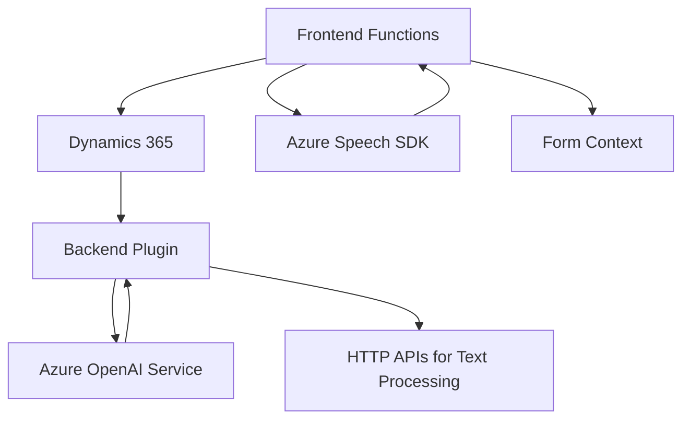

### **Análisis Técnico**

#### **Breve Resumen**
El repositorio contiene archivos relacionados con la integración entre formularios de Dynamics 365 y servicios de Azure, específicamente Azure Speech SDK y Azure OpenAI. La solución está diseñada para enriquecer la experiencia de usuario mediante reconocimiento y síntesis de voz, mapeo automático de datos en formularios, y transformación de texto con inteligencia artificial.

---

### **1. Tipo de Solución**
- El proyecto engloba una **solución híbrida**:
  - **Frontend:** Procesos basados en JavaScript para interacción directa con el SDK de Azure Speech y formularios de Dynamics 365.
  - **Backend:** Un plugin en C# que utiliza Azure OpenAI para transformar texto durante eventos específicos en Dynamics CRM.
  - **Integración con servicios externos (SDK, IA, APIs)**.
  - Compatible con **aplicaciones empresariales** orientadas al flujo de trabajo en CRMs.

---

### **2. Tecnologías, Frameworks y Patrones Usados**
#### **Tecnologías**
- **Language:** JavaScript (Frontend), C# (Backend Plugin).
- **Frameworks/SDKs:**
  - Azure Speech SDK (para reconocimiento y síntesis de voz).
  - Microsoft Dynamics CRM SDK (implementación de plugins).
  - Azure OpenAI GPT (transformación de texto en backend).

#### **Patrones Observados**
1. **Modularización:** código segmentado según responsabilidad.
2. **Observador:** Uso de callbacks para la carga de SDK y eventos como el reconocimiento de voz.
3. **Delegación:** Separación entre lógica básica y avanzada en las funciones del Frontend y Backend.
4. **Plugin-Based Architecture:** Una arquitectura típica de Dynamics CRM para reaccionar en eventos específicos.
5. **API Client:** Invocación a servicios en la nube mediante el cliente HTTP para ejecutar tareas específicas, como síntesis o transformación de texto.

---

### **3. Arquitectura**
- **Distribuida basada en servicios:** El diseño usa servicios en la nube de Azure (Speech SDK y OpenAI) que integran capacidades avanzadas como la IA y la generación de voz directamente en los componentes del software.
- **Modelo híbrido frontend-backend:**
  - La parte **frontend** utiliza una **arquitectura modular** orientada a funciones para manipular datos del formulario y comunicación dinámica con Speech SDK mediante JavaScript.
  - La parte **backend** sigue una arquitectura **plugin/microservicio** de Dynamics CRM, donde la lógica se ejecuta en respuesta a eventos de usuario.
- **Dependencias externas:** Se basa en conectividad con Azure para ejecutar tareas clave (voz e IA).

---

### **4. Dependencias y Componentes Externos**
1. **Azure Speech SDK**: Manejo de reconocimiento y síntesis de voz.
2. **Azure OpenAI GPT**: Transformación de texto empresarial.
3. **Microsoft Dynamics 365 SDK**: Interacción con formularios y APIs locales.
4. **HTTP Client Libraries**:
   - `System.Net.Http` y `HttpClient` para las llamadas HTTP desde el backend.
5. **Serialización JSON**:
   - `System.Text.Json` y `Newtonsoft.Json` para procesamiento de datos estructurados.

---

### **5. Diagrama Mermaid**

---

### **Conclusión Final**
Esta solución representa una integración moderna entre tecnologías empresariales de Dynamics 365 y servicios en la nube de Azure. De manera arquitectónica:
1. En **Frontend**, las funciones modulares interactúan directamente con el SDK de Azure para enriquecer formularios usando reconocimiento de voz y síntesis.
2. En **Backend**, el plugin utiliza inteligencia artificial vía Azure OpenAI para transformar texto en formatos estructurados.

La arquitectura está diseñada para aplicaciones escalables y se basa fuertemente en servicios externos de Azure.