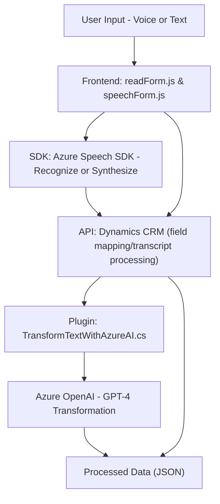

### Breve resumen técnico
Este repositorio contiene un conjunto de archivos que muestran la implementación de funcionalidades para la interactividad entre formularios web (frontend), reconocimiento y síntesis de voz usando el **Azure Speech SDK** y un plugin para **Dynamics 365** que utiliza **Azure OpenAI**. Los componentes están bien estructurados y modularizados.

---

### Descripción de Arquitectura
Este sistema sigue una **arquitectura de n capas**:
1. **Presentación (Frontend)**: Archivos `readForm.js` y `speechForm.js` en JavaScript que manejan la interacción con el usuario, lectura de formularios e integración con SDKs externos como Azure Speech.
2. **Negocio (Plugins)**: El archivo `TransformTextWithAzureAI.cs` actúa como capa de negocio, implementando reglas de transformación de texto mediante un patrón cliente REST hacia **Azure OpenAI**.
3. **Servicios externos**:
   - **Azure Speech SDK** para síntesis y reconocimiento de voz.
   - **Azure OpenAI Service** para procesamiento de texto con GPT.
4. **Datos**: Integración directa con Microsoft Dynamics CRM usando su capa API y objetos (`Xrm.WebApi`, `formContext`).

La arquitectura no califica como microservicios, ya que depende directamente de Dynamics CRM. Sin embargo, dentro de las capas, se utiliza un enfoque **modular orientado a servicios**, dividiendo la lógica en unidades independientes.

---

### Tecnologías usadas
1. **Frontend:**
   - **JavaScript**: Para interacción con formularios y SDKs basados en el navegador.
   - **Azure Speech SDK**: Reconocimiento y síntesis de voz en tiempo real.
   - **Microsoft Dynamics CRM APIs (`Xrm.WebApi`)**: Administración y modificación dinámica de formularios.
2. **Backend:**
   - **C#:** Desarrollo del plugin extendiendo la interfaz `IPlugin` de Dynamics CRM.
   - **Azure OpenAI Service**: Funcionalidad basada en GPT para transformación automática de texto.
   - **REST APIs (System.Net.Http)**: Comunicación HTTP entre el plugin y servicios externos.
   - **JSON Utilities (`System.Text.Json`)**: Serialización y deserialización de datos JSON.

---

### Diagrama Mermaid válido para GitHub

---

### Conclusión Final
Este proyecto es una **hybrid cloud integration architecture** que presenta una solución completamente integrada usando SDKs de voz y servicios de AI en Azure con la plataforma Dynamics CRM. Su diseño modular facilita la gestión del código en varias capas: presentación, negocio y datos. Sin embargo, hay áreas que pueden ser mejoradas:
1. **Seguridad**: Las claves API deben ser gestionadas con variables de ambiente o servicios de configuración segura.
2. **Extensibilidad**: Aunque el diseño modular favorece la ampliación, el acoplamiento con Dynamics CRM limita la portabilidad del código a otras plataformas.
3. **Documentación**: Las operaciones principales están bien descritas, pero faltan referencias claras a los puntos de configuración clave (por ejemplo, `azureKey` y las URL de APIs).

En general, la solución es robusta para aplicaciones específicas de Dynamics CRM que requieren procesamiento de voz y texto avanzado.