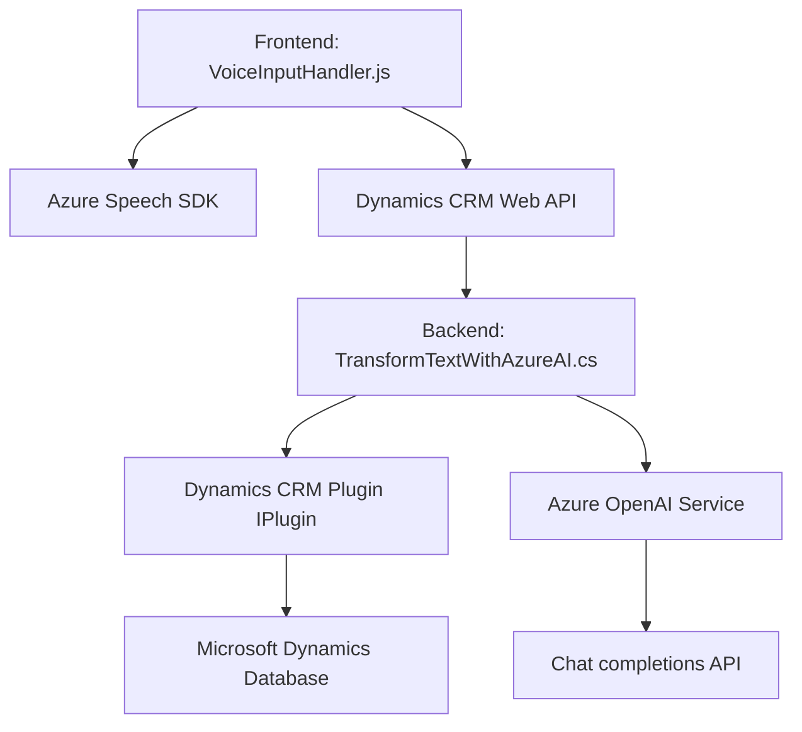

### Breve resumen técnico
El repositorio integra funcionalidades orientadas a la interacción dinámica entre usuarios y una plataforma CRM (Microsoft Dynamics). Utiliza tecnologías avanzadas como reconocimiento de voz y procesamiento de texto con inteligencia artificial mediante servicios de Azure. Está dividido en módulos frontend y backend (plugins), con un enfoque modular.

### Descripción de arquitectura
La solución tiene una arquitectura de **n capas**, separando lógicamente las responsabilidades:
1. **Frontend**: Módulos de JavaScript para la interacción con formularios, reconocimiento de voz y sintetización de texto.
2. **Backend**: Plugins que interactúan con Dynamics CRM y servicios externos (Azure OpenAI) para el procesamiento de texto estructurado.

El diseño aplica principios de modularidad y desacoplamiento, ya que el frontend realiza reconocimiento de voz, mientras que la lógica compleja es delegada a APIs externas y plugins en el backend.

### Tecnologías usadas
1. **Frontend**:
   - Lenguaje: JavaScript
   - Frameworks/Sistemas: Microsoft Dynamics CRM web APIs
   - Dependencias:
     - Azure Speech SDK: Reconocimiento y sintetización de voz
     - Lógica de interacción con DOM y formularios

2. **Backend**:
   - Lenguaje: C#
   - Frameworks/Sistemas: 
     - Microsoft Dynamics SDK (`IPlugin`, `Microsoft.Xrm.Sdk`)
     - JSON processing libraries: Newtonsoft.Json.Linq, System.Text.Json
   - Servicios externos:
     - Azure OpenAI (chat completions API)

### Diagrama Mermaid válido para GitHub

### Conclusión final
La solución presentada tiene una arquitectura de **n capas** que distribuye claramente las responsabilidades entre un módulo de frontend interactivo (reconocimiento y síntesis de voz) y un backend orientado a servicios (procesamiento con API de Azure OpenAI). Las tecnologías utilizadas son adecuadas para entornos donde interacción dinámica y procesamiento automatizado de información son requisitos esenciales, especialmente en aplicaciones corporativas de CRM.