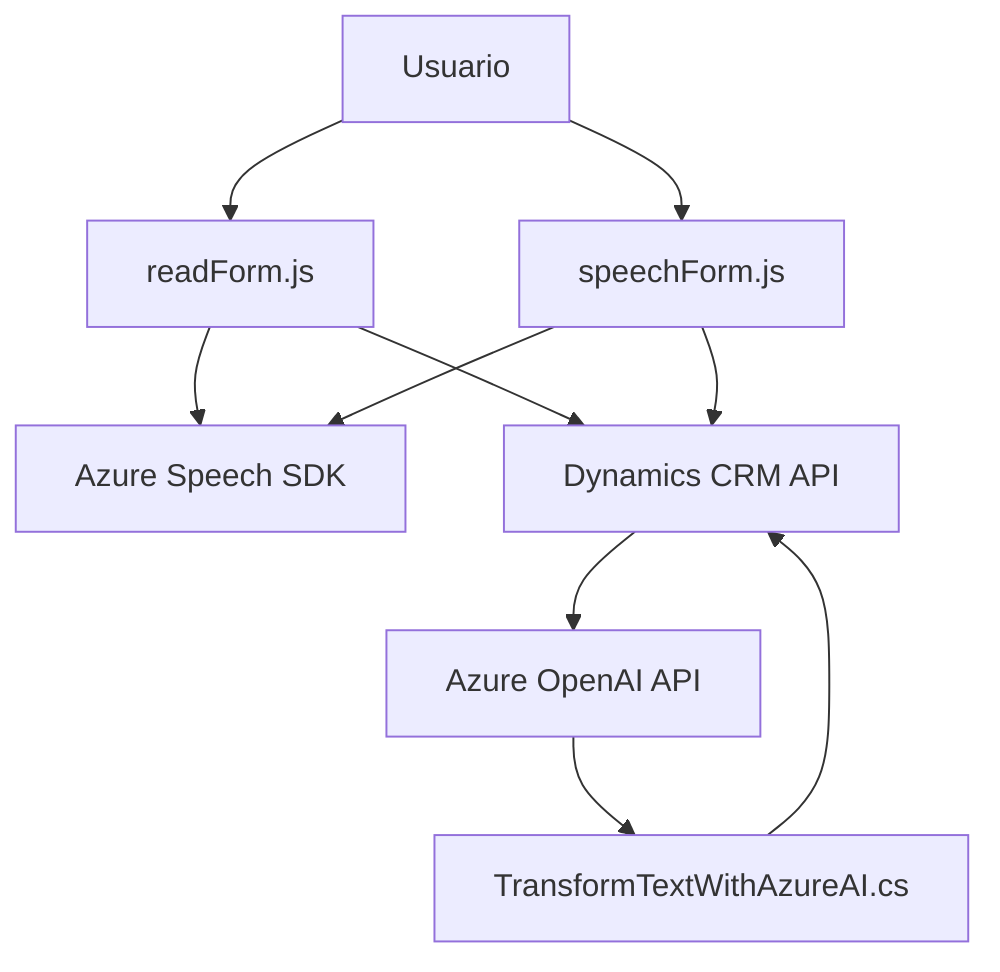

### Breve resumen técnico

El repositorio proporciona scripts para interacción con formularios mediante entrada y salida de voz, apoyándose en **Azure Speech SDK** y **Dynamics CRM**. Además, ofrece un plugin para transformar texto usando **Azure OpenAI API**.

### Descripción de arquitectura
La solución utiliza **Frontend**, **integración con servicios en la nube** y un **plugin** para procesamiento en el backend de Dynamics CRM. Está estructurada en capas:
1. **Capa de presentación**: Scripts `readForm.js` y `speechForm.js` en el frontend, que interactúan con el usuario y procesan datos de entrada/salida.
2. **Capa de lógica de negocio**: Funcionalidades encapsuladas en el plugin `TransformTextWithAzureAI.cs` y las APIs de Dynamics CRM.
3. **Capa de datos y servicios externos**: Comunicación con **Azure Speech SDK** y **Azure OpenAI** para síntesis y procesamiento de texto/voz.

La arquitectura parece ser **n capas**, con dependencias directas de servicios externos (Azure). No es completamente desacoplada, ya que las integraciones son específicas del sistema Dynamics CRM.

### Tecnologías usadas
1. **Backend**:
   - **C#**: Implementación del plugin de Dynamics CRM.
   - **Dynamics CRM SDK**: Para la inserción de datos y ejecución de acciones dentro de la plataforma.
   - **Azure OpenAI Service**: Procesamiento del texto con inteligencia artificial.
   - **Azure Speech SDK**: Reconocimiento y síntesis de voz.
   - **HTTP/Rest APIs**: Para comunicación con servicios externos.

2. **Frontend**:
   - **JavaScript**: Scripts que gestionan la interacción del usuario mediante voz y entrada.
   - **DOM Manipulation**: Para leer y escribir datos en los formularios específicos del CRM.

### Diagrama Mermaid válido para GitHub

### Conclusión final
La solución combina un **frontend** dinámico con eventos de voz y un **backend con plugin** orientado a trabajar sobre Dynamics CRM. Usa servicios avanzados en la nube (Azure Speech y OpenAI) para proporcionar una experiencia interactiva con voz y procesamiento contextual. Si bien se presenta como una arquitectura **n-capas**, podría optimizarse hacia **hexagonal** para una mejor separación de responsabilidades entre frontend, backend y servicios externos.