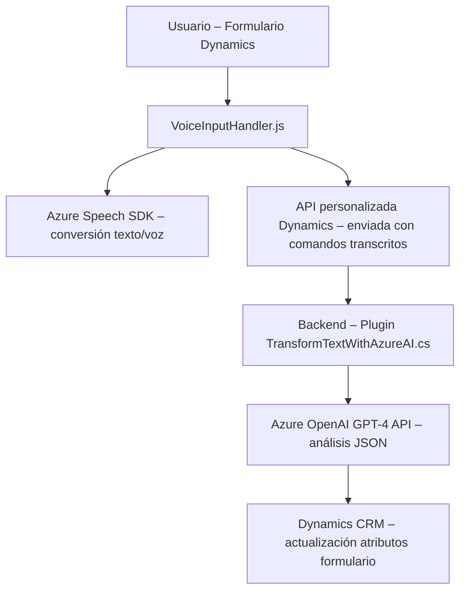

### **Breve resumen técnico**
El repositorio contiene una solución orientada al procesamiento de entradas basadas en voz y texto con integración de servicios cognitivos de Azure (Azure Speech SDK y Azure OpenAI). Los archivos presentan componentes para el frontend (Javascript) y un plugin para Dynamics CRM (C#).

---

### **Descripción de arquitectura**
La solución es una arquitectura de **n capas** distribuida en al menos dos niveles:
1. **Capa de presentación/interacción**: Implementado con _Javascript_ en el frontend de Dynamics 365, que gestiona la entrada de voz y la comunicación con APIs externas (Azure OpenAI y Dynamics CRM).
2. **Capa de lógica de negocio** (_backend – Microsoft Dynamics 365 Plugin_): Implementada mediante _C#_, procesa datos y delega operaciones al servicio de Azure OpenAI. Además, integra directamente con la API de Dynamics CRM y sus objetos.

Ambas capas están conectadas a servicios externos proporcionados por Azure para facilitar tareas como _speech-to-text_, _text-to-speech_ y generación de texto estructurado mediante modelos GPT.

Se aplican patrones como **event-driven architecture**, **client-side dynamic loading**, y uso de una **capa de integración** para conectar el sistema empresarial (Dynamics CRM) con servicios externos.

---

### **Tecnologías, frameworks y patrones usados**
1. **Tecnologías:**
   - **Frontend:** Javascript (vanilla JS).
   - **Backend:** C#, Dynamics CRM SDK APIs.
   - **Microsoft Azure Speech SDK** (para síntesis de voz y reconocimiento de datos).
   - **Azure OpenAI GPT-4** API (análisis de texto).
   
2. **Frameworks:**
   - **Dynamics 365**: Utilizado para formularios y plugins en el backend.
   - **HTTP Client Libraries** (_System.Net.Http_ y _Newtonsoft.Json.Linq_).

3. **Patrones de Arquitectura:**
   - **Evento dirigido** (_Event-driven programming_): A través de callbacks para la carga dinámica del SDK y la interacción con APIs.
   - **Integración API Pattern**: Las llamadas a servicios de Azure están centralizadas en métodos específicos, permitiendo una capa de abstracción.
   - **Factory Pattern:** Creación en tiempo de ejecución de configuraciones e instancias para Azure Speech.
   - **Modularización:** Código segmentado en funciones y clases reutilizables y orientado a la separación de responsabilidades.

---

### **Dependencias o componentes externos presentes**
La solución presenta las siguientes dependencias externas:
1. **Microsoft Azure Speech SDK:**
   - Dinámicamente cargado en el navegador desde la URL `"https://aka.ms/csspeech/jsbrowserpackageraw"`.
2. **Azure OpenAI GPT-4 API:**
   - Servicio de inteligencia artificial para análisis y generación de texto por demanda.
   - Dirección configurada en el archivo del plugin: `"https://openai-netcore.openai.azure.com/"`.
3. **Microsoft Dynamics 365 APIs:**
   - Utilizado para casos específicos de datos organizacionales, como formularios y atributos estructurados.
4. **Librerías de soporte:**
   - Javascript (_Funciones del navegador_).
   - C# (`System.Text.RegularExpressions`, `Newtonsoft.Json`, `System.Net.Http`).

---

### **Diagrama Mermaid**

---

### **Conclusión final**
Este repositorio representa una solución de **integración avanzada** con plataformas de Microsoft Dynamics CRM, utilizando servicios cognitivos de Azure como el Speech SDK y OpenAI GPT-4 para enriquecer la experiencia del usuario. La solución adopta una arquitectura de **n capas**, con separación clara entre UI, lógica de negocio y servicios externos. Destaca por la modularidad del código, el uso de patrones de diseño recomendados (eventos, fábrica e integración de APIs) y la implementación de complementos adheridos a la arquitectura de extensibilidad de Dynamics CRM.