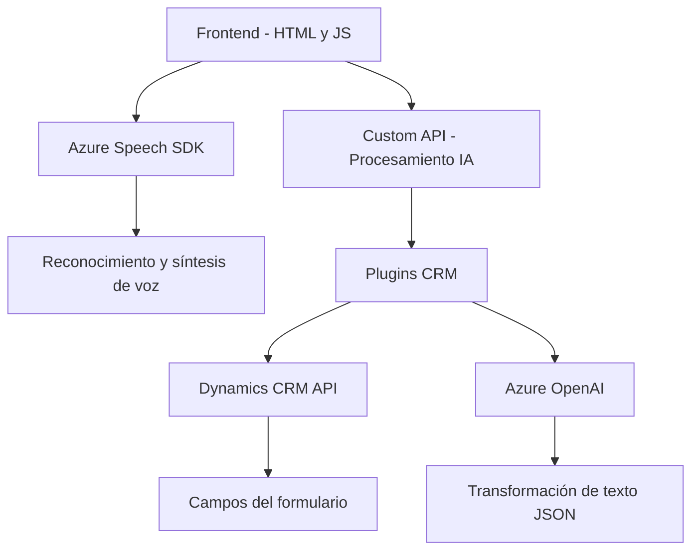

### Breve resumen técnico
El repositorio analizado contiene tres componentes principales:
1. **Frontend**: Implementa interacción entre formularios y el reconocimiento de voz, con integración de Azure Speech SDK.
2. **Plugin en Dynamics CRM**: Realiza transformaciones del texto mediante Azure OpenAI en entornos Dynamics.
3. **API personalizada**: Expone transformación de texto hacia el frontend.

### Descripción de arquitectura
La arquitectura representada en el repositorio sigue un enfoque **modular con integración externa**. El sistema tiene las siguientes características clave:
1. **Frontend con SDK externo**: Procesa datos de formularios y emplea reconocimiento o síntesis de voz.
2. **Plugin centrado en CRM**: Extiende funcionalidad mediante procesamiento de OpenAI.
3. **Uso de un patrón de capas**:
   - Una capa para la interfaz de usuario (Frontend).
   - Una capa de lógica del negocio (Plugins CRM).
   - Una capa para integración con servicios externos (Azure Speech, OpenAI).

### Tecnologías usadas
- **Frontend**:
  - SDK de reconocimiento de voz: Azure Speech SDK.
  - Llamadas a APIs externas y personalizadas: Dynamics CRM WebAPI.
  - JavaScript para lógica del cliente y manipulación DOM de formularios.
- **Plugin Dynamics**:
  - Framework .NET para desarrollo de extensiones.
  - Microsoft.Xrm.Sdk para interacción con Dynamics CRM.
  - Azure OpenAI para procesamiento de datos mediante IA.
  - Librerías JSON (`System.Text.Json`, `Newtonsoft.Json.Linq`) para manejo de respuestas API.

### Dependencias o componentes externos presentes
#### En el Frontend:
- **Azure Speech SDK**: Integración directa desde un CDN para reconocimiento de voz y síntesis.
- **Dynamics 365 API (Xrm.WebApi)**: Utilizada para operaciones CRUD y de interfaz.
- **Custom API**: Captura y procesa texto mediante Dynamic API personalizada.
#### En el Plugin:
- **Azure OpenAI Services**: Endpoint de OpenAI en Azure para transformaciones de texto.
- **Dynamics CRM SDK**: Abstrae acceso en contexto CRM.

---

### Diagrama Mermaid válido para GitHub

### Conclusión final
Esta solución es una integral entre tecnologías frontend, extensiones de Dynamics CRM, y servicios externos para interacción con inteligencia artificial. Su arquitectura modular permite mejorar la funcionalidad de interacción con formularios mediante reconocimiento y síntesis de voz, así como el procesamiento de datos con IA. Sin embargo, algunas áreas tienen oportunidades de mejora, como:
1. **Uso síncrono de APIs en el plugin CRM**: Esto puede impactar el rendimiento en escenarios de alta concurrencia.
2. **Acoplamiento fuerte con servicios externos**: Aunque necesario, podría generar fallos críticos si las dependencias como Azure OpenAI no están disponibles.

En general, la arquitectura presentada está diseñada para la interacción avanzada con formularios y servicios de AI, siendo adecuada para aplicaciones empresariales.