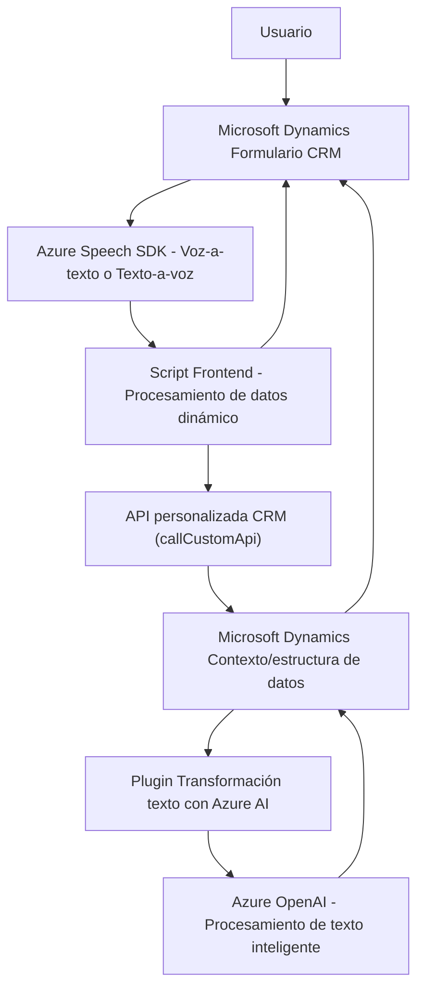

### Breve resumen técnico:
Los tres archivos representan una solución integral orientada a la captura, procesamiento y conversión de datos interactivos con voz en un entorno de Microsoft Dynamics CRM. Se integran servicios externos (Azure Speech SDK y Azure OpenAI), empleando patrones modulares y orientados a servicios.

### Descripción de arquitectura:
1. **Tipo de solución:** Sistema híbrido de **integración API con frontend y backend** para Microsoft Dynamics CRM y procesamiento externo mediante inteligencia artificial (Azure).
2. **Arquitectura principal:** 
   - **Frontend:** Modular, basado en scripts de JavaScript para el procesamiento en el navegador y manipulación de formularios.
   - **Backend:** Construcción basada en **extensiones Plugin para Dynamics CRM**, interactuando con servicios externos (Azure OpenAI) y manipulando JSON interno para lógica empresarial.
   - **Patrones usados:** 
     - Modularidad.
     - Interoperabilidad vía SDK/HTTP.
     - Separación de responsabilidades (frontend y plugins).

### Tecnologías usadas:
1. **Frontend:**
   - JavaScript.
   - Azure Speech SDK para síntesis y reconocimiento de voz.
   - Contextos de formulario para sistemas CRM.
   - Manipulación dinámica de datos del formulario (`getFieldMap`, `applyValueToField`).
2. **Backend/Plugin:**
   - C#, diseño con el estándar de **plugins CRM Dynamics** (interfaz `IPlugin`).
   - Uso de regular expressions para parsing avanzado.
   - `Newtonsoft.Json` y herramientas de manejo JSON.
   - **Azure OpenAI** para procesamiento avanzado de lenguaje natural.

### Dependencias externas:
1. **Azure Speech SDK:** Utilizado para convertir texto en audio (síntesis de voz) y reconocimiento de voz.
2. **Azure OpenAI:** Procesa texto y aplica inteligencia artificial para estructuración JSON.
3. **Microsoft Dynamics Web API:** Manipulación de datos en formularios CRM y gestión de contexto (entorno de ejecución).

### Diagrama Mermaid válido para GitHub:

### Conclusión final:
Esta solución combina elementos de frontend modular en JavaScript, un backend implementado como plugins de Dynamics CRM en C#, y servicios externos en Azure para inteligencia artificial y procesamiento de voz. La arquitectura es altamente orientada a servicios y modular, permitiendo la escalabilidad, integración y adaptación. Ideal para entornos basados en Microsoft CRM donde la interacción con voz y la IA puedan mejorar la experiencia del usuario.