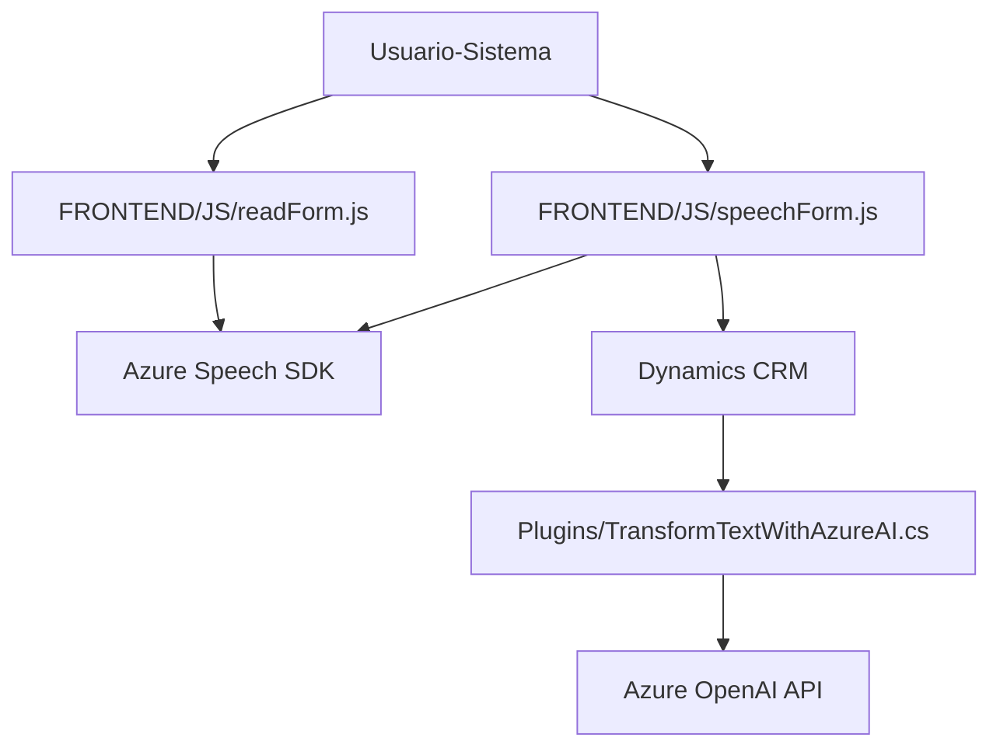

### Breve Resumen Técnico
La solución en el repositorio establece una integración completa para procesar datos hablados y textuales en un entorno **Dynamics 365 CRM**, utilizando servicios **Azure Speech SDK** y un plugin basado en **Azure OpenAI**. Los componentes de frontend se encargan de grabar, transcribir y extraer información basada en los formularios, mientras que el backend transforma texto en formatos estructurados mediante inteligencia artificial. Esto es una muestra de una arquitectura con integración de servicios externos y enfoque modular.

---

### Descripción de Arquitectura
La arquitectura general se divide en dos capas principales:

1. **Frontend**: Implementación basada en JavaScript que realiza funciones como el reconocimiento de voz, transcripción, preparación de datos y actualización de formularios.
   - **Modularidad**: Cada archivo se diseña como una unidad independiente funcional (grabación de voz, transcripción de audio, extracción de datos, procesamiento de texto).
   - **Cargas dinámicas**: Se adapta a la disponibilidad del SDK de Azure en tiempo de ejecución.
   
2. **Backend (Plugin CRM)**: Un plugin desarrollado en C# que implementa un patrón clásico de **Dynamics CRM Plugin**.
   - **Interfaz IPlugin**: Ejecuta eventos desencadenados por el CRM.
   - **Azure OpenAI Integration**: Utiliza servicios de inteligencia artificial para transformar datos textuales en JSON procesable.

Patrones principales:
- **Multicapa**: Hay una separación clara de responsabilidades entre el frontend (gestión inicial) y el backend (procesamiento avanzado).
- **Integración API**: Comunicación fluida entre el sistema Dynamics CRM y los servicios de Azure.
- **Plugin Design Pattern**: Usado en el código C# para integrar procesamiento específico en eventos del CRM.

---

### Tecnologías Usadas
1. **Frontend (JavaScript)**:
   - **Azure Speech SDK**: Captura de voz y síntesis hablada.
   - **Dynamics CRM APIs**: Manipulación de formas y datos en el contexto del CRM.
   - **Modular Functionality in JavaScript**: Uso extensivo de funciones encapsuladas para legibilidad y reutilización.

2. **Backend (C#)**:
   - **C#**: Para la implementación del plugin y manejo de lógica.
   - **Dynamics CRM Plugins**: Desarrollado utilizando `IServiceProvider` y otras interfaces de Dynamics SDK.
   - **Azure OpenAI API**: Uso de modelos GPT-4 para transformación avanzada de texto.
   - **Json Libraries**: `System.Text.Json` y `Newtonsoft.Json.Linq` para procesar datos JSON.

3. **Integración de Servicios Externos**:
   - Azure Speech SDK (para voz y reconocimiento relacionado).
   - Azure OpenAI API (procesamiento mediante IA).

4. **Consumo de APIs**:
   - Carga dinámica del SDK JavaScript desde `"https://aka.ms/csspeech/jsbrowserpackageraw"`.
   - En el Plugin CRM, consumo mediante llamadas HTTP REST a OpenAI API configuradas bajo Azure.

---

### Diagrama Mermaid

### Conclusión Final
El repositorio implementa una **solución de integración avanzada**, donde el ecosistema Dynamics CRM se conecta con servicios externos mediante tecnologías de inteligencia artificial en Azure. Con una arquitectura modular que aprovecha el principio de separación de capas, la solución realiza capturas de voz y enriquecimiento de datos para automatizar tareas complejas. Se trata de un sistema que puede ser considerado **multicapa** y **extensible**, adecuado para entornos corporativos que requieran interacción avanzada con los usuarios.