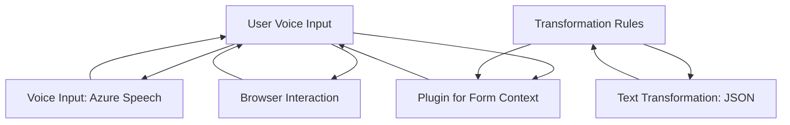

### Resumen técnico
Este repositorio contiene componentes que interactúan con Microsoft Dynamics 365 y Azure. La solución tiene tres partes principales:
1. Un **frontend** desarrollado en JavaScript para implementar funcionalidades de síntesis y entrada de voz mediante **Azure Speech SDK**.
2. Un **plugin en C#**, usado como extensión en Dynamics CRM para transformación de texto a JSON estructurado, integrándose con **Azure OpenAI GPT-4**.
3. Arquitecturalmente, se aprovechan capacidades de extensibilidad de Dynamics 365 y los servicios cloud de Azure.

### Descripción de arquitectura
La solución utiliza una arquitectura modular con las siguientes características:
- **Cliente-Servidor:** Los archivos frontend consumen datos del usuario y se conectan con servicios externos, como **Azure Speech SDK**, y también interactúan con la API de Dynamics.
- **Event-driven architecture:** En el frontend, las transcripciones y grabaciones de voz dependen de eventos como `recognizeOnceAsync`.
- **Plugins:** En el backend (C#), se implementa una arquitectura de plugins específica para Dynamics CRM que responde al contexto de ejecución.
- La arquitectura podría asimilarse a un enfoque de **n capas**:
  - Capa de presentación: módulos frontend que interactúan con el usuario.
  - Capa lógica/aplicación: procesamiento en el código C# y funciones de JavaScript.
  - Capa de integración: consumo de APIs externas como Azure Speech SDK y Azure OpenAI.

### Tecnologías usadas
1. **Front-end:** 
   - JavaScript.
   - Azure Speech SDK (Utiliza servicios de conversión de texto a voz y reconocimiento de voz).
   - Dynamics 365 Context (`executionContext`, `formContext`) para manipulación de datos en formularios del CRM.
   - APIs y programación asíncrona (`Promise`, `async/await`).

2. **Backend (C#):**
   - Microsoft Dynamics SDK para plugins.
   - Azure OpenAI GPT-4 integrado por medio de solicitudes **REST** usando **HttpClient**.
   - Librerías para procesamiento de texto y manipulación de JSON (`Newtonsoft.Json.Linq`).

### Dependencias o componentes externos presentes
1. **Azure Speech SDK:** Para brindar funcionalidades de entrada y síntesis de voz. Utiliza claves y regiones específicas de Azure (identidad en la nube).
2. **Dynamics CRM API (Xrm.WebApi):** Permite la manipulación de formularios y datos en el sistema CRM de Microsoft Dynamics 365.
3. **Azure OpenAI GPT API:** Para ejecutar transformaciones avanzadas de texto a JSON utilizando técnicas IA de OpenAI dentro de servicios de Azure.
4. **Newtonsoft.Json:** Librería ampliamente utilizada para el manejo de datos en formato JSON en aplicaciones .NET.
5. **Contexto de Dynamics (executionContext):** Contexto derivado del entorno de Microsoft Dynamics CRM para ejecutar plugins y gestionar formularios.

### Diagrama Mermaid

### Conclusión final
La solución está diseñada para facilitar la interacción entre Dynamics 365 y servicios avanzados de Azure (Speech SDK y OpenAI GPT). Utiliza una arquitectura modular escalable, combinando procesamiento local en el frontend con invocaciones remotas a APIs externas. La implementación es adecuada para escenarios de entrada/salida de voz en formularios CRM, con posibilidades de integrarse más profundamente en soluciones empresariales basadas en IA. Sin embargo, su dependencia de credenciales y configuración de servicios en la nube requiere una gestión eficiente y segura.