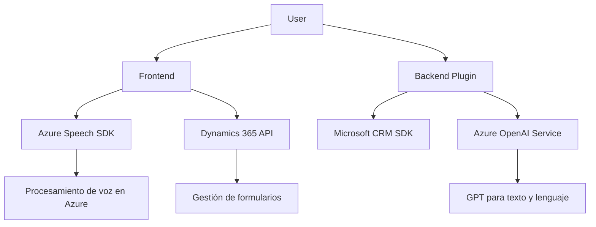

### Resumen Técnico
Este repositorio contiene tres archivos principales:
1. **Frontend/JS/readForm.js:** Convierten los datos de formularios de una aplicación Dynamics 365 en texto utilizando Azure Speech SDK.
2. **Frontend/JS/speechForm.js:** Maneja la entrada por voz, transcripción, y actualización de campos del formulario con soporte para integración de inteligencia artificial.
3. **Plugins/TransformTextWithAzureAI.cs:** Un plugin para Microsoft Dynamics CRM que transforma texto utilizando Azure OpenAI.

La solución integra procesamiento de voz, texto y uso de inteligencia artificial a través de servicios en la nube, destacándose por el uso extensivo de patrones como la modularidad y arquitectura orientada a servicios (SOA).

---

### Descripción de la Arquitectura
La solución implementa una **arquitectura orientada a servicios (SOA)**, compuesta de tres capas principales:
1. **Frontend:** Construido en JavaScript, interactúa directamente con usuarios en aplicaciones Dynamics 365. Utiliza el **Azure Speech SDK** para entrada de voz o sintetización de texto, con un enfoque modular para encapsular la lógica de cada funcionalidad.
2. **Backend/Plugins:** Extensible mediante un plugin que usa **Microsoft Dynamics CRM SDK** para gestionar eventos y realizar tareas adicionales, como la integración con **Azure OpenAI** para transformar texto.
3. **Servicios Externos:** Hace uso de APIs en la nube, como Azure Services (Speech SDK y OpenAI), para enriquecer el flujo de datos y mejorar la experiencia de usuario.  

Esta solución emplea una combinación de **patrones SOA**, arquitectura de tres capas y **modularidad funcional** para separar preocupaciones: los servicios de frontend se enfocan en manipulación de datos y audio, mientras que los plugins integran procesamiento con inteligencia artificial a nivel backend.

---

### Tecnologías y Frameworks Usados
1. **Frontend:**
   - **JavaScript:** Para funcionalidades como entrada y síntesis de voz.
   - **Azure Speech SDK:** Biblioteca para integración de voz con Azure.
   - **Dynamics 365 JavaScript API (`Xrm.WebApi.online`)**: Para trabajar con entidades y campos del formulario.

2. **Backend/Plugins:**
   - **Microsoft Dynamics CRM SDK:** Interface `IPlugin` para extensibilidad.
   - **Azure OpenAI Service:** Modelo GPT para procesamiento de lenguaje natural.
   - **System.Net.Http:** Para realizar solicitudes HTTP hacia OpenAI.
   - **JSON Serializers (System.Text.Json, Newtonsoft):** Para manipulación estructurada de datos.

3. **Servicios Externos:**
   - Speech-to-Text y Text-to-Speech mediante Azure Speech Services.
   - Transformación de texto enriquecido basado en Azure OpenAI.

---

### Principales Dependencias y Componentes Externos
- **Servicios en la nube:** Azure APIs, incluyendo Speech SDK y OpenAI para voz, texto, y procesamiento por IA.
- **SDKs de Dynamics:** Base para acceder, gestionar y extender la funcionalidad de formularios y entidades en Dynamics 365.
- **Serialización JSON:** Bibliotecas como Newtonsoft y System.Text.Json para trabajar con datos estructurados.
- **HTTP Connection:** Para integrar comunicación con APIs externas.

---

### Diagrama **Mermaid** para GitHub Markdown

---

### Conclusión Final
La solución está diseñada para ser una extensión funcional de Dynamics 365, habilitando funcionalidades avanzadas como entrada por voz, transcripción basada en IA, y procesamiento de texto enriquecido. Utiliza servicios en la nube (Azure Speech API y OpenAI) y sigue principios de modularidad, orientados a servicios, combinados con una arquitectura de tres capas y plugins.

El diseño es moderno, integrando la tecnología en un flujo integral que combina cliente (UI) con servicios backend y la nube. Sin embargo, destaca la necesidad de mejorar la gestión de credenciales y seguridad para alinearse con prácticas recomendadas.