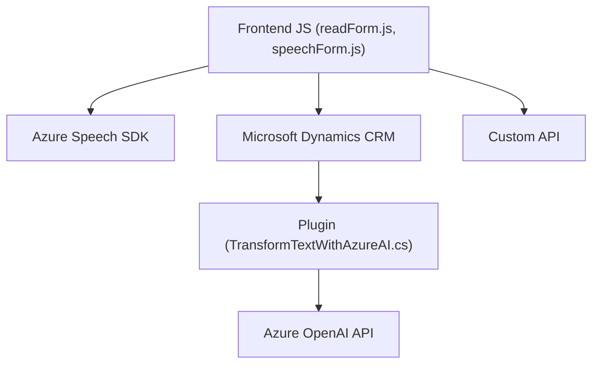

### Breve resumen técnico
El proyecto abarca una solución orientada a la interacción dinámica de formularios en Microsoft Dynamics CRM utilizando entrada de voz y procesamiento basado en Azure Speech y Azure OpenAI. Incluye funcionalidades como síntesis de texto a voz, transcripción de entrada de voz, transformación de texto mediante IA, y la interacción con APIs personalizadas dentro del contexto de Dynamics CRM. Los tres archivos analizados representan diferentes componentes de esta solución.

---

### Descripción de arquitectura
La arquitectura del sistema se basa en un enfoque híbrido:
1. **Arquitectura de N capas**: El proyecto organiza la funcionalidad en:
   - **Frontend**: Interacción del usuario con formularios y entrada/salida de voz.
   - **Backend (Plugins)**: Procesamiento avanzado basado en IA dentro de Dynamics CRM.
   - **Servicios externos**: Integración con APIs de Azure Speech y Azure OpenAI.
2. **Orientación hacia eventos**: Muchas funciones dependen del flujo asíncrono de eventos (carga dinámica del SDK, síntesis de texto/voz, procesamiento de transcripciones).
3. **Integración con servicios en la nube**: Todo el procesamiento de datos intensivos (voz, IA) está delegado a servicios gestionados en la nube.
4. **Uso modular**: Las funciones están divididas en tareas específicas, lo cual mejora la mantenibilidad y facilita la reutilización.
5. **Uso de dependencias externas dinámicas**: Los SDKs externos (Azure Speech y OpenAI) son cargados de manera dinámica según la necesidad.

---

### Tecnologías usadas
1. **Frontend**:
   - Lenguaje: JavaScript
   - Microsoft Dynamics CRM Form API para interactuar con las entidades del formulario.
   - Azure Speech SDK para síntesis de voz y transcripción.
   - HTML/DOM APIs para manipular dinámicamente scripts y elementos.

2. **Backend**:
   - Lenguaje: C#
   - Microsoft Dynamics SDK (`IPlugin`, `IOrganizationService`) para extensibilidad en el entorno CRM.
   - Azure OpenAI REST API para transformación de texto.
   - Librerías auxiliares como `System.Net.Http` para realizar solicitudes HTTP y `Newtonsoft.Json` para manejar JSON.

3. **Servicios Cloud**:
   - Azure Speech SDK: Gestión de síntesis de voz y transcripción.
   - Azure OpenAI: Procesamiento IA (GPT-4).

---

### Dependencias externas identificadas
1. **Azure Cloud Services**:
   - Speech SDK: Requiere la clave de suscripción y región configurada.
   - OpenAI API: Conexión mediante REST API para procesamiento de texto.

2. **Microsoft Dynamics CRM**:
   - Form API: Acceso directo a contextos de formularios.
   - Plugins: Extensiones personalizadas para ejecutar lógica en eventos del CRM.

3. **Librerías externas en el backend**:
   - `System.Net.Http` para HTTP client.
   - `Newtonsoft.Json` para manipulación de estructuras JSON.

4. **APIs Custom**:
   - Dentro del frontend hay integración con APIs personalizadas creadas en Dynamics (`Xrm.WebApi.online`, `Xrm.WebApi.retrieveMultipleRecords`).

---

### Diagrama Mermaid

---

### Conclusión final
El proyecto implementa una solución centrada en mejorar la experiencia de usuario en formularios de Dynamics CRM mediante interfaces de voz y capacidades avanzadas de procesamiento con IA. Se apoya en una arquitectura de múltiples capas que combina un frontend dinámico, un backend extendido mediante plugins, e integraciones robustas con servicios cloud como Azure Speech y Azure OpenAI. Aunque modular y eficiente en su diseño actual, podría beneficiarse de mejoras como mayor separación de responsabilidades en el código JavaScript y prácticas de seguridad más estrictas en el manejo de claves y datos sensibles.