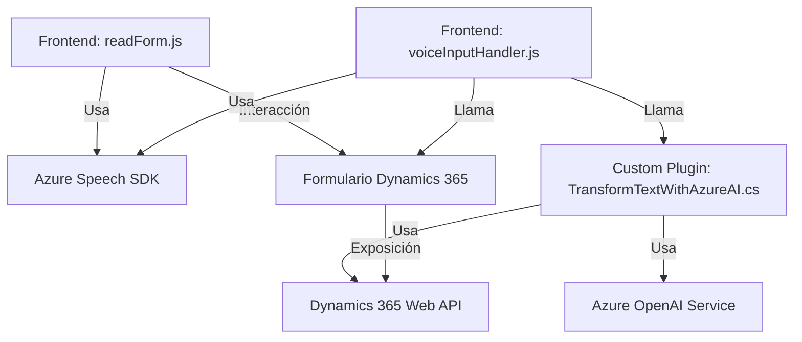

### Breve resumen técnico
El repositorio contiene tres archivos que conforman distintas partes de una solución híbrida que utiliza **Azure Speech SDK** y **Azure OpenAI Service** para el procesamiento de texto y voz en aplicaciones basadas en formularios de Dynamics 365 CRM. Los módulos están orientados hacia la integración de servicios externos y la automatización de tareas, siendo aplicables tanto al frontend como al backend de una solución CRM.

---

### Descripción de la arquitectura
1. **Tipo de solución:**
   - La solución tiene componentes de **integración API**, un **frontend** para interacción con formularios, y **plugins backend (server-side)** para procesamiento.

2. **Arquitectura:**
   - **Distribuida en tres capas**:
     - **Frontend:** Archivos JavaScript para la funcionalidad interactiva que captura datos del formulario, los sintetiza o los transcribe a texto mediante Azure Speech SDK, y realiza llamadas a APIs.
     - **Backend:** Plugin para Dynamics 365 basado en .NET y C#, que utiliza Azure OpenAI para transformar texto según reglas específicas. Esta capa maneja la lógica de negocios y la integración con el servicio de procesamiento de texto.
     - **Servicios Externos:** Integración con APIs de **Azure Speech SDK** y **Azure OpenAI Service**, las cuales actúan como servicios especializados para procesamiento de voz y texto respectivamente.

3. **Patrones:**
   - **N-capas:** Dividido en diferentes capas (presentación, lógica de negocio, servicios) con comunicación a través de APIs.
   - **Integración de servicios externos:** Uso de Azure Speech SDK y OpenAI con abstracción mediante métodos específicos que encapsulan las interacciones.
   - **Callback-asynchronous pattern:** Uso de funciones asíncronas y callbacks para manejar dependencias dinámicas como el SDK de Azure Speech.
   - **Single Responsibility Principle:** Modularización de funciones en el frontend y separación adecuada de responsabilidades entre frontend y backend.
   - **Plugin-Oriented Architecture:** Implementación específica para extensibilidad en Dynamics 365 mediante un plugin.

---

### Tecnologías usadas
1. **Frontend:**
   - **JavaScript (ES6)**: Utilizado para la lógica y manipulación de formularios en Dynamics 365.
   - **Azure Speech SDK**: Para síntesis y reconocimiento de voz.
   
2. **Backend:**
   - **C# (.NET Framework)**: Desarrollado para el plugin de Dynamics CRM.
   - **Azure OpenAI** (modelo GPT-4): Para procesamiento y transformación avanzada de texto.
   - **Dynamics 365 Web API**: Integración con funcionalidades del entorno CRM para lectura/escritura de campos.

3. **Librerías adicionales:**
   - **Newtonsoft.Json:** Para manejo avanzado de datos en formato JSON.
   - **System.Net.Http:** Para consumir servicios externos (Azure OpenAI).

---

### Dependencias o componentes externos
- **Azure Speech SDK:** Reconocimiento y síntesis de voz.
  - URL: https://aka.ms/csspeech/jsbrowserpackageraw
- **Azure OpenAI Service:** Modelos IA para transformación de texto (como GPT-4).
  - URL: https://openai-netcore.openai.azure.com/
- **Dynamics 365 Web API:** Manipulación de formularios y datos del CRM.
- **Microsoft XRM SDK:** Base del plugin para interacción con Dynamics CRM.

---

### Diagrama Mermaid (estructura representativa)

---

### Conclusión final
Este repositorio implementa una solución híbrida bien estructurada para sistemas Dynamics 365 CRM, combinando un frontend interactivo con capacidades avanzadas de voz y texto, y un backend robusto basado en .NET para lógica de negocio e integración con tecnologías de Azure. Su arquitectura de **n-capas** permite la flexibilidad y escalabilidad, mientras que el uso de servicios de Azure asegura soluciones modernas y rápidas para procesamiento de datos y voz.

