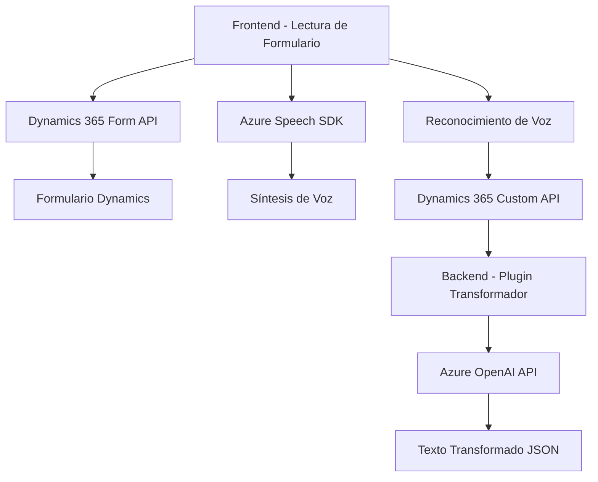

### Breve resumen técnico:
La solución presentada implementa funcionalidades que mezclan procesamiento y generación de voz con servicios de Azure en un entorno específico: Dynamics 365. Se trata de un conjunto de módulos separados entre frontend, backend y plugins que interactúan para procesar datos de formularios mediante servicios de inteligencia artificial (IA) y APIs específicas de Microsoft Azure.

---

### Descripción de arquitectura:
El diseño general muestra una arquitectura **n-capas** donde:
1. **Frontend** (JavaScript): Realiza interacción directa con usuarios en formularios de Dynamics 365, centrada en funcionalidades de voz (lectura y reconocimiento) que dependen del Azure Speech SDK.
2. **Middleware** (Plugins en C#): Extiende capacidades de Dynamics 365 para transformar texto y generar respuestas JSON mediante el servicio Azure OpenAI. Esto ocurre dentro del contexto del sistema CRM.
3. **Servicios externos**: El sistema depende de dos servicios clave de Azure: Speech SDK (para reconocimiento y síntesis de voz) y OpenAI (procesamiento de texto con IA avanzada).

El diseño está alineado con principios de modularidad y responsabilidad única, separando claramente las funciones de cada módulo. Además, el código sigue patrones relacionados con la arquitectura event-driven y utiliza manejo de promesas y callbacks para interactuar de forma asincrónica con servicios externos.

---

### Tecnologías usadas:
1. **Frontend**:
   - JavaScript (frameworks internos de Dynamics 365).
   - Azure Speech SDK.
   - Dynamics 365 Form API y Custom API.

2. **Backend**:
   - C# para plugins en Dynamics 365.
   - Integration con Azure OpenAI usando `HttpClient` y JSON parsing.

3. **Servicios externos**:
   - Microsoft Azure Speech API.
   - Microsoft Azure OpenAI API.

4. **Dependencias adicionales**:
   - Newtonsoft.Json para JSON en backend.
   - Text manipulation y lógica de conversión en frontend.

---

### Diagrama **Mermaid**:

---

### Conclusión final:
La solución planteada integra dinámicamente servicios avanzados basados en inteligencia artificial (IA) y voz para extender funcionalidades en un sistema CRM (Dynamics 365). Está diseñada con enfoque modular y utilizando una arquitectura **n-capas**, donde cada elemento desempeña una función específica y controla las dependencias relacionadas. La estructura general es robusta y acoplada correctamente con servicios de Azure, aunque puntos como el manejo de credenciales y seguridad podrían mejorarse.

Se recomienda validar el rendimiento y confiabilidad del sistema al interactuar con APIs externas, especialmente bajo condiciones de alta concurrencia.