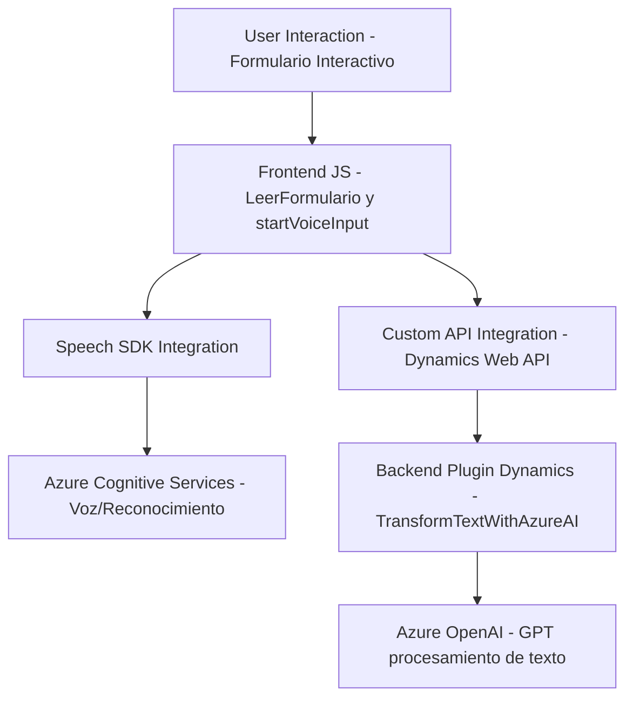

### Breve resumen técnico

El repositorio contiene tres principales módulos/ficheros con funcionalidades que integran capacidades de voz (reconocimiento y síntesis) y procesamiento de texto mediante Azure Cognitive Services y Dynamics CRM. Busca mejorar el flujo de interacción en formularios y procesamiento de datos con voz y texto, utilizando servicios AI y SDKs externos.

---

### Descripción de arquitectura

La solución implementa una **arquitectura de integración basada en servicios externos**, combinando módulos de frontend (JavaScript) con un plugin en backend (C#) para Dynamics CRM. Los componentes se comunican con servicios de Azure como Cognitive Services Speech SDK y OpenAI GPT. La solución funciona como un modelo **n capas**, separando la lógica del frontend, backend y servicios externos.

- **Frontend (JS)**: Maneja la interacción con el usuario a través de un formulario. Procesa datos visibles, genera síntesis de voz y reconoce entrada de voz mediante Azure Speech SDK.
- **Backend Plugin (C#)**: Un plugin implementado para Dynamics CRM, transformando texto con Azure OpenAI.
- **Servicios Externos**:
  - Azure Speech SDK: Manejo de voz (reconocimiento, síntesis).
  - Azure OpenAI: Procesamiento avanzado y transformación de texto.

---

### Tecnologías usadas

1. **Frontend (JavaScript)**:
   - Azure Cognitive Services Speech SDK.
   - Manipulación de datos del DOM.
   - Promesas para operaciones asíncronas.
   - Dynamics Web API (`Xrm.WebApi`) para comunicación con el backend.

2. **Backend (C#)**:
   - `Microsoft.Xrm.Sdk`: Integración con Microsoft Dynamics.
   - `System.Net.Http`: Realiza llamadas al servicio Azure OpenAI.
   - `Newtonsoft.Json` y `System.Text.Json`: Procesa y manipula objetos JSON.
   - Azure OpenAI (GPT) para transformar texto.

3. **Patrones**:
   - **Facade Pattern**: Simplifica interacciones con servicios externos (Azure SDK y API).
   - **Plugin Pattern**: Extiende las capacidades de Dynamics CRM con lógica personalizada.
   - **Adapter Pattern**: Intermediación entre las aplicaciones (Dynamics) y servicios AI.

---

### Diagrama Mermaid

---

### Conclusión final

La solución propuesta muestra una integración robusta de servicios externos (Azure Cognitive Services y Azure OpenAI) con Microsoft Dynamics CRM. Utiliza una arquitectura **n capas**, donde el frontend maneja la interacción con el usuario, el backend emplea plugins para extender Dynamics, y los servicios externos actúan como capas de procesamiento.

- **Fortaleza**: Modularidad y enfoque a servicios externos. Fácil extensión.
- **Consideración**: Seguridad al exponer claves de Azure Speech y OpenAI desde API e interacción SDK. Podría optimizarse con medidas como secrets management.