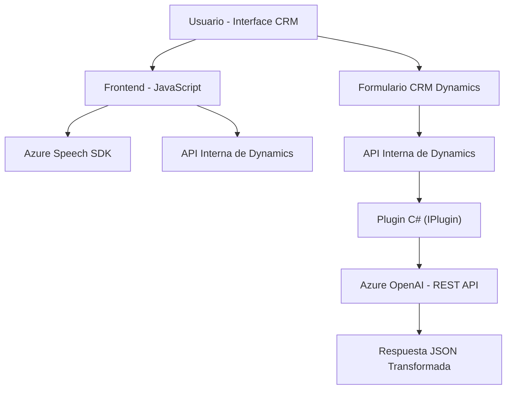

### Breve Resumen Técnico

Este repositorio contiene tres componentes principales:  
1. **Frontend:** Archivos JavaScript que integran la síntesis y reconocimiento de voz mediante el SDK de Azure Speech, aplicable a formularios de Dynamics CRM.  
2. **Backend:** Un plugin en C# que extiende Dynamics CRM, integrando Azure OpenAI para transformar texto en JSON estructurado.  

El sistema está orientado a enriquecer la experiencia de usuarios en un escenario CRM mediante sintetización y reconocimiento de voz, además de la integración de inteligencia artificial.

---

### Descripción de la Arquitectura

La solución utiliza un enfoque **n-capas** adaptado para CRM:  
- **Frontend (Presentación):** Implementación de JavaScript para interactuar con el cliente y Azure Speech SDK.  
- **Backend (Lógica de Negocio y Persistencia):** Plugin basado en C# que utiliza Dynamics CRM SDK y Azure OpenAI como servicios externos.  

Las capas están estrechamente vinculadas al contexto CRM, donde el frontend actúa como cliente y el plugin como backend.

---

### Tecnologías Usadas

1. **Frontend:**
   - **Azure Speech SDK (JavaScript):** Para sintetización y reconocimiento de voz.  
   - **Microsoft Dynamics APIs:** Para manipulación de formularios (`formContext`, `Xrm.WebApi`).  

2. **Backend:**
   - **Dynamics CRM SDK (`IPlugin`):** Extender capacidades estándar de plugins.  
   - **Azure OpenAI:** Integración de procesamiento de texto con IA.  
   - **.NET Core:** Framework para el desarrollo del plugin y comunicación HTTP.

3. **General:**
   - **HTTP Communication:** Para conectarse con APIs externas (Azure SDK/OpenAI).  
   - **JSON libraries:** Manipulación de datos estructurados.

---

### Diagrama Mermaid

---

### Conclusión Final

Esta solución implementa una arquitectura **n-capas** adaptada al contexto CRM Dynamics con extensiones potentes para reconocimiento de voz y procesamiento de texto mediante Azure Speech SDK y OpenAI. La modularidad de la solución permite escalabilidad futura, siendo adecuada para escenarios que requieran integración de IA, interacción por voz y manipulación avanzada de formularios CRM.