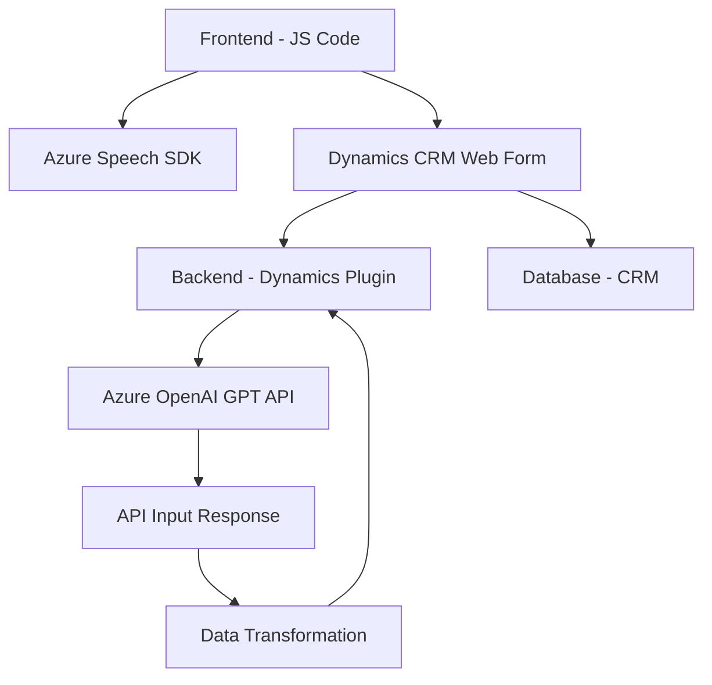

### Breve resumen técnico
El repositorio presentado contiene tres partes clave:  
1. Archivos en JavaScript que implementan funcionalidades para formularios en Dynamics CRM, usando Azure Speech SDK para conversión texto-a-voz y Azure AI para análisis de datos.  
2. Un plugin en C# que ejecuta en Dynamics CRM, integrando el Azure OpenAI GPT-4 con capacidades de transformación de texto según normas específicas.  
El código sigue una orientación modular, con integración a APIs externas y dependencias en servicios como Azure.

---

### Descripción de arquitectura
1. **Tipo de solución**:  
   La solución integra componentes de cliente (JavaScript) para funcionalidades en formularios de Dynamics CRM, y un componente de servidor con procesamiento adicional mediante plugins (.NET).  
   En su conjunto, funciona como una **arquitectura híbrida para aplicaciones de negocio**, donde se gestionan interacciones cliente-servidor con un modelo de extensión específico para Dynamics CRM.

2. **Modelo arquitectónico**:  
   La solución está diseñada bajo la **arquitectura de n capas**, con separación clara entre presentación (formulario cliente), lógica de negocio en plugins y servicios externos (Azure SDKs y Azure APIs).

---

### Tecnologías usadas
1. **Frontend/cliente (JavaScript)**:
   - Azure Speech SDK: Para manejo de voz (texto-a-voz y reconocimiento de voz).
   - DOM Manipulation: Para integración y control dinámico de formularios en Dynamics CRM.
   - Dynamics Web API: Interfaz para operaciones CRUD en el CRM.

2. **Backend (.NET C#)**:
   - Dynamics CRM Plugin Model (IPlugin): Desarrollo de extensiones dentro del entorno de servidor de Dynamics CRM.
   - Azure OpenAI GPT-4: Procesamiento de texto basado en inteligencia artificial.
   - JSON processing (Newtonsoft.Json & System.Text.Json): Análisis y serialización/deserialización de datos.
   - HTTPClient: Comunicación REST con servicios externos (Azure APIs).

3. **Patrones aplicados**:
   - Event-based programming (callbacks): Para manejar cargas y dependencias en el cliente.
   - Plugin Pattern: Implementación de lógica personalizada en Dynamics CRM.
   - API integration: Comunicación eficaz con servicios externos (Azure Speech, Azure OpenAI).

---

### Dependencias o componentes externos
1. **Azure Speech SDK**: Utilizado en frontend para generación de audio de voz e input de audio.  
2. **Azure OpenAI GPT**: Llamadas desde el plugin en Dynamics para transformar texto a través de inteligencia artificial avanzada.  
3. **Dynamics Web API**: Acceso a funcionalidad nativa del CRM para manipulación de datos.  
4. **Newtonsoft.Json y System.Text.Json**: Operaciones relacionadas con JSON en el backend del plugin.  
5. **Microsoft Dynamics Framework (IPlugin, Xrm)**: Base para construir extensiones en el entorno CRM.  

---

### Diagrama **Mermaid**

---

### Conclusión final
La solución es un sistema modular con una arquitectura en n capas que combina frontend y backend para implementar una funcionalidad de interacción con formularios de Dynamics CRM. Los archivos de JavaScript definen interacciones en el cliente y las operaciones en los elementos del formulario, mientras que el plugin en C# extiende la lógica mediante la integración con inteligencia artificial.  
Es una demostración robusta de cómo aprovechar Azure Speech SDK y Azure OpenAI para habilitar capacidades avanzadas en un ecosistema de Dynamics CRM.  
En el diagrama **Mermaid**, se ilustran las interacciones entre los componentes del sistema (cliente, servidor y dependencias externas) utilizando una representación gráfica simple apta para GitHub Markdown.