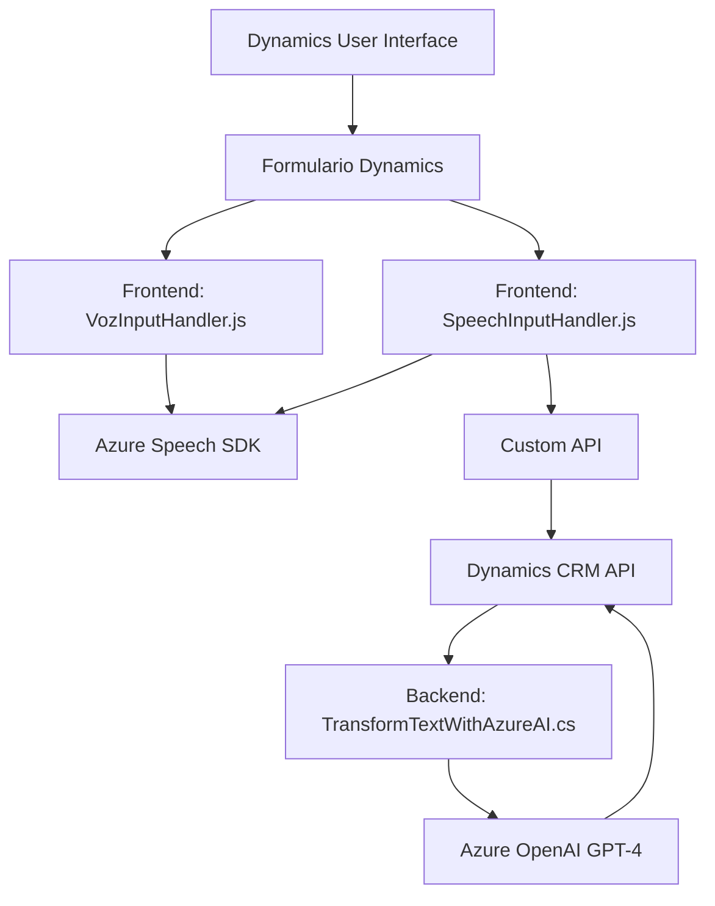

### Breve resumen técnico
El repositorio parece estar diseñado para trabajar con formularios de Dynamics CRM, con funcionalidades específicas para el reconocimiento y síntesis de voz (en frontend) y un plugin backend para la transformación de texto mediante Azure OpenAI. Estas funcionalidades están basadas en el SDKs de Azure y patrones de modularización.

El objetivo principal es proporcionar capacidades de interacción más naturales (voz y transformación de texto) para sistemas basados en Dynamics CRM.

---

### Descripción de arquitectura
1. **Arquitectura global:**  
   La solución está diseñada con una arquitectura **n-capas**, donde se encapsulan componentes bajo capas claramente diferenciadas:
   - **Frontend:** Funciones en JavaScript para interactuar con formularios, reconocimiento y síntesis de voz.
   - **Backend:** Plugin en C# que es ejecutado por Dynamics CRM para procesar texto con Azure OpenAI.
   - **Servicios externos:** Azure Speech SDK y Azure OpenAI para habilitar capacidades avanzadas de inteligencia artificial.
   
2. **Modularidad:**  
   Cada aspecto funcional está bien aislado: análisis y síntesis de formularios en el frontend (JS), y transformación de texto en el backend (C# plugin).
   
3. **Integración con APIs:**  
   Dinámica en el frontend y backend. Usa Azure APIs para reconocimiento y transformación, además de APIs de Dynamics CRM.

---

### Tecnologías usadas
1. **Frontend:**  
   - **JavaScript:** Para lógica de voz (Azure Speech SDK), manipulación de DOM (formulario), y procesamiento interno.
   - **Azure Speech SDK:** Para síntesis y reconocimiento de voz.
   - **Dynamics Web API:** Comunicación con APIs de Dynamics CRM.

2. **Backend:**  
   - **C# (Microsoft Dynamics Plugin):** Plugin que utiliza el modelo de extensibilidad de Dynamics CRM.
   - **Azure OpenAI API:** GPT-4 endpoint para transformación de texto.
   - **Newtonsoft.Json y System.Net.Http:** Para manejo de JSON y solicitudes HTTP.

---

### Diagrama Mermaid válido para GitHub

---

### Conclusión final
El repositorio implementa una solución híbrida para automatizar interacciones con formularios de Dynamics CRM usando inteligencia artificial y capacidades de voz. Utiliza una arquitectura **n-capas**, donde el frontend proporciona reconocimiento de voz y síntesis integrándose con servicios de Azure Speech SDK, mientras que el backend procesa texto con Azure OpenAI a través de plugins de Dynamics.

**Ventajas:**  
- Modularidad alta que simplifica escalabilidad y mantenimiento.  
- Uso de servicios Azure para aprovechar capacidades avanzadas como GPT-4 y Speech SDK.  

**Sugerencias:**  
Es posible considerar mejoras como:
1. Implementación de tests unitarios para cada módulo JS y C#.
2. Desacoplar hardcoded keys/regiones de Azure mediante una configuración más segura (por ejemplo, archivado en Azure Key Vault).
3. Optimización para manejar errores de integración en APIs externas.