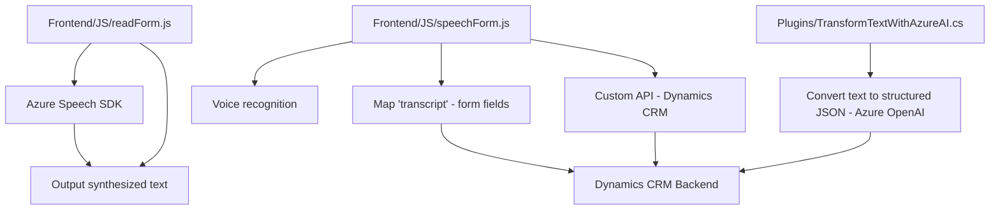

### Breve resumen técnico
El repositorio analiza diversos componentes relacionados con **servicios de reconocimiento de voz, síntesis de texto a voz, y procesamiento de texto mediante servicios externos** en contextos de Dynamics 365 CRM. Los tres archivos presentados implementan funciones en un sistema híbrido, utilizando **JavaScript y .NET**, y dependencias externas como **Azure Speech SDK** y **Azure OpenAI Service**. El enfoque general combina interactividad en tiempo real (front-end) y lógica extendida en el CRM (con plugins en C#).

---

### Descripción de arquitectura
1. **Tipo de solución**  
   - Basada en integración modular de interfaces para **entry-by-voice**, **synthesis of voice outputs**, y **text-processing via AI** en un entorno basado en formularios dinámicos en Dynamics CRM. 
   - Híbrida: API y front-end interactúan con un backend en Dynamics CRM mediante plugins y llamadas a servicios externos.

2. **Patrones de arquitectura**
   - **N capas:** Front-end se comunica con el back-end de Dynamics CRM con interacciones definidas por plugins y APIs personalizadas.
   - **Integración dinámica:** Los SDK de Azure son cargados solo cuando se necesitan, para mejorar el rendimiento.
   - **Extensibilidad:** Plugins para Dynamics CRM con eventos personalizados (`IPlugin`) y funciones especializadas, acopladas con servicios externos (Azure Speech y OpenAI).

3. **Elementos representativos**
   - Sistema de interacción por voz en formularios del CRM.
   - Reconocimiento de voz y mapeo dinámico a campos del formulario CRM.
   - Conversión de texto estructurado mediante normas externas configurable y dinámico.

---

### Tecnologías usadas
1. **Frontend (JavaScript):**
   - Azure Speech SDK (gestión de voz y síntesis).
   - Promesas y programación asíncrona (`async/await`).
   - CRM SDK para comunicación con Dynamics.

2. **Backend (.NET - C#):**
   - Microsoft Dynamics CRM SDK (`IPlugin`, `IPluginExecutionContext`, `IOrganizationServiceFactory`).
   - System.Net.Http para interacción con APIs.
   - JSON serialization/deserialization con `System.Text.Json`.
   - Azure OpenAI Service para procesamiento de texto y generación estructurada.

3. **Servicios externos:**
   - **Azure Speech SDK:** Reconocimiento y síntesis de voz.
   - **Azure OpenAI Service:** Conversión y transformación de texto según reglas.
   - **Custom API**: APIs específicas dentro de Dynamics CRM para interacción directa.

---

### Diagrama Mermaid válido para GitHub

---

### Conclusión final
El repositorio presenta una solución integrada para trabajar con formularios dinámicos mediante **voz y AI** en entornos de **Dynamics CRM**. Su arquitectura se categoriza como **n capas**, donde el front-end se ocupa de la interacción usuario-SDK-API, mientras que el backend se encarga del procesamiento y asignación de valores generados mediante plugins personalizados y servicios externos (Azure). La incorporación de **servicios externos como Azure Speech y OpenAI** amplía las capacidades del sistema, proporcionando una solución robusta y flexible. A pesar de ser funcional, podría beneficiarse de monitoreo más robusto y un manejo de errores explícito.