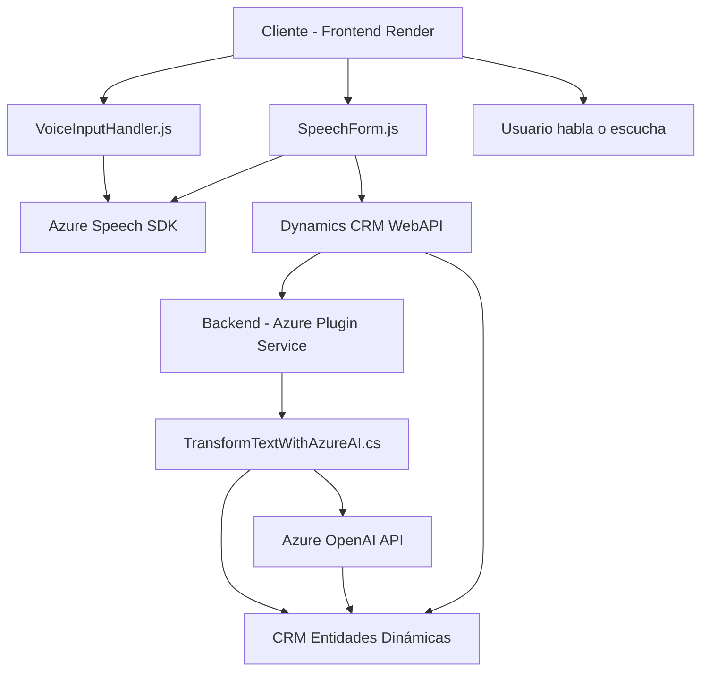

### Breve resumen técnico
El repositorio contiene tres archivos principales que se utilizan para integrar servicios de voz y texto con un sistema basado en Dynamics CRM y Azure. Los archivos trabajan de manera coordinada para extraer texto, procesarlo y convertirlo en voz (Frontend) o aplicarle reglas transformacionales mediante la integración de Azure OpenAI en un plugin del backend.

---

### Descripción de arquitectura
1. **Tipo de solución**:
   - Es una **solución híbrida cliente-servidor** que integra funcionalidades avanzadas como reconocimiento y síntesis de voz con servicios de Azure Speech SDK y procesamiento inteligente de textos a través de Azure OpenAI.

2. **Arquitectura**:
   - **Cliente**:
     - El frontend presenta una arquitectura modular con funciones separadas para síntesis de voz (archivo `VoiceInputHandler.js`) y reconocimiento de voz que interactúan con las APIs de Azure y los formularios de Dynamics CRM.
   - **Backend**:
     - El archivo `TransformTextWithAzureAI.cs` sigue una arquitectura basada en **plugins CRM** con inversiones en patrones cliente-servidor para integrar servicios externos como Azure OpenAI.

3. **Componentes arquitectónicos**:
   - **Azure Speech SDK**:
     Utilizado para sintetizar texto y reconocimiento de voz en el cliente.
   - **Dynamics CRM**:
     Utilizado para formularios interactivos y datos empresariales subyacentes.
   - **Azure OpenAI**:
     Procesamiento de textos basado en inteligencia artificial en el backend.

---

### Tecnologías usadas
- **Frontend**:
  - **JavaScript** como lenguaje principal.
  - **Azure Speech SDK** para reconocer y convertir texto a voz en el navegador.
  - **Dynamics CRM WebAPI** para la interacción con formularios y entidades.

- **Backend**:
  - **C#/.NET** para creación de plugins.
  - **Azure OpenAI API** para procesamiento inteligente de texto.
  - **Newtonsoft.Json** y `System.Text.Json` como librerías para el manejo de datos JSON.
  - **HTTPClient** para llamadas REST a servicios externos.
  - **Microsoft Dynamics SDK** para el acceso al modelo CRM.

---

### Diagrama **Mermaid**
El siguiente diagrama muestra la interacción entre los componentes principales de la arquitectura:

---

### Conclusión final
La solución presentada en el repositorio tiene como objetivo brindar capacidades avanzadas de voz y procesamiento de texto mediante la interacción de un frontend modular con un backend dinámico. Se utiliza una arquitectura cliente-servidor respaldada por servicios de Microsoft Azure y Dynamics CRM para garantizar escalabilidad y funcionalidad. Además:
1. **Patrones arquitectónicos** como la integración con servicios externos (mediante SDK y APIs) y el uso de abstracciones contribuyen a un diseño robusto y modular.
2. **Dependencias externas importantes**:
   - Azure Speech SDK.
   - Azure OpenAI.
   - Dynamics CRM WebAPI.
3. **Áreas de mejora potencial** dependientes de requisitos futuros:
   - Implementación adicional de validaciones contextuales.
   - Segmentación para proyectos más especializados mediante microservicios o funciones serverless, si el volumen lo justifica.

La integración propuesta es idónea para escenarios donde se requiera interacción avanzada entre voz, texto e inteligencia artificial en un entorno empresarial.