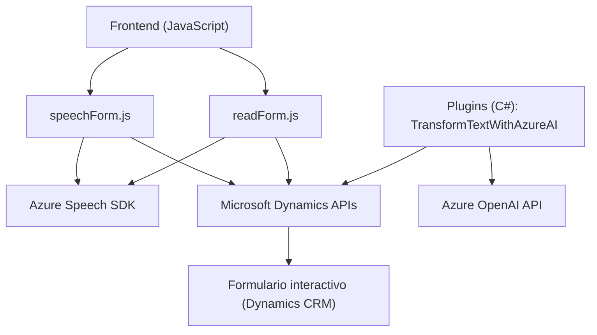

### Breve resumen técnico
El repositorio presenta una solución híbrida de integración entre frontend (archivos JS) y backend (plugin .NET) que utiliza servicios externos (Azure Speech SDK y Azure OpenAI) para capacidades avanzadas de reconocimiento y síntesis de voz, así como procesamiento inteligente de datos mediante inteligencia artificial. Está orientado a la interacción con formularios en Microsoft Dynamics CRM.

---

### Descripción de arquitectura
1. **Frontend**:
   - Se trata de módulos JavaScript que implementan funcionalidades específicas relacionadas con la interacción con el formulario, el reconocimiento de voz, la síntesis de texto a voz y la integración con APIs externas.
   - Su diseño está basado en modularidad y encapsulamiento de funciones, favoreciendo un enfoque de desarrollo desacoplado y reutilizable.

2. **Backend**:
   - Implementa un plugin de Dynamics CRM en .NET que consume el servicio Azure OpenAI para transformar datos. Toda la lógica está orientada a extender las capacidades de Dynamics mediante funcionalidad propia en forma de un `IPlugin`.

3. **Arquitectura general**:
   - *Hybrid architecture*: La solución combina un enfoque de microservicios (APIs externas) con un diseño orientado a servicios (Microsoft Dynamics + Azure). La comunicación entre el frontend y el backend es a través de eventos y llamadas API REST, lo que refleja una separación de responsabilidades y un diseño modular.

---

### Tecnologías usadas
- **Frontend**:
  - JavaScript para la lógica del cliente y manipulación del DOM en HTML (formularios).
  - Azure Speech SDK (`window.SpeechSDK`) para síntesis y reconocimiento de voz.
  - Microsoft Dynamics CRM (API `Xrm.WebApi`) para manipulación de formularios y datos.

- **Backend**:
  - .NET Framework para el desarrollo de plugins (C#).
  - Azure OpenAI (GPT-4) para procesamiento inteligente.
  - `System.Net.Http` para integración con servicios REST.
  - `Newtonsoft.Json` para serialización y manejo de datos JSON.
  - `Microsoft.Xrm.Sdk` para conectividad y manipulación dentro de Dynamics CRM.

---

### Dependencias y componentes externos
1. **Azure Speech SDK**:
   - Utilizado en el frontend para reconocimiento y síntesis de voz.
   
2. **Azure OpenAI**:
   - Consumido en el backend (plugin) para transformar texto utilizando un modelo GPT-4.

3. **Microsoft Dynamics CRM**:
   - Plataforma principal de despliegue, que incluye APIs internas como `Xrm.WebApi` para funcionalidades de integración.

4. **Frontend-Backend integrations**:
   - Comunicación entre los módulos JS y el plugin en Dynamics CRM se lleva a cabo mediante APIs y eventos en los formularios.

---

### Diagrama Mermaid válido para GitHub

---

### Conclusión final
La solución del repositorio ofrece una experiencia de usuario avanzada al integrar tecnologías de síntesis y reconocimiento de voz (Azure Speech SDK) con un sistema CRM como Microsoft Dynamics. Adicionalmente, la lógica se complementa con un plugin backend que utiliza Azure OpenAI para transformar texto con reglas definidas, extendiendo las capacidades de la herramienta y facilitando la interacción con datos estructurados. Su diseño modular y el uso de APIs externas apuntan hacia una arquitectura centrada en servicios, logrando separación de responsabilidades y fácil mantenibilidad.