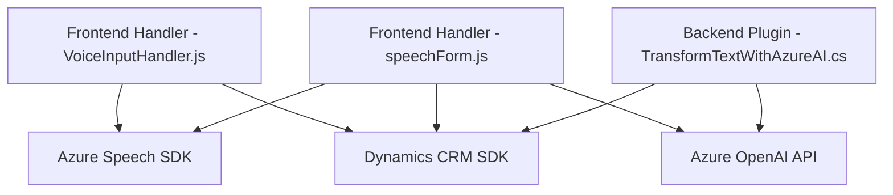

### Resumen técnico

El repositorio implementa soluciones orientadas a **integración funcional con Microsoft Dynamics CRM**, destacando los siguientes componentes:
- Uso de **Azure Speech SDK** para procesamiento de voz (entrada y síntesis).
- Uso de **Azure OpenAI API** para transformar texto mediante GPT.
- Plugins orientados a operaciones en el contexto de Dynamics CRM.

Los archivos del repositorio sugieren que la solución está centrada en proporcionar inteligencia artificial y herramientas de comunicación accesibles por voz y texto dentro del ecosistema de Microsoft Dynamics 365.

---

### Descripción de arquitectura

1. **Tipo de solución**:  
   - Solución híbrida basada en:
     - **Frontend**: Scripts en JavaScript para el manejo de formularios interactivos y entrada/salida de voz.  
     - **Backend/Plugins**: Plugins en C# que funcionan como intermediarios entre Microsoft Dynamics CRM y Azure OpenAI.

2. **Arquitectura global**:  
   - **N-capas** (estructuralmente): Se emplea una aproximación donde cada capa desempeña responsabilidades definidas:  
     - **Frontend**: Responsable de la interfaz de usuario y manipulación directa de formularios.  
     - **Backend/Plugins**: Responsable de la lógica de negocio avanzada (procesamiento por AI y CRUD).  
     - **Servicios externos**: Interacción con Azure para voz y AI.  

   - Existe un fuerte enfoque en la **interacción con APIs externas** (como Azure Speech SDK y OpenAI), lo que podría calificarse como **arquitectura de servicio**.

---

### Tecnologías usadas

1. **Frontend (JavaScript):**  
   - Bibliotecas de terceros:
     - **Azure Speech SDK**.
   - Tecnologías integradas:
     - Microsoft Dynamics contextos (`formContext`, `executionContext`).  

2. **Backend (C# Plugins):**
   - Framework:
     - **Microsoft Dynamics CRM SDK**.
     - **.NET Framework** (cliente HTTP y manipulación de JSON).
   - Integración:
     - **Azure OpenAI REST API** para procesamiento de texto inteligente.

3. **Patrones arquitectónicos usados:**  
   - **Eventos y asincronía**: Uso de callbacks y promesas en scripts JS.  
   - **Desacoplamiento y modularidad**: Funciones aisladas para operaciones independientes tanto en JS como en C#.  
   - **Responsabilidad única**: Métodos y clases están definidos por roles específicos, adhiriéndose al SRP.  

---

### Dependencias o componentes externos presentes

1. **Azure Speech SDK**:
   - Para síntesis y reconocimiento de voz.  
   - Cargado dinámicamente desde `https://aka.ms/csspeech/jsbrowserpackageraw`.

2. **Azure OpenAI API**:
   - Para transformación de texto inteligente mediante modelos tipo GPT.

3. **Microsoft Dynamics CRM**:
   - Contexto de ejecución: Manipulación directa de formularios y campos.  

4. **Librerías adicionales en C#:**  
   - `Newtonsoft.Json` y `System.Text.Json` para manejo dinámico de estructuras JSON.  
   - `System.Net.Http` para solicitudes HTTP hacia APIs.

---

### Diagrama Mermaid para GitHub Markdown

---

### Conclusión final

La solución presentada en el repositorio está orientada a integrar **procesos inteligentes de entrada/salida de voz y procesamiento de texto** dentro de formularios personalizados de Dynamics CRM. Para esta integración se emplean tecnologías de **Azure Speech SDK** y **Azure OpenAI**, respaldadas por una arquitectura de **n-capas** que separa frontend y backend mientras utiliza servicios externos.

#### Ventajas:
- Modularidad en diseño.
- Escalabilidad gracias a la integración de servicios cloud (Azure).
  
#### Recomendaciones:
- Aumentar la seguridad del manejo de claves y servicios en Azure.  
- Considerar gradualmente el uso de patrones adicionales como **hexagonal** para desacoplar servicios externos.