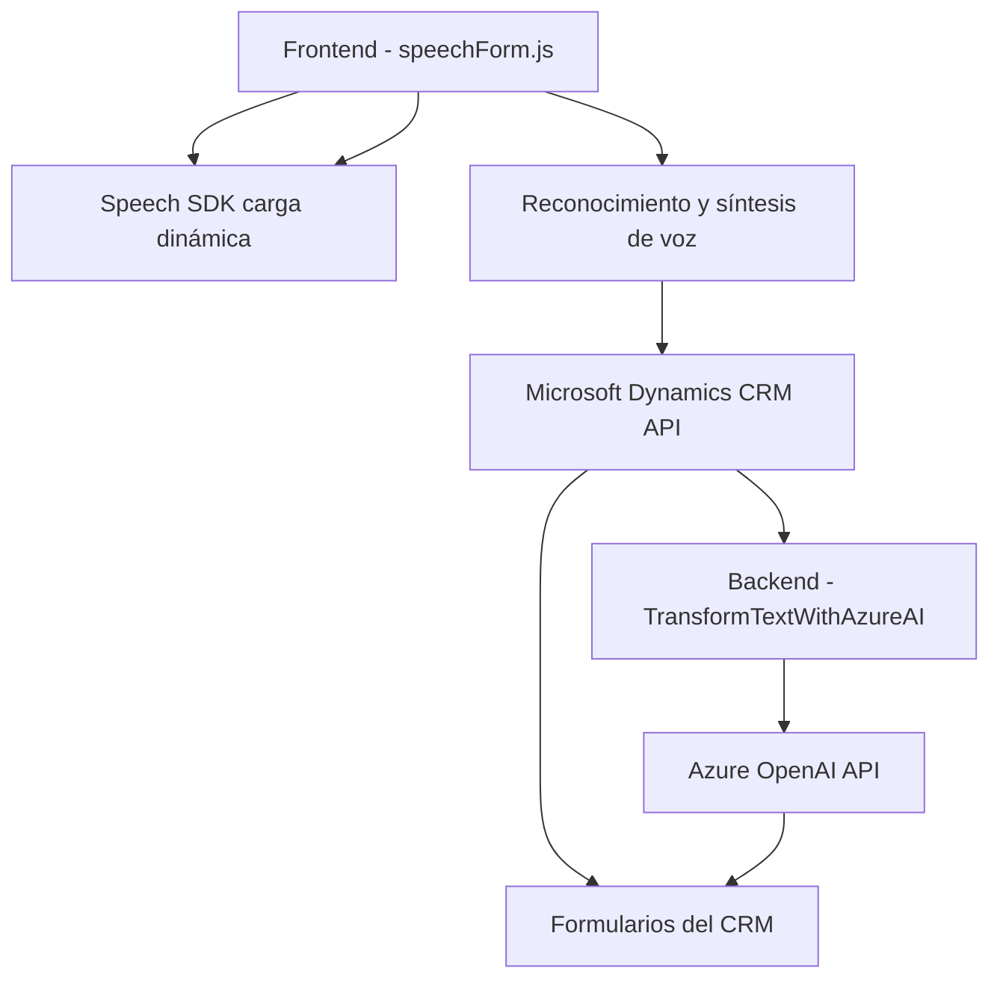

### Breve Resumen Técnico

El repositorio representa una solución orientada a la interacción con formularios, integrando capacidades de reconocimiento de voz, síntesis de voz y procesamiento de datos con servicios de Microsoft Azure (e.g., Speech SDK y OpenAI). Está dividido en diversas capas:
- **Frontend**: Contiene lógica del cliente en JavaScript que interactúa con SDKs externos.
- **CRM Plugin**: Define un plugin que opera en el lado servidor usando Microsoft Dynamics CRM y Azure OpenAI API.

---

### Descripción de Arquitectura

**Tipo de Solución:** La solución combina un **frontend** con capacidades de **reconocimiento y síntesis de voz** mediante el SDK de Azure Speech, siendo diseñada para integrarse con **Microsoft Dynamics CRM**, y un **server-side plugin** que transforma datos de entrada usando Azure OpenAI. En conjunto, permite la obtención de datos desde formularios mediante reconocimiento de voz y los aplica a campos específicos del CRM. También ofrece la opción de procesar texto utilizando un servicio externo de IA.

**Arquitectura:** La solución está configurada bajo un **modelo de arquitectura de n capas**, dado que incluye:
1. **Frontend (cliente)**: Lógica interactiva del usuario.
2. **API externas y SDKs**: Mediadores para interactuar con servicios como Azure Speech o OpenAI.
3. **Plugin (servidor/CRM Logic)**: Backend vinculado al sistema Dynamics CRM mediante el patrón de **plugin** típico de esta plataforma.

**Patrones de Diseño y Principios:**
1. **Modularidad**: Cada función realiza una única tarea específica, haciendo la solución más fácil de mantener.
2. **Carga dinámica de servicios/externalización (dynamic imports, SDK loader)**: El SDK de Speech es cargado dinámicamente solo cuando es necesario.
3. **Event-driven Architecture**: Parte del flujo del frontend se basa en eventos (e.g., invocación de SDK después de su carga).
4. **Plugin Pattern**: Usado en la solución de servidor para transformar texto dentro de la lógica definida.

---

### Tecnologías Usadas

#### Frontend
1. **JavaScript** para lógica del cliente y manipulación de formularios.
2. **Azure Speech SDK** para reconocimiento y síntesis de voz.
3. **Dynamics CRM Javascript API (Xrm.WebApi)** para operaciones en formularios y actualización de datos.

#### Backend
1. **C#** como lenguaje principal.
2. **Microsoft Dynamics CRM Plugin Framework** para la integración.
3. **Azure OpenAI API** para procesamiento del texto con IA.
4. **System.Net.Http** para realizar solicitudes al servicio de OpenAI.
5. **JSON** para estructuras de datos estándar y comunicación entre APIs.
6. **Azure SDK** en el backend para interacción con los servicios de Microsoft Azure.

---

### Diagrama Mermaid

---

### Conclusión Final

La solución combina de manera efectiva tecnologías modernas en el ámbito de servicios en la nube (Azure Speech y OpenAI), aplicaciones CRM (Dynamics), y modularidad del frontend (JavaScript). La arquitectura sigue el patrón de **n capas**, con una separación entre frontend, backend y APIs externas, lo que facilita la extensibilidad. El diseño modular también permite una integración eficiente para agregar nuevas funcionalidades en el futuro.